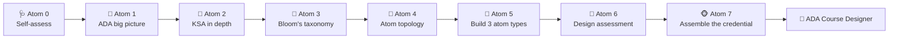
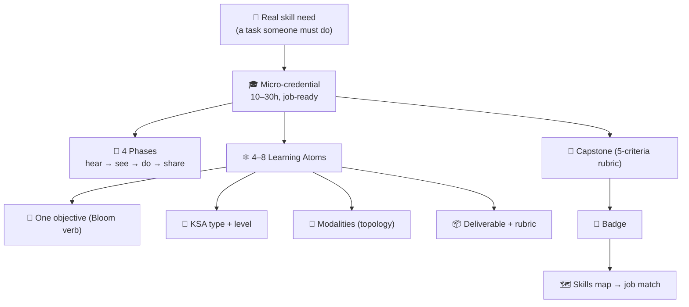
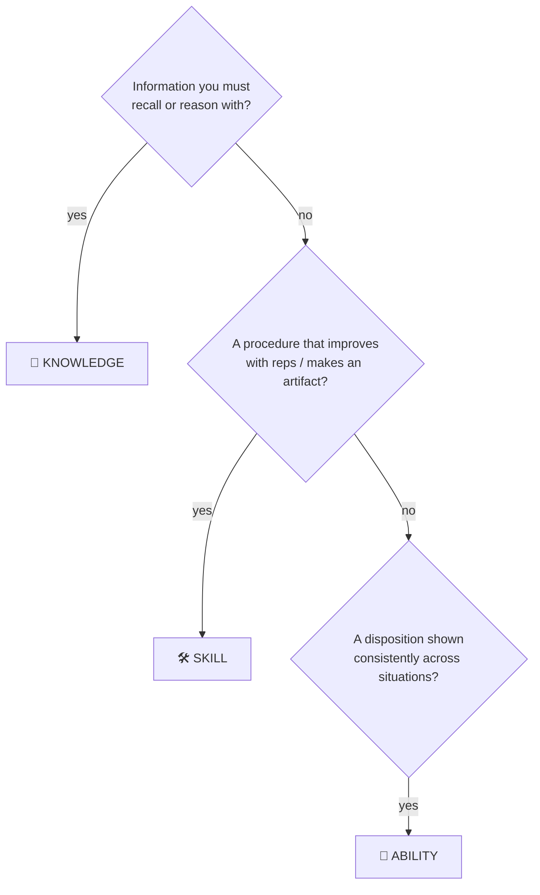
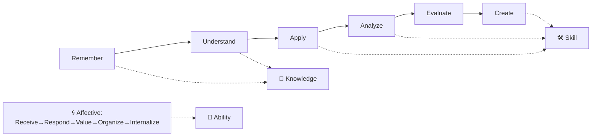
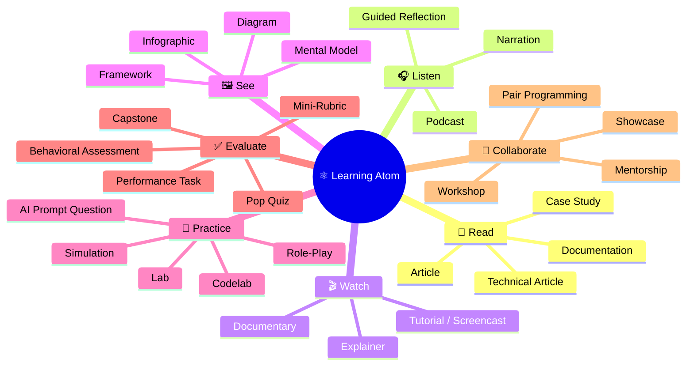
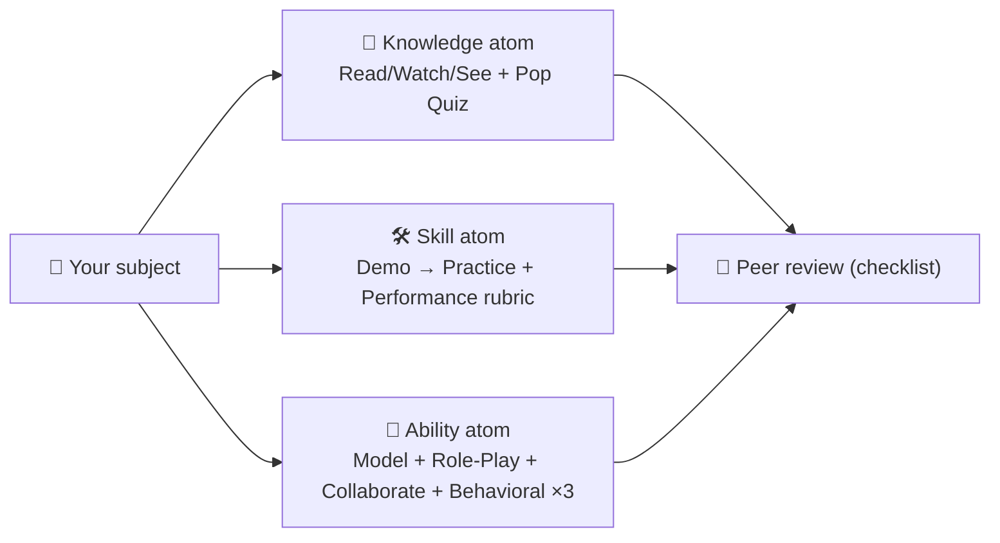
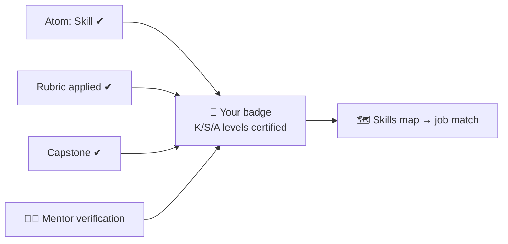
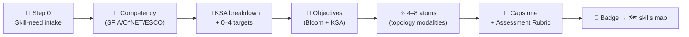

# 🎓 LEARN.md — Master the ADA Methodology (by building one)

<p align="center">
  
  
  
  
</p>

This document **is an ADA micro-credential** — it uses the methodology to teach the methodology
(*learn ADA by doing ADA*). You will not just read about KSA, Bloom, and the Learning Atom
topology; you will **debrief each concept in depth**, do **activities**, **author learning atoms
of every type**, and finish by **assembling a complete ADA Credential from the templates**.

> 🏅 **Badge you'll earn:** *ADA Methodology Designer* — can deconstruct a real skill need into a
> KSA-typed, Bloom-aligned, topology-rich micro-credential with a capstone, rubric, and skills map.

> 🖥️ **Prefer an interactive, packaged version?** This same curriculum ships as a full worked
> example with its own sidebar/progress course site:
> [`examples/ada-methodology-designer-micro-credential/`](examples/ada-methodology-designer-micro-credential/README.md)
> (open its [`course.html`](examples/ada-methodology-designer-micro-credential/course.html)).

---

## 🧭 How to use this course

Work the atoms **in order** — each produces an artifact the next one builds on, and together they
*become* your capstone. Keep a single working folder (your "build kit"); every deliverable goes in it.



**Source texts you'll use throughout** (open them as you go):
[KSA Taxonomy](specs/ksa-taxonomy.md) ·
[Learning Atom Topology](specs/learning-atom-topology.md) ·
[v2 KSA Framework](specs/ada-v2-ksa-framework.md) ·
[Micro-credential v2 schema](specs/micro-credential-v2-schema.md) ·
[Role-to-Credential Mapping](specs/role-to-credential-mapping.md) ·
[Gen AI Authoring Workflow](specs/genai-authoring-workflow.md).

**Templates you'll fill in** (your build kit):
[Micro-Credential](templates/micro-credential-ada-template.md) ·
[Learning Atom](templates/learning-atom-template.md) ·
[Codelab](templates/codelab-ada-template.md).

**Worked examples to imitate:**
[Growth Mindset](examples/growth-mindset-micro-credential/README.md) (an Ability) ·
[Python Variables](examples/python-variables-micro-credential/README.md) (a technical Skill).

---

## 📋 The micro-credential spec (this course, formally)

Conforms to [`specs/micro-credential-v2-schema.md`](specs/micro-credential-v2-schema.md).

```yaml
schema: ada-microcredential/v2
id: mc-learn-ada-methodology
title: "Learn & Master the ADA Methodology"
language: en
duration_hours: 20
level: intermediate
status: published
license: CC-BY-SA-4.0
mentors: ["@sancarbar"]

target_roles:
  - role: "Instructional designer / curriculum author / L&D lead / mentor using ADA"
    framework_ref: >
      O*NET 25-9031.00 Instructional Coordinators · ESCO "develop curriculum",
      "design pedagogical approaches" · SFIA: LEDA (learning & development), KNOW

ksa:
  - { id: K-ada-architecture, type: knowledge, label: "ADA building blocks & flow (micro-credential → phases → atoms → capstone → badge → skills map)", target_level: 2, bloom: understand }
  - { id: K-ksa-framework,    type: knowledge, label: "KSA types, the 0-4 proficiency scale, the affective domain, and how to classify a competency", target_level: 3, bloom: analyze }
  - { id: K-bloom,            type: knowledge, label: "Bloom's revised cognitive + affective taxonomies; writing measurable objectives", target_level: 2, bloom: understand }
  - { id: K-topology,         type: knowledge, label: "The 7 modalities and their sub-types; modality↔KSA and modality↔phase fit", target_level: 2, bloom: understand }
  - { id: S-write-objectives, type: skill,     label: "Write Bloom-verb objectives tagged with KSA type + target level", target_level: 2, bloom: apply }
  - { id: S-design-atoms,     type: skill,     label: "Design learning atoms of each KSA type with topology-correct modalities", target_level: 3, bloom: create, primary: true }
  - { id: S-build-rubric,     type: skill,     label: "Build the 5-criteria Assessment Rubric + mini-rubrics; map evidence → badge", target_level: 2, bloom: apply }
  - { id: S-assemble-mc,      type: skill,     label: "Assemble a complete micro-credential from the ADA templates", target_level: 3, bloom: create, primary: true }
  - { id: A-design-judgment,  type: ability,   label: "Design with learner empathy, framework rigor, and human-in-the-loop judgment", target_level: 2, affective_stage: value, assessed_occasions: 3 }

atoms:
  - { id: atom-0, title: "Diagnostic — where are you now?", ksa_refs: [], phase: 1, modalities: [{dimension: evaluate, subtype: Skills Self-Assessment}], rubric: diagnostic }
  - { id: atom-1, title: "The ADA big picture", ksa_refs: [K-ada-architecture], phase: 1, modalities: [{dimension: read, subtype: Article}, {dimension: see, subtype: Flowchart}, {dimension: evaluate, subtype: Pop Quiz}], rubric: knowledge-mini }
  - { id: atom-2, title: "KSA in depth", ksa_refs: [K-ksa-framework], phase: 1, modalities: [{dimension: read, subtype: Technical Article}, {dimension: see, subtype: Framework}, {dimension: practice, subtype: Worksheet / Exercise}, {dimension: evaluate, subtype: Mini-Rubric}], rubric: knowledge-mini }
  - { id: atom-3, title: "Bloom's taxonomy", ksa_refs: [K-bloom, S-write-objectives], phase: 1, modalities: [{dimension: read, subtype: Technical Article}, {dimension: see, subtype: Diagram}, {dimension: practice, subtype: Worksheet / Exercise}, {dimension: evaluate, subtype: Mini-Rubric}], rubric: skill }
  - { id: atom-4, title: "The Learning Atom topology", ksa_refs: [K-topology], phase: 2, modalities: [{dimension: see, subtype: Mind Map}, {dimension: read, subtype: Documentation / Reference}, {dimension: practice, subtype: Design Exercise}, {dimension: evaluate, subtype: Pop Quiz}], rubric: knowledge-mini }
  - { id: atom-5, title: "Build one atom of each KSA type", ksa_refs: [S-design-atoms, A-design-judgment], phase: 3, modalities: [{dimension: practice, subtype: Design Exercise}, {dimension: collaborate, subtype: Async Peer Review}, {dimension: evaluate, subtype: Performance Task}], rubric: skill }
  - { id: atom-6, title: "Design the assessment", ksa_refs: [S-build-rubric], phase: 3, modalities: [{dimension: practice, subtype: Design Exercise}, {dimension: evaluate, subtype: Performance Task}], rubric: skill }
  - { id: atom-7, title: "Capstone — assemble the full credential", ksa_refs: [S-assemble-mc, A-design-judgment], phase: 4, modalities: [{dimension: practice, subtype: Project Task}, {dimension: collaborate, subtype: Showcase / Demo Day}, {dimension: evaluate, subtype: Capstone Project}], rubric: capstone-5 }

capstone:
  title: "Design a complete ADA micro-credential for a real organizational skill need"
  integrates_ksa: [K-ada-architecture, K-ksa-framework, K-bloom, K-topology, S-write-objectives, S-design-atoms, S-build-rubric, S-assemble-mc, A-design-judgment]
  rubric: capstone-5

badge:
  name: "ADA Course Designer"
  evidence_required: ["atom-5", "atom-6", "capstone"]
  issued_on: verified-evidence
```

### 🧬 KSA breakdown — what mastery means here

| KSA | Component | Why this type | Target |
| --- | --------- | ------------- | ------ |
| 🧠 Knowledge | ADA architecture & flow | The map you reason from | L2 |
| 🧠 Knowledge | KSA framework + 0–4 scale + affective domain | The classification engine of v2 | **L3** |
| 🧠 Knowledge | Bloom's cognitive + affective taxonomies | How objectives become measurable | L2 |
| 🧠 Knowledge | The 7-modality topology | The menu you design atoms from | L2 |
| 🛠️ Skill | Write Bloom + KSA objectives | A repeatable authoring move | L2 |
| 🛠️ Skill | Design atoms of each KSA type | The core craft — practiced for real | **L3** |
| 🛠️ Skill | Build the Assessment Rubric | Makes learning measurable & fair | L2 |
| 🛠️ Skill | Assemble a full micro-credential | The end-to-end deliverable | **L3** |
| 🌱 Ability | Instructional-design judgment | Empathy + rigor + human-in-the-loop, shown across the build | L2 |

### 📘 Learning objectives (Bloom + KSA)

| Objective | Bloom | KSA | Component | Target |
| --------- | ----- | --- | --------- | ------ |
| Explain how the ADA building blocks fit together | Understand | 🧠 K | K-ada-architecture | L2 |
| Classify any competency as Knowledge, Skill, or Ability and set a 0–4 target | Analyze | 🧠 K | K-ksa-framework | L3 |
| Write measurable objectives using Bloom verbs, tagged with KSA | Apply | 🛠️ S | S-write-objectives | L2 |
| Select topology modalities that fit an atom's KSA type and phase | Understand/Apply | 🧠 K | K-topology | L2 |
| Design a Knowledge, a Skill, and an Ability atom | Create | 🛠️ S | S-design-atoms | L3 |
| Build a 5-criteria Assessment Rubric and an evidence→badge map | Apply | 🛠️ S | S-build-rubric | L2 |
| Assemble a complete, job-ready ADA micro-credential | Create | 🛠️ S | S-assemble-mc | L3 |
| Design with learner empathy and human-in-the-loop rigor | Value (affective) | 🌱 A | A-design-judgment | L2 |

### 🔍 Phase planner

| Phase | Atom(s) | KSA focus | Activity | Assessment |
| ----- | ------- | --------- | -------- | ---------- |
| 🙉 1 · hear | 0, 1, 2, 3 | 🧠 K → 🛠️ S | read + diagrams; classify competencies; write objectives | self-assessment, quizzes, mini-rubrics |
| 🙈 2 · see | 4 | 🧠 K | study the topology mind map; choose modalities | pop quiz + design exercise |
| 🙊 3 · do | 5, 6 | 🛠️ S + 🌱 A | author 3 atoms; build the rubric | performance tasks + peer review |
| 🐵 4 · share | 7 (capstone) | 🛠️ S + 🌱 A | assemble the full credential; showcase + peer review | capstone-5 |

---

# 🩺 Atom 0 — Diagnostic: Where are you now?

**Phase:** 🙉 1 (*hear*) · **Modality:** ✅ Evaluate (Skills Self-Assessment) · **Rubric:** diagnostic

Rate yourself **0–4** (the ADA proficiency scale you'll learn in Atom 2) on each component. Re-rate
at the end — the delta is your evidence of growth.

| Component | 0–4 now | 0–4 after |
| --------- | :-----: | :-------: |
| Explain the ADA architecture | ☐ | ☐ |
| Classify a competency as K/S/A | ☐ | ☐ |
| Write a Bloom-verb objective | ☐ | ☐ |
| Pick modalities for an atom | ☐ | ☐ |
| Build an assessment rubric | ☐ | ☐ |
| Assemble a full micro-credential | ☐ | ☐ |

> 📦 **Deliverable:** your filled self-assessment (keep it for the end).

---

# 🙉 Atom 1 — The ADA Big Picture

**Phase:** 🙉 1 (*hear*) · **KSA:** 🧠 Knowledge · **Target:** L2 · **Component:** `K-ada-architecture`

### 🎯 Objective
- **Explain** how ADA's building blocks fit together, from a job skill to a verifiable badge.

### 📖 Reading — *The ADA stack* (≈ 6 min)

ADA (**Applied Digital Apprenticeship**) packages learning as **micro-credentials**: focused,
**10–30-hour, job-ready units**. Each micro-credential is built from **4–8 Learning Atoms** and
sequenced through **4 Learning Phases** that follow the Confucius progression
*hear → see → do → share*. Every atom develops one **objective**, typed by **KSA** and aimed at a
**proficiency level**, taught through **modalities** from the topology, and proven by a
**deliverable + rubric**. The micro-credential ends in a **capstone** (an integrative, job-like
task), which earns a **badge**, which writes proven KSA levels into the learner's **skills map** —
the graph that gets **matched against real jobs**.



The four phases, and what each is for:

| Phase | Confucius | Goal | Typical content |
| ----- | --------- | ---- | --------------- |
| 🙉 1 Self-Guided Introduction | *I hear and I forget* | meet the concepts | readings, podcasts, videos, comprehension checks |
| 🙈 2 Visual Exploration | *I see and I remember* | make it concrete | diagrams, mental models, demos, case walkthroughs |
| 🙊 3 Applied Practice | *I do and I understand* | build the skill | labs, codelabs, simulations, rubric-scored practice |
| 🐵 4 Collaboration & Reflection | *I share and I multiply* | prove & transfer | peer review, showcase, capstone, reflection |

### ✅ Evaluate — Pop quiz
1. How many hours and how many atoms define a typical micro-credential?
2. Put the four phases in order with their Confucius lines.
3. What does a badge write into, and what is that used for?

<details><summary>Answer key</summary>

1. **10–30 hours**; **4–8 atoms**.
2. 🙉 hear → 🙈 see → 🙊 do → 🐵 share.
3. Into the **skills map** (proven KSA levels), used for **job matching**.
</details>

### 📦 Deliverable
- A 4–5 sentence "explain-back" of the ADA stack in your own words + a quick sketch of the diagram.

### 🔗 Sources
- [`README.md`](README.md) · [`specs/ada-v2-ksa-framework.md`](specs/ada-v2-ksa-framework.md).

---

# 🙉 Atom 2 — KSA in Depth (Knowledge · Skills · Abilities)

**Phase:** 🙉 1 (*hear*) · **KSA:** 🧠 Knowledge · **Target:** L3 · **Component:** `K-ksa-framework`

### 🎯 Objective
- **Classify** any competency as Knowledge, Skill, or Ability, and set a **0–4** target level.

### 📖 Reading — *The competency spine* (≈ 10 min)

KSA gives every objective a **type**, so it's taught and assessed the way it actually develops.

**🧠 Knowledge — the *know-what* / *know-why*.** Cognitive, factual, conceptual understanding you
can recall and reason with (HTTP status codes; color theory; what psychological safety is).
*Develops through* Read · Listen · Watch · See. *Assessed with* quizzes, concept checks, "explain
it back". *Bloom home:* Remember, Understand.

**🛠️ Skill — the *know-how*.** Procedural proficiency built through **deliberate, repeated
practice**; observable and improvable. Can be technical (build a REST endpoint) or human
(facilitate a retro). *Develops through* Practice — labs, codelabs, simulations, role-play, reps.
*Assessed with* performance tasks and rubrics on a produced artifact. *Bloom home:* Apply, Analyze,
Create.

**🌱 Ability — the *can-do* / *will-do* (durable capacities & attitudes).** Enduring dispositions
that shape *how consistently and how well* someone applies knowledge and skills across changing
contexts: adaptability, resilience, collaboration, growth mindset, attention to detail. *Develops
through* repeated authentic practice **+ reflection + feedback over time**. *Assessed with*
behavioral rubrics, reflective journals, and peer/mentor **360** across **multiple occasions** —
**never a single quiz**. *Bloom home:* all levels, paired with the **affective domain**.

> **Skill vs. Ability — the practical test:** if it improves mainly through *reps and procedure*,
> it's a **Skill**. If it's a *disposition expressed consistently across situations* (and reads as
> an "attitude" in a job posting), it's an **Ability**. Many competencies have both layers — model
> both when it matters.

**🪜 The shared 0–4 proficiency scale** (so gaps are computable):

| Level | Label | Knowledge | Skill | Ability |
| ----- | ----- | --------- | ----- | ------- |
| 0 | None | no exposure | cannot perform | not observed |
| 1 | Aware | recalls basics | performs with full guidance | shows it occasionally, prompted |
| 2 | Working | explains & relates | performs routine cases solo | reliable in familiar contexts |
| 3 | Proficient | reasons about trade-offs | handles novel/complex; mentors | shows it under pressure / new contexts |
| 4 | Expert | synthesizes, teaches | sets best practice | role-models & develops it in others |

> **Job-readiness rule of thumb:** most entry roles need **L2** on core KSA and **L1** on adjacent.

**🌀 The affective domain (for Abilities):** Receive → Respond → Value → Organize → Internalize.
This is how an attitude *deepens* — from noticing it, to acting when prompted, to valuing it, to
organizing your behavior around it, to it becoming "who you are."

### 🖼️ See — classify with the decision flow



### 🧪 Practice — *Worksheet: classify 8 competencies*

For each, write **K / S / A** and a **0–4** target. (Tie-breakers: a tool/method/task → S; an
adjective about the person → A; a concept/standard → K.)

1. "Knows SQL join types"  2. "Writes a SQL query that answers a question"  3. "Detail-oriented"
4. "Explains what idempotency means"  5. "Facilitates a sprint retro"  6. "Coachable / takes feedback"
7. "Builds a Figma prototype"  8. "Understands GDPR principles"

<details><summary>Sample key</summary>

1. K·L2 2. S·L2 3. A·L2 4. K·L2 5. S·L2 (+A empathy) 6. A·L2 7. S·L2 8. K·L1–2.
</details>

### ✅ Evaluate — Mini-rubric (`knowledge-mini`)
Accuracy of type · correct tie-breaker reasoning · sensible level. Pass = 2+ on each.

### 📦 Deliverable
- Your 8 classifications **with one sentence of reasoning each**, using the tie-breakers.

### 🔗 Sources
- [`specs/ksa-taxonomy.md`](specs/ksa-taxonomy.md) (the canonical reference).

---

# 🙉 Atom 3 — Bloom's Taxonomy & Measurable Objectives

**Phase:** 🙉 1 (*hear*) · **KSA:** 🧠 K → 🛠️ S · **Target:** L2 · **Components:** `K-bloom`, `S-write-objectives`

### 🎯 Objective
- **Write** measurable learning objectives using Bloom verbs, each **tagged with a KSA type**.

### 📖 Reading — *Bloom, the verb engine of objectives* (≈ 9 min)

**Bloom's revised taxonomy (cognitive domain, 2001)** orders thinking from simple to complex.
Each level has signature **verbs** you use to write objectives you can actually measure:

| Level | Means | Sample verbs | Pairs with KSA |
| ----- | ----- | ------------ | -------------- |
| **Remember** | recall facts | define, list, name, recall, label | 🧠 K |
| **Understand** | explain meaning | explain, summarize, classify, compare | 🧠 K |
| **Apply** | use it in a new situation | use, implement, run, solve, demonstrate | 🛠️ S |
| **Analyze** | break down, find structure | differentiate, debug, compare, test | 🛠️ S / 🧠 K |
| **Evaluate** | judge against criteria | critique, justify, assess, review | 🛠️ S |
| **Create** | produce something new | design, build, compose, assemble | 🛠️ S |

A good objective = **a Bloom verb + an observable thing + (often) a condition/standard**. Avoid
fuzzy verbs that can't be measured: *know, understand-as-feeling, be familiar with, appreciate,
learn about.* Replace them with what the learner will **do**.

- 👎 "Understand variables." → 👍 "**Explain** how a name is bound to a value." (Understand · 🧠 K)
- 👎 "Know testing." → 👍 "**Write** a unit test that verifies a function." (Apply · 🛠️ S)

**The affective domain (Krathwohl)** is Bloom's companion for **Abilities/attitudes**:
Receive → Respond → Value → Organize → Internalize. Use it when the objective is a disposition:
*"**Values** feedback as fuel and seeks it proactively."* (Value · 🌱 A).

> **Rule:** the Bloom level should match the KSA type. Knowledge lives in Remember/Understand;
> Skills in Apply/Analyze/Create; Abilities span all levels **plus** the affective domain — and are
> never assessed by a recall quiz.

### 🖼️ See — Bloom ↔ KSA alignment



### 🧪 Practice — *Rewrite & tag*

Rewrite these into measurable objectives, then tag **Bloom level + KSA**:
1. "Students will know about REST."  2. "Learners get good at giving feedback."
3. "Understand Python data types."  4. "Be adaptable."

<details><summary>Sample key</summary>

1. "**Explain** what makes an API RESTful." (Understand · 🧠 K)
2. "**Structure** a feedback message using SBI." (Apply · 🛠️ S) + "**Value** candor delivered with
   care." (Value · 🌱 A)
3. "**Identify** core types and **predict** `type()` results." (Understand · 🧠 K)
4. "**Re-plan** calmly when requirements change, across ≥3 occasions." (affective Value · 🌱 A)
</details>

### ✅ Evaluate — Mini-rubric (`skill`)
Verb is measurable · level matches KSA · objective is observable. Pass = 2+ each.

### 📦 Deliverable
- **5 objectives** for a topic you care about, each tagged `Bloom · KSA · level`. (You'll reuse
  these in the capstone.)

### 🔗 Sources
- [`specs/ksa-taxonomy.md`](specs/ksa-taxonomy.md) §"Bloom home" rows · the
  [Micro-Credential Template](templates/micro-credential-ada-template.md) objectives section.

---

# 🙈 Atom 4 — The Learning Atom Topology

**Phase:** 🙈 2 (*see*) · **KSA:** 🧠 Knowledge · **Target:** L2 · **Component:** `K-topology`

### 🎯 Objective
- **Select** topology modalities (and sub-types) that fit an atom's **KSA type and phase**.

### 📖 Reading — *The menu you design from* (≈ 8 min)

A Learning Atom is the **smallest instructional unit**: one objective, taught through a chosen mix
of **modalities**, producing a deliverable assessed by a rubric. The topology organizes learning
into **7 modalities** in four purpose-groups:

| Group | Modality | Verb | Purpose | KSA affinity |
| ----- | -------- | ---- | ------- | ------------ |
| **Acquire** | 📖 Read | I read | concepts via text | 🧠 K |
| **Acquire** | 🎧 Listen | I hear | concepts via sound | 🧠 K · 🌱 A |
| **Acquire** | 🎬 Watch | I see | ideas/processes in motion | 🧠 K |
| **Acquire** | 🖼️ See | I picture | structure & relationships | 🧠 K |
| **Apply** | 🧪 Practice | I do | build skill by doing | 🛠️ S |
| **Assess** | ✅ Evaluate | I prove | measure & evidence | all |
| **Amplify** | 🤝 Collaborate | I share | learn socially, show dispositions | 🌱 A · 🛠️ S |

Each modality has many **sub-types** (the leaves). A few per modality: Read → *Article, Technical
Article, Case Study, Documentation, Cheat Sheet*; Listen → *Podcast, Narration, Guided Reflection*;
Watch → *Explainer, Tutorial/Screencast, Documentary*; See → *Diagram, Mental Model, Framework,
Infographic, Flowchart*; Practice → *Lab, Codelab, Simulation, Role-Play, AI Prompt Question,
Project Task*; Evaluate → *(Diagnostic / Formative / Summative)* *Pop Quiz, Mini-Rubric, Performance
Task, Behavioral Assessment, Capstone*; Collaborate → *Pair Programming, Workshop, Hackathon,
Mentorship, Showcase, Retrospective*.

> **AI is cross-cutting**, not a dimension: Gen AI can power a *Practice* atom (AI Prompt Question),
> an *Evaluate* atom (AI Q&A check), or a tutor in any modality.

### 🖼️ See — the full topology (mind map)



**Choosing modalities by KSA type** (the rule that matters most):

| KSA target | Lead modalities | Evaluation |
| ---------- | --------------- | ---------- |
| 🧠 Knowledge | Read · Listen · Watch · See (offer ≥2 for accessibility) | Pop Quiz / AI Q&A |
| 🛠️ Skill | Watch a demo → **Practice** (lab/codelab) | Performance Task + Mini-Rubric |
| 🌱 Ability | **See** (model it) + **Practice** (role-play) + **Collaborate** | Behavioral Assessment (≥3) + Reflection |

### 🧪 Practice — *Design exercise: pick modalities*

For each atom goal, list 2–3 modality **sub-types** and the evaluation:
1. 🧠 "Explain HTTP status codes."  2. 🛠️ "Build a CRUD endpoint."  3. 🌱 "Collaborate across disciplines."

<details><summary>Sample key</summary>

1. 📖 Technical Article + 🖼️ Infographic + ✅ Pop Quiz.
2. 🎬 Screencast + 🧪 Codelab + ✅ Performance Task (+ Mini-Rubric).
3. 🖼️ Mental Model + 🧪 Role-Play + 🤝 Group Project + ✅ Behavioral Assessment ×3.
</details>

### ✅ Evaluate — Pop quiz
- Name the 7 modalities and their KSA affinity. Why never assess an Ability with a quiz?

### 📦 Deliverable
- A modality plan (sub-types + evaluation) for **3 atom goals** of different KSA types.

### 🔗 Sources
- [`specs/learning-atom-topology.md`](specs/learning-atom-topology.md) (the complete catalog).

---

# 🙊 Atom 5 — Build One Atom of Each KSA Type

**Phase:** 🙊 3 (*do*) · **KSA:** 🛠️ Skill + 🌱 Ability · **Target:** L3 · **Components:** `S-design-atoms`, `A-design-judgment`

### 🎯 Objective
- **Design** three complete learning atoms — one **Knowledge**, one **Skill**, one **Ability** —
  each with topology-correct modalities and a matching evaluation.

### 🧭 What to do

Pick a single subject you know well (e.g. "Git basics", "writing emails", "data viz"). Using the
[Learning Atom Template](templates/learning-atom-template.md), author **three atoms** about it:



For **each** atom, fill in: objective (Bloom + KSA + level) · prerequisites · modalities (from the
topology) · learning activities · deliverable · evaluation · reflection. Match the modality to the
KSA type — that's what's being assessed.

### 🤝 Collaborate — peer review (or self-review against the checklist)

- [ ] Exactly **one objective** with a Bloom verb + KSA type + level.
- [ ] Modalities are **from the topology** and **fit the KSA type**.
- [ ] Knowledge atom offers **≥2 Acquire options**; Skill atom pairs **Demo + Practice**;
      Ability atom uses **See + Practice + Collaborate** with a **behavioral** evaluation (≥3).
- [ ] The evaluation actually measures the objective (no quiz for an Ability).

### ✅ Evaluate — Performance task (`skill`)
Scored with the `skill` mini-rubric (correct mechanics · modality–KSA fit · evaluation match).

### 📦 Deliverable
- **3 finished atoms** (K, S, A) + the peer-review checklist you applied. These become atoms in
  your capstone credential.

### 🔗 Sources
- [Learning Atom Template](templates/learning-atom-template.md) · imitate the atoms in the
  [Growth Mindset](examples/growth-mindset-micro-credential/atoms) and
  [Python Variables](examples/python-variables-micro-credential/atoms) courses.

---

# 🙊 Atom 6 — Design the Assessment

**Phase:** 🙊 3 (*do*) · **KSA:** 🛠️ Skill · **Target:** L2 · **Component:** `S-build-rubric`

### 🎯 Objective
- **Build** the standard 5-criteria **Assessment Rubric**, plus the evidence → badge → skills-map map.

### 📖 Reading — *Right tool for each KSA* (≈ 5 min)

Match the instrument to the type: **Knowledge** → quiz / concept check; **Skill** → performance
task + mini-rubric on an artifact; **Ability** → **behavioral rubric across ≥3 occasions** +
reflection + 360. The **capstone** is summative and graded with the **5-criteria Assessment
Rubric**, weighted to 100 points across four proficiency bands.

### 🧪 Practice — build the standard Assessment Rubric

Tailor the descriptors to your subject (keep the bands and weights):

| Criteria | Excellent (100–90%) | Competent (89–80%) | Developing (79–70%) | Initial (69% or less) | Weight |
| :--- | :--- | :--- | :--- | :--- | :--- |
| **Relevance (competency alignment)** | \[describe mastery] | \[describe] | \[describe] | \[describe] | **20 pts** |
| **Application of skills** | \[describe] | \[describe] | \[describe] | \[describe] | **25 pts** |
| **Problem-solving & creativity** | \[describe] | \[describe] | \[describe] | \[describe] | **20 pts** |
| **Clarity & communication** | \[describe] | \[describe] | \[describe] | \[describe] | **15 pts** |
| **Collaboration & reflection** | \[describe] | \[describe] | \[describe] | \[describe] | **20 pts** |
| **TOTAL** | | | | | **100 pts** |

Then write the **evidence → badge** logic and the **skills-map** fragment:



```yaml
badge:
  name: "[Your badge]"
  evidence_required: ["[atom-x]", "capstone"]
  issued_on: verified-evidence
  components: { "[K-id]": 2, "[S-id]": 2, "[A-id]": 2 }
```

### ✅ Evaluate — Performance task (`skill`)
Bands are distinct & observable · weights total 100 · pass rule stated · badge maps to KSA levels.

### 📦 Deliverable
- A completed Assessment Rubric + mini-rubrics + the badge/skills-map fragment for your subject.

### 🔗 Sources
- The standardized rubric in the [Micro-Credential Template](templates/micro-credential-ada-template.md) ·
  [`specs/skills-map-and-job-matching.md`](specs/skills-map-and-job-matching.md).

---

# 🐵 Atom 7 — Capstone: Assemble the Full ADA Credential

**Phase:** 🐵 4 (*share*) · **KSA:** 🛠️ Skill + 🌱 Ability · **Target:** L3 · **Components:** `S-assemble-mc`, `A-design-judgment`

### 🎯 Objective
- **Create** a complete, job-ready ADA micro-credential for a **real organizational skill need**,
  using **all** the templates, then **showcase** it for peer + mentor review.

### 🧭 The build (use every template)



1. **Open the [Micro-Credential Template](templates/micro-credential-ada-template.md)** and complete
   **Step 0 (skill-need intake)** → **Step 1 (competency)** → **Step 2 (KSA breakdown)** →
   **Step 3 (objectives)**. Reuse your Atom 3 objectives.
2. **Design 4–8 atoms** using the [Learning Atom Template](templates/learning-atom-template.md)
   (reuse and extend your three atoms from Atom 5). Add a
   [Codelab](templates/codelab-ada-template.md) if your skill is technical.
3. **Add the capstone + the 5-criteria Assessment Rubric** from Atom 6.
4. **Define the badge → skills map** so completion is job-matchable.
5. **Run the Design Conformance Checklist** at the end of the template.
6. **Showcase** (5 min): the skill need, your KSA breakdown, one atom you're proud of, and how the
   badge closes a real job gap. Exchange a **peer review**.

### 📦 What to submit
- [ ] A completed **micro-credential** doc (Step 0 → badge), 4–8 **atoms**, a **capstone brief**,
      a **5-criteria Assessment Rubric**, and a **badge → skills-map** fragment.
- [ ] Conformance checklist passed; one **peer review** given; a **showcase**.
- [ ] Re-take the **Atom 0 self-assessment** and note your deltas.

### 🚀 Capstone brief & 📊 Assessment Rubric

Your capstone is graded with the standard rubric below (weighted to 100; pass ≥ 70% with at least
*Developing* on every criterion, mentor-verified — human-in-the-loop).

| Criteria | Excellent (100–90%) | Competent (89–80%) | Developing (79–70%) | Initial (69% or less) | Weight |
| :--- | :--- | :--- | :--- | :--- | :--- |
| **Relevance (competency alignment)** | Anchored to a real skill need + framework; tight throughout. | Relevant; minor gaps. | Loosely relevant; notable gaps. | Off-target or unanchored. | **20 pts** |
| **Application of skills** | KSA typing, Bloom objectives, modality fit all correct and consistent. | Mostly correct, minor errors. | Several gaps (mistyped KSA, fuzzy verbs, modality mismatch). | Minimal or incorrect application. | **25 pts** |
| **Problem-solving & creativity** | Atoms are well-sequenced and inventive; capstone simulates the real task. | Sound, conventional design. | Uneven sequence; thin capstone. | Incoherent or missing capstone. | **20 pts** |
| **Clarity & communication** | Docs are clear, on-template, professional; showcase crisp. | Generally clear. | Uneven clarity / off-template. | Unclear or incomplete. | **15 pts** |
| **Collaboration & reflection** | Insightful peer review + honest reflection + human-in-the-loop flagged. | Adequate review + reflection. | Minimal. | Missing. | **20 pts** |
| **TOTAL** | | | | | **100 pts** |

### 🏅 Badge → skills map

On verified completion you earn **🏅 ADA Course Designer**, certifying `S-design-atoms` and
`S-assemble-mc` at **L3**, the four Knowledge components at L2–L3, and `A-design-judgment` at L2 —
the components an L&D / instructional-design role lists as must-haves.

---

## ✅ Course conformance checklist (self-check before you claim the badge)

- [ ] I can **classify** any competency as K/S/A and justify it with the tie-breakers.
- [ ] My objectives use **measurable Bloom verbs** and a **KSA tag + level**.
- [ ] My atoms' **modalities match their KSA type**, drawn from the topology.
- [ ] My **Ability** evidence is behavioral **across ≥3 occasions** (never a quiz).
- [ ] My capstone simulates a **real task** and is scored with the **5-criteria rubric**.
- [ ] My **badge maps to KSA levels** that feed a **skills map** for job matching.
- [ ] I flagged where a **mentor/employer must validate** (human-in-the-loop).

## 🎓 Outcomes & recognition

- You can **explain** ADA, **classify** competencies, and **write** measurable objectives.
- You can **author atoms of every KSA type** and **build assessment rubrics**.
- You produced a **complete, portfolio-ready ADA micro-credential** from the templates.
- LinkedIn-compatible digital badge: **🏅 ADA Course Designer**.

> ⚠️ **Human-in-the-loop:** AI can accelerate every step (see
> [`specs/genai-authoring-workflow.md`](specs/genai-authoring-workflow.md)), but competency
> mappings, sources, and badge decisions must be **validated by a human** mentor/employer before
> they count. See [`CLAUDE.md`](CLAUDE.md) §5.
