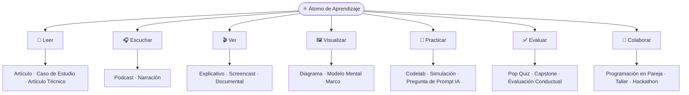
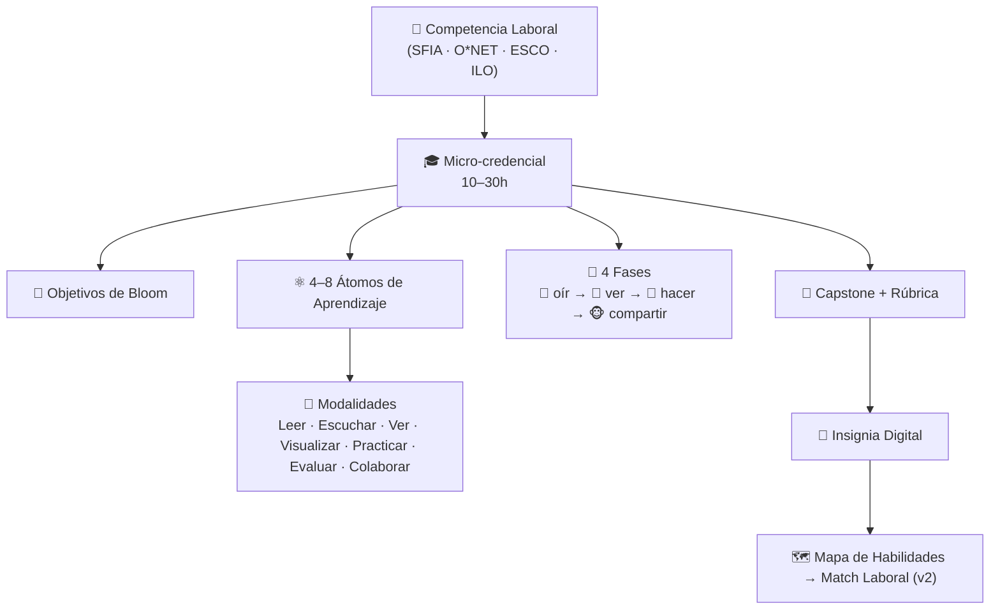
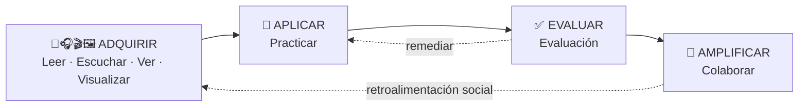

<p align="center">
  
</p>

<h1 align="center">🚀 Metodología ADA<br/>(Aprendizaje Digital Aplicado)</h1>

<p align="center">
  Innovar, aprender y aplicar. Una metodología abierta para desarrollar talento digital listo para el mundo laboral.
  <br />
  <br />
  🌐 <a href="https://github.com/ada-school/ada-methodology/blob/main/README.md">English Version</a> 🇬🇧 | <a href="https://github.com/ada-school/ada-methodology/blob/main/README-PT-BR.md">Versão em Português</a> 🇧🇷
</p>

<p align="center">
  
  
  
  
</p>

<br />

<p align="center">
  🎓 <strong>¿Eres nuevo?</strong> Aprende y domina la metodología creando una →
  <a href="LEARN.md"><strong>LEARN.md</strong></a> (una micro-credencial ADA autoguiada, en inglés).
</p>

---

## 🎯 Principio Pedagógico

> "Lo oigo y lo olvido, lo veo y lo recuerdo, lo hago y lo entiendo, lo comparto y lo multiplico."

La **metodología ADA** promueve el **aprendizaje experiencial y progresivo**, enfocada en desarrollar **competencias laborales del mundo real**. El aprendizaje está estructurado en **micro-credenciales modulares**, cada una compuesta por **átomos de aprendizaje**, la unidad instruccional más pequeña soportada por espacios de aprendizaje colaborativo y reflexivo.

---

## 🗺️ La Metodología de un Vistazo

<p align="center">
  
</p>

**ADA es un marco holístico que va más allá de las limitaciones de la evaluación tradicional
para construir competencias listas para el trabajo mediante un aprendizaje estructurado,
experiencial y colaborativo.** Funciona en dos niveles:

- **La filosofía guía** — el aprendizaje es un viaje del **consumo pasivo → la creación
  activa**, expresado en cuatro fases progresivas (*oír → ver → hacer → compartir*). Cada
  fase eleva deliberadamente la autonomía del estudiante: de la introducción autoguiada, a
  la exploración visual, a la práctica aplicada, a la colaboración y la reflexión.
- **Los bloques de construcción** — los **Átomos de Aprendizaje** (la unidad instruccional
  más pequeña, cada una con un solo objetivo) se combinan en **Micro-Credenciales** (10–30 h,
  unidades listas para el trabajo). Esta estructura modular hace el contenido **flexible,
  reutilizable y enfocado en habilidades laborales específicas**, y cada átomo recorre un
  flujo multiformato (**Leer → Escuchar → Ver → Visualizar → Practicar → Evaluar →
  Colaborar**) para que los conceptos se introduzcan, demuestren, apliquen y comprueben.

> En la **v2**, cada átomo y credencial se tipifica además con el **marco KSA**
> (Conocimientos · Habilidades · Aptitudes) y se mapea en un **mapa de habilidades** para que
> los estudiantes alcancen el mínimo requerido por una oportunidad laboral real. Ver [`specs/`](specs/).

---

##  ⚛ Átomo de Aprendizaje: La Unidad Modular Fundamental

Cada **átomo de aprendizaje** aborda un **único objetivo de aprendizaje** e integra teoría, práctica y evaluación alineadas con la Taxonomía de Bloom. Piénsalo como la **unidad de conocimiento autónoma más pequeña — un solo bloque de Lego**: un bloque tiene una forma y un color y ayuda a construir un castillo; un átomo aporta una habilidad específica.

<p align="center">
  
</p>

Un átomo se construye con **7 modalidades** agrupadas como **Adquirir → Aplicar → Evaluar → Amplificar**:

| Modalidad | Grupo | Propósito Pedagógico | Ejemplos de Subtipos |
| --------- | ----- | -------------------- | -------------------- |
| 📖 **Leer** | Adquirir | Introducir y contextualizar conceptos | Artículo, Artículo Técnico, Paper Científico, Caso de Estudio, Crónica, Diario |
| 🎧 **Escuchar** | Adquirir | Reforzar conceptos emocionalmente | Podcast, Narración, Audiorrelato, Musical, Entrevista |
| 🎬 **Ver** | Adquirir | Demostrar ideas o procesos | Explicativo, Short, Reel, Tutorial/Screencast, Documental, Serie |
| 🖼️ **Visualizar** | Adquirir | Codificar estructura y relaciones | Diagrama, Modelo Mental, Marco, Infografía, Mapa Mental, Diagrama de Flujo |
| 🧪 **Practicar** | Aplicar | Aplicar habilidades en contextos realistas | Laboratorio, Codelab, Reto de Prueba, Simulación, Juego de Roles, Pregunta de Prompt IA |
| ✅ **Evaluar** | Evaluar | Medir y evidenciar el aprendizaje | Pop Quiz (formativo), Cuestionario (sumativo), Mini-Rúbrica, Capstone, Evaluación Conductual |
| 🤝 **Colaborar** | Amplificar | Aprender socialmente; mostrar disposiciones | Programación en Pareja, Taller, Hackathon, Club de Lectura, Showcase, Mentoría |



> 🔗 Ver el **mapa completo y detallado** de cada subtipo con diagramas: [**Topología del Átomo de Aprendizaje**](specs/learning-atom-topology.md).
> 🔗 Ver también: [Plantilla de Átomo de Aprendizaje](templates/es/plantilla-atomo-aprendizaje.md)

---

## 🧱 Estructura de Micro-Credencial ADA

Las micro-credenciales ADA son experiencias de aprendizaje cortas (10-30 horas) diseñadas para desarrollar habilidades específicas de alto impacto laboral. Cada una incluye 4-8 **átomos de aprendizaje** y sigue un diseño instruccional estructurado.



### Componentes Estándar:

1. **Título de micro-credencial**: Claro, alineado con competencias.
2. **Competencia laboral objetivo**: Basada en marcos como SFIA, O*NET, ESCO.
3. **Prerrequisitos**: Conocimientos o habilidades requeridas.
4. **Objetivos de aprendizaje**: Basados en la Taxonomía de Bloom.
5. **Átomos de aprendizaje**: Unidades modulares y reutilizables.
6. **Laboratorio o experiencia práctica**: Aprendizaje aplicado.
7. **Evaluación**: Basada en rúbricas con evaluación Humana o IA.
8. **Proyecto capstone**: Un entregable compartible, listo para portafolio.

> 🔗 Ver: [Plantilla de Micro-Credencial](templates/es/plantilla-microcredencial-ada.md)

---

## 🔄 Fases del Aprendizaje ADA

### 🙉 Fase 1: *Introducción Autoguiada*

> "Lo oigo y lo olvido." — Confucio

> **Objetivo:** Introducir conceptos a través de contenido autodirigido
> Incluye: lecturas, podcasts, videos, casos de estudio cortos y verificaciones de comprensión.

---

### 🙈 Fase 2: *Exploración Visual*

> "Lo veo y lo recuerdo." — Confucio

> **Objetivo:** Reforzar el aprendizaje visual y experimentalmente
> Incluye: animaciones, escenarios de juego de roles, recorridos de casos y demostraciones guiadas.

---

### 🙊 Fase 3: *Práctica Aplicada*

> "Lo hago y lo entiendo." — Confucio

> **Objetivo:** Aplicar el conocimiento en desafíos prácticos
> Incluye: laboratorios prácticos, herramientas, simulaciones y evaluaciones basadas en rúbricas.

---

### 🐵 Fase 4: *Colaboración y Reflexión*

> "Lo comparto y lo multiplico." — Metodología ADA

> **Objetivo:** Promover el aprendizaje colaborativo y social
> Incluye: retroalimentación entre pares, co-creación, encuentros virtuales, foros y presentaciones de proyectos.

---

## 🌀 Flujo de Aprendizaje Basado en Átomos ADA



Esta secuencia crea **experiencias de aprendizaje adaptativas, inclusivas y enfocadas en habilidades**.

---

## 🎓 Resultados de Aprendizaje

Los estudiantes que completen las micro-credenciales ADA demostrarán:

* Dominio conceptual de temas relevantes.
* Aplicación práctica de habilidades relacionadas con el trabajo.
* Capacidades de evaluación y reflexión.
* Evidencia lista para portafolio del aprendizaje.
* Participación en aprendizaje colaborativo.

---

## 🤝 Dimensión Humana y Colaborativa

La metodología de aprendizaje ADA enfatiza el **elemento humano**, promoviendo:

* Sesiones dirigidas por mentores.
* Charlas de expertos invitados.
* Retroalimentación entre pares.
* Desafíos de equipos interdisciplinarios.
* Co-creación comunitaria.
* Oportunidades de presentación y oratoria.

---

## 📘 Ejemplo en Práctica

> 🔗 Ver el [**Ejemplo Completo de Micro-Credencial ART**](examples/art_microcredential_template.md)

Este ejemplo describe cómo estructurar átomos alrededor de una competencia laboral real usando los niveles de Bloom, desde comprender modelos de difusión hasta crear aplicaciones generadoras de imágenes.

---

## 🧬 ADA v2 — Marco KSA y Match Laboral

ADA está evolucionando a una **v2** que hace la metodología **precisa en competencias** y
**emparejable con empleos**, sin eliminar nada de la v1. Añade el **marco KSA —
Conocimientos, Habilidades, Aptitudes (Knowledge, Skills, Abilities)** — para que cada
objetivo esté *tipificado* y se enseñe/evalúe en consecuencia, además de un **mapa de
habilidades** que le dice al estudiante exactamente qué debe ganar para alcanzar el mínimo de
un empleo específico, y un **flujo de autoría con IA Generativa** para diseñarlo todo.

* 🧠 **Conocimiento (Knowledge)** — el *saber-qué / saber-por qué* (conceptos, hechos) → Leer · Escuchar · Ver.
* 🛠️ **Habilidad (Skill)** — el *saber-cómo* (procedimientos técnicos **y** humanos) → Practicar · laboratorios.
* 🌱 **Aptitud (Ability)** — el *poder-hacer / querer-hacer* (disposiciones duraderas y **actitudes**) → Colaborar · reflexionar, en múltiples ocasiones.

```
OFERTA LABORAL → [IA Generativa + validación humana] → PERFIL KSA OBJETIVO
              → diferencia con el estudiante → MAPA DE HABILIDADES (qué ganar) → % DE MATCH
              → diseñar micro-credenciales y átomos → ganar insignias verificadas → LISTO PARA EL TRABAJO
```

> 🔗 Especificaciones: [**`specs/`**](specs/) · Comienza por el
> [Marco KSA de ADA v2](specs/ada-v2-ksa-framework.md).
> 🔗 Para asistentes de IA que trabajen en este repositorio: [**`CLAUDE.md`**](CLAUDE.md).

**Ejemplos KSA aplicados** (competencias técnicas, humanas y de actitud):

* 🛠️ [Habilidad técnica — Fundamentos de API REST](examples/ksa-technical-skill-rest-api.md)
* 🤝 [Habilidad humana — Dar y Recibir Retroalimentación](examples/ksa-human-skill-feedback.md)
* 🌱 [Actitud — Adaptabilidad y Mentalidad de Crecimiento](examples/ksa-attitude-adaptability.md)
* 🗺️ [De principio a fin — Oferta laboral → mapa de habilidades → listo para el trabajo](examples/skills-map-job-match-frontend.md)
* 🌱 [**Curso completo** — microcredencial de Mentalidad de Crecimiento](examples/growth-mindset-micro-credential/README.md) · 🖥️ [abrir el `course.html` interactivo](examples/growth-mindset-micro-credential/course.html) *(contenido en inglés)*
* 🐍 [**Curso completo** — microcredencial de Variables en Python (principiante)](examples/python-variables-micro-credential/README.md) · 🖥️ [abrir el `course.html` interactivo](examples/python-variables-micro-credential/course.html) *(contenido en inglés)*
* 🎓 [**Curso completo** — microcredencial de Diseñador de la Metodología ADA](examples/ada-methodology-designer-micro-credential/README.md) · 🖥️ [abrir el `course.html` interactivo](examples/ada-methodology-designer-micro-credential/course.html) *(contenido en inglés)*
* 🗣️ [**Curso completo** — microcredencial de Comunicación Efectiva](examples/effective-communication-micro-credential/README.md) · 🖥️ [abrir el `course.html` interactivo](examples/effective-communication-micro-credential/course.html) *(contenido en inglés)*
* 🧭 [**Curso completo** — microcredencial de Autoaprendizaje (en línea + IA)](examples/self-learning-micro-credential/README.md) · 🖥️ [abrir el `course.html` interactivo](examples/self-learning-micro-credential/course.html) *(contenido en inglés)*
* 🧩 [**Curso completo** — microcredencial de Resolución de Problemas](examples/problem-solving-micro-credential/README.md) · 🖥️ [abrir el `course.html` interactivo](examples/problem-solving-micro-credential/course.html) *(contenido en inglés)*
* 🧠 [**Curso completo** — microcredencial de Pensamiento Crítico](examples/critical-thinking-micro-credential/README.md) · 🖥️ [abrir el `course.html` interactivo](examples/critical-thinking-micro-credential/course.html) *(contenido en inglés)*
* 💡 [**Curso completo** — microcredencial de Innovación y Creatividad](examples/innovation-creativity-micro-credential/README.md) · 🖥️ [abrir el `course.html` interactivo](examples/innovation-creativity-micro-credential/course.html) *(contenido en inglés)*

---

## 🧭 Del Perfil del Cargo a la Ruta de Aprendizaje

ADA es un **sistema de aprendizaje dinámico**: eliges un **cargo real con demanda de
contratación** (p. ej. *Científico/a de Datos*) y la metodología lo **descompone en una ruta
conectada de micro-credenciales**, de modo que las habilidades que ganas suman ese cargo.

La práctica clave es **cómo descubrimos las habilidades en primer lugar** — *triangulamos*
tres fuentes y dejamos que la **IA sintetice** mientras los **humanos validan**:

1. 📚 **Marcos** — O\*NET, ESCO, SFIA, ILO ISCO para una base canónica y citable.
2. 📈 **Mercado en vivo** — ofertas laborales reales y señales de demanda de lo que piden hoy.
3. 👀 **Observación del trabajo de altos desempeños** — paneles DACUM, acompañamiento (shadowing)
   y Entrevistas de Eventos Conductuales para capturar lo que los expertos *realmente hacen* y
   los **diferenciadores** (a menudo Aptitudes/actitudes duraderas) que definen el desempeño real.

Un cargo se convierte así en un **árbol medible**:

```
CARGO → DEBERES → TAREAS → KSA (al nivel de alto desempeño, 0–4)
      → ÁTOMOS DE APRENDIZAJE (unidades medibles + evidencia) → MICRO-CREDENCIALES
      → RUTA secuenciada → MAPA DE HABILIDADES + % DE MATCH (tu brecha medible)
```

Cada KSA lleva un **nivel objetivo y criterios de desempeño observables** tomados del trabajo
real, así que "aprobar" significa *poder hacer el trabajo como un alto desempeño* — y la
**brecha de habilidades siempre es un número** que indica al estudiante exactamente qué ganar
a continuación.

> 🔗 Metodología y prompts de IA: [**Mapeo de Cargo a Credencial**](specs/role-to-credential-mapping.md)
> · Ejemplo aplicado: [**Procesamiento de Datos → ruta a Científico/a de Datos**](examples/role-data-scientist-pathway.md).

---

## 🛠 Cómo Construir una Micro-Credencial ADA

1. Identificar una **competencia laboral del mundo real**.
2. Definir **objetivos de aprendizaje** a través de los niveles de Bloom.
3. Diseñar **átomos de aprendizaje** para cada objetivo.
4. Desarrollar **laboratorios prácticos o simulaciones**.
5. Crear **evaluaciones formativas y sumativas**.
6. Especificar un **entregable final**.
7. Integrar **oportunidades colaborativas**.

> 🔗 Usar la [Guía Paso a Paso](guides/guia-diseno-curriculos.md)

---

## 🧭 Recursos para Diseñadores de Currículos

* 🎓 [**Aprende ADA (empieza aquí)** — domina la metodología creando una credencial.](LEARN.md)
* [Guía Paso a Paso](guides/guia-diseno-curriculos.md).
* [Plantilla de Átomo de Aprendizaje.](templates/es/plantilla-atomo-aprendizaje.md)
* [Ejemplos de Átomos de Aprendizaje.](examples/learning-atom-art.md)
* [Plantilla de Micro-Credencial.](templates/es/plantilla-microcredencial-ada.md)
* [Ejemplo de Micro-Credencial.](examples/art_microcredential_template.md)

### 🧬 v2 (KSA · Mapa de Habilidades · IA Generativa)

> Las especificaciones de la v2 se mantienen en inglés como fuente canónica.

* [Marco KSA de ADA v2 (empieza aquí).](specs/ada-v2-ksa-framework.md)
* [Mapeo de Cargo a Credencial (perfil del cargo → ruta, IA + observación de altos desempeños).](specs/role-to-credential-mapping.md)
* [Topología del Átomo de Aprendizaje (modalidades y subtipos, con diagramas).](specs/learning-atom-topology.md)
* [Taxonomía KSA.](specs/ksa-taxonomy.md)
* [Mapa de Habilidades y Match Laboral.](specs/skills-map-and-job-matching.md)
* [Flujo de Autoría con IA Generativa.](specs/genai-authoring-workflow.md)
* [Esquema de Micro-Credencial v2.](specs/micro-credential-v2-schema.md)
* [Ejemplos KSA: técnico / humano / actitud / match laboral.](examples/skills-map-job-match-frontend.md)
* [Ejemplo de ruta de cargo: Procesamiento de Datos → Científico/a de Datos.](examples/role-data-scientist-pathway.md)
* [Curso completo: microcredencial de Mentalidad de Crecimiento](examples/growth-mindset-micro-credential/README.md) (con [`course.html`](examples/growth-mindset-micro-credential/course.html) interactivo).
* [Curso completo: microcredencial de Variables en Python](examples/python-variables-micro-credential/README.md) — una habilidad técnica para principiantes (con [`course.html`](examples/python-variables-micro-credential/course.html) interactivo).
* 🎓 [Curso completo: microcredencial de Diseñador de la Metodología ADA](examples/ada-methodology-designer-micro-credential/README.md) — certifícate para diseñar credenciales ADA (con [`course.html`](examples/ada-methodology-designer-micro-credential/course.html) interactivo).
* 🗣️ [Curso completo: microcredencial de Comunicación Efectiva](examples/effective-communication-micro-credential/README.md) — una habilidad humana casi universal (con [`course.html`](examples/effective-communication-micro-credential/course.html) interactivo).
* 🧭 [Curso completo: microcredencial de Autoaprendizaje](examples/self-learning-micro-credential/README.md) — aprende cualquier cosa en línea y con IA, la meta-habilidad (con [`course.html`](examples/self-learning-micro-credential/course.html) interactivo).
* 🧩 [Curso completo: microcredencial de Resolución de Problemas](examples/problem-solving-micro-credential/README.md) — definir, diagnosticar y decidir (con [`course.html`](examples/problem-solving-micro-credential/course.html) interactivo).
* 🧠 [Curso completo: microcredencial de Pensamiento Crítico](examples/critical-thinking-micro-credential/README.md) — razonar, evaluar evidencia y defender una postura (con [`course.html`](examples/critical-thinking-micro-credential/course.html) interactivo).
* 💡 [Curso completo: microcredencial de Innovación y Creatividad](examples/innovation-creativity-micro-credential/README.md) — reformular, generar ideas, prototipar y presentar (con [`course.html`](examples/innovation-creativity-micro-credential/course.html) interactivo).

---

## 📄 Certificación y Reconocimiento

Los graduados reciben:

* Retroalimentación evaluada por IA o humanos.
* Proyecto capstone compartible.
* **Insignia digital compatible con LinkedIn**.
* Reconocimiento de habilidades verificadas y listas para el trabajo.

---

## 💬 Cómo Contribuir

Cualquier educador u organización puede:

* Sugerir mejoras → [Abrir un Issue](https://github.com/ada-school/ada-methodology/issues).
* Crear y publicar sus propias micro-credenciales.
* Adaptar y traducir recursos.

> 📘 Ver: [Guía de Contribución](https://github.com/ada-school/ada-methodology/blob/main/CONTRIBUTING.md)

---

## 🏫 Para Instituciones Educativas

¿Eres parte de una escuela, bootcamp o iniciativa de aprendizaje?

Te invitamos a:

* Adoptar la Metodología ADA.
* Co-crear experiencias de aprendizaje.
* Ayudar a las personas a dominar habilidades que importan.
* Compartir tu trabajo con la comunidad.

📧 Contáctanos: [ada@ada-school.org](mailto:ada@ada-school.org)

---

## 📜 Licencia

Este marco está licenciado bajo [Creative Commons Attribution-ShareAlike 4.0 (CC BY-SA 4.0)](https://creativecommons.org/licenses/by-sa/4.0/).

✅ Puedes:

* Usar, adaptar y distribuir libremente
* Atribuir a **Ada School** como la fuente
* Compartir mejoras bajo la misma licencia

---

<p align="center">
  
  <br />
  <strong>Hecho con 💙 por <a href="https://ada-school.org/" target="_blank">Ada School</a></strong>
</p>

---
