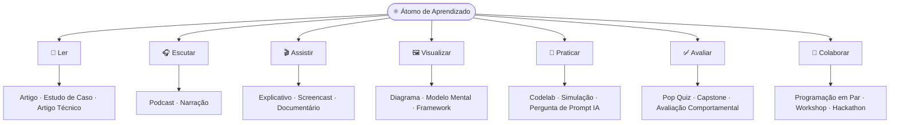
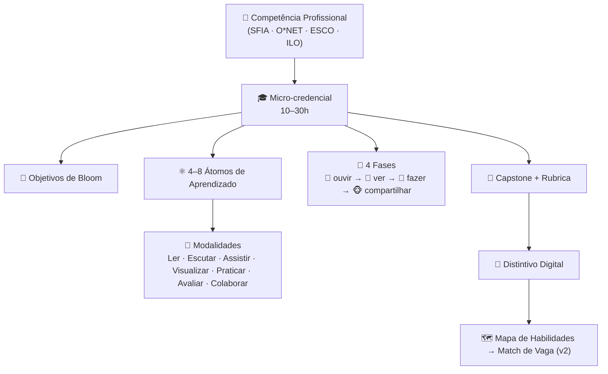
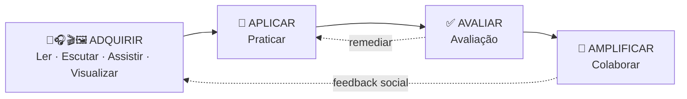

<p align="center">
  
</p>

<h1 align="center">🚀 Metodologia ADA<br/>(Aprendizado Digital Aplicado)</h1>

<p align="center">
  Inovar, aprender e aplicar. Uma metodologia aberta para desenvolver talentos digitais prontos para o mercado de trabalho.
  <br />
  <br />
  🌐 <a href="https://github.com/ada-school/ada-methodology/blob/main/README.md">English Version</a> 🇬🇧 | <a href="https://github.com/ada-school/ada-methodology/blob/main/README-ES.md">Versión en Español</a> 🇨🇴
</p>

<p align="center">
  
  
  
  
</p>

<br />

<p align="center">
  🎓 <strong>É novo por aqui?</strong> Aprenda e domine a metodologia criando uma →
  <a href="LEARN.md"><strong>LEARN.md</strong></a> (uma micro-credencial ADA autoguiada, em inglês).
</p>

---

## 🎯 Princípio Pedagógico

> "Eu ouço e esqueço, eu vejo e me lembro, eu faço e entendo, eu compartilho e multiplico."

A **metodologia ADA** promove **aprendizado experiencial e progressivo**, focada no desenvolvimento de **competências profissionais do mundo real**. O aprendizado é estruturado em **micro-credenciais modulares**, cada uma composta por **átomos de aprendizado**, a menor unidade instrucional apoiada por espaços de aprendizado colaborativo e reflexivo.

---

## 🗺️ A Metodologia em um Relance

<p align="center">
  
</p>

**ADA é um framework holístico que vai além das limitações da avaliação tradicional para
construir competências prontas para o trabalho por meio de aprendizado estruturado,
experiencial e colaborativo.** Ele funciona em dois níveis:

- **A filosofia guia** — o aprendizado é uma jornada do **consumo passivo → à criação
  ativa**, expressa em quatro fases progressivas (*ouvir → ver → fazer → compartilhar*). Cada
  fase eleva deliberadamente a autonomia do estudante: da introdução autoguiada, à exploração
  visual, à prática aplicada, à colaboração e reflexão.
- **Os blocos de construção** — os **Átomos de Aprendizado** (a menor unidade instrucional,
  cada uma com um único objetivo) se combinam em **Micro-Credenciais** (10–30 h, unidades
  prontas para o trabalho). Essa estrutura modular torna o conteúdo **flexível, reutilizável e
  focado em habilidades profissionais específicas**, e cada átomo percorre um fluxo
  multiformato (**Ler → Escutar → Assistir → Visualizar → Praticar → Avaliar →
  Colaborar**) para que os conceitos sejam introduzidos, demonstrados, aplicados e comprovados.

> Na **v2**, cada átomo e credencial é também tipificado com o **framework KSA**
> (Conhecimentos · Habilidades · Aptidões) e mapeado em um **mapa de habilidades** para que
> os estudantes atinjam o mínimo exigido por uma oportunidade de trabalho real. Ver [`specs/`](specs/).

---

##  ⚛ Átomo de Aprendizado: A Unidade Modular Fundamental

Cada **átomo de aprendizado** aborda um **único objetivo de aprendizado** e integra teoria, prática e avaliação alinhadas à Taxonomia de Bloom. Pense nele como a **menor unidade autônoma de conhecimento — um único bloco de Lego**: um bloco tem uma forma e uma cor e ajuda a construir um castelo; um átomo fornece uma habilidade específica.

<p align="center">
  
</p>

Um átomo é construído a partir de **7 modalidades** agrupadas como **Adquirir → Aplicar → Avaliar → Amplificar**:

| Modalidade | Grupo | Propósito Pedagógico | Exemplos de Subtipos |
| ---------- | ----- | -------------------- | -------------------- |
| 📖 **Ler** | Adquirir | Introduzir e contextualizar conceitos | Artigo, Artigo Técnico, Paper Científico, Estudo de Caso, Crônica, Diário |
| 🎧 **Escutar** | Adquirir | Reforçar conceitos emocionalmente | Podcast, Narração, Audiodrama, Musical, Entrevista |
| 🎬 **Assistir** | Adquirir | Demonstrar ideias ou processos | Explicativo, Short, Reel, Tutorial/Screencast, Documentário, Série |
| 🖼️ **Visualizar** | Adquirir | Codificar estrutura e relações | Diagrama, Modelo Mental, Framework, Infográfico, Mapa Mental, Fluxograma |
| 🧪 **Praticar** | Aplicar | Aplicar habilidades em contextos realistas | Laboratório, Codelab, Desafio de Teste, Simulação, Role-Play, Pergunta de Prompt IA |
| ✅ **Avaliar** | Avaliar | Medir e evidenciar o aprendizado | Pop Quiz (formativo), Questionário (somativo), Mini-Rubrica, Capstone, Avaliação Comportamental |
| 🤝 **Colaborar** | Amplificar | Aprender socialmente; mostrar disposições | Programação em Par, Workshop, Hackathon, Clube de Leitura, Showcase, Mentoria |



> 🔗 Ver o **mapa completo e detalhado** de cada subtipo com diagramas: [**Topologia do Átomo de Aprendizado**](specs/learning-atom-topology.md).
> 🔗 Ver também: [Modelo de Átomo de Aprendizado](templates/pt-br/modelo-atomo-aprendizado.md)

---

## 🧱 Estrutura de Micro-Credencial ADA

As micro-credenciais ADA são experiências de aprendizado curtas (10-30 horas) projetadas para desenvolver habilidades específicas de alto impacto profissional. Cada uma inclui 4-8 **átomos de aprendizado** e segue um design instrucional estruturado.



### Componentes Padrão:

1. **Título da micro-credencial**: Claro, alinhado com competências.
2. **Competência profissional alvo**: Baseada em frameworks como SFIA, O*NET, ESCO.
3. **Pré-requisitos**: Conhecimentos ou habilidades necessários.
4. **Objetivos de aprendizado**: Baseados na Taxonomia de Bloom.
5. **Átomos de aprendizado**: Unidades modulares e reutilizáveis.
6. **Laboratório ou experiência prática**: Aprendizado aplicado.
7. **Avaliação**: Baseada em rubricas com avaliação Humana ou IA.
8. **Projeto capstone**: Uma entrega compartilhável, pronta para portfólio.

> 🔗 Ver: [Modelo de Micro-Credencial](templates/pt-br/modelo-microcredencial-ada.md)

---

## 🔄 Fases do Aprendizado ADA

### 🙉 Fase 1: *Introdução Autoguiada*

> "Eu ouço e esqueço." — Confúcio

> **Objetivo:** Introduzir conceitos através de conteúdo autodirigido
> Inclui: leituras, podcasts, vídeos, estudos de caso curtos e verificações de compreensão.

---

### 🙈 Fase 2: *Exploração Visual*

> "Eu vejo e me lembro." — Confúcio

> **Objetivo:** Reforçar o aprendizado visual e experimentalmente
> Inclui: animações, cenários de interpretação, percursos de casos e demonstrações guiadas.

---

### 🙊 Fase 3: *Prática Aplicada*

> "Eu faço e entendo." — Confúcio

> **Objetivo:** Aplicar conhecimento em desafios práticos
> Inclui: laboratórios práticos, ferramentas, simulações e avaliações baseadas em rubricas.

---

### 🐵 Fase 4: *Colaboração e Reflexão*

> "Eu compartilho e multiplico." — Metodologia ADA

> **Objetivo:** Promover aprendizado colaborativo e social
> Inclui: feedback entre pares, cocriação, encontros virtuais, fóruns e apresentações de projetos.

---

## 🌀 Fluxo de Aprendizado Baseado em Átomos ADA



Esta sequência cria **experiências de aprendizado adaptativas, inclusivas e focadas em habilidades**.

---

## 🎓 Resultados do Aprendizado

Estudantes que completarem as micro-credenciais ADA demonstrarão:

* Domínio conceitual de tópicos relevantes.
* Aplicação prática de habilidades relacionadas ao trabalho.
* Capacidades de avaliação e reflexão.
* Evidência pronta para portfólio do aprendizado.
* Engajamento em aprendizado colaborativo.

---

## 🤝 Dimensão Humana e Colaborativa

A metodologia de aprendizado ADA enfatiza o **elemento humano**, promovendo:

* Sessões conduzidas por mentores.
* Palestras de especialistas convidados.
* Feedback entre pares.
* Desafios de equipes interdisciplinares.
* Cocriação comunitária.
* Oportunidades de apresentação e oratória.

---

## 📘 Exemplo na Prática

> 🔗 Ver o [**Exemplo Completo de Micro-Credencial ART**](examples/art_microcredential_template.md)

Este exemplo descreve como estruturar átomos em torno de uma competência profissional real usando os níveis de Bloom, desde compreender modelos de difusão até criar aplicações geradoras de imagens.

---

## 🧬 ADA v2 — Framework KSA e Match de Vagas

A ADA está evoluindo para uma **v2** que torna a metodologia **precisa em competências** e
**combinável com vagas**, sem remover nada da v1. Ela adiciona o **framework KSA —
Conhecimentos, Habilidades, Aptidões (Knowledge, Skills, Abilities)** — para que cada
objetivo seja *tipificado* e ensinado/avaliado de acordo, além de um **mapa de habilidades**
que diz ao estudante exatamente o que precisa conquistar para atingir o mínimo de uma vaga
específica, e um **fluxo de autoria com IA Generativa** para projetar tudo isso.

* 🧠 **Conhecimento (Knowledge)** — o *saber-o quê / saber-por quê* (conceitos, fatos) → Ler · Escutar · Assistir.
* 🛠️ **Habilidade (Skill)** — o *saber-como* (procedimentos técnicos **e** humanos) → Praticar · laboratórios.
* 🌱 **Aptidão (Ability)** — o *poder-fazer / querer-fazer* (disposições duradouras e **atitudes**) → Colaborar · refletir, em múltiplas ocasiões.

```
VAGA DE EMPREGO → [IA Generativa + validação humana] → PERFIL KSA ALVO
                → diferença com o estudante → MAPA DE HABILIDADES (o que conquistar) → % DE MATCH
                → projetar micro-credenciais e átomos → conquistar distintivos verificados → PRONTO PARA O TRABALHO
```

> 🔗 Especificações: [**`specs/`**](specs/) · Comece pelo
> [Framework KSA da ADA v2](specs/ada-v2-ksa-framework.md).
> 🔗 Para assistentes de IA que trabalham neste repositório: [**`CLAUDE.md`**](CLAUDE.md).

**Exemplos KSA aplicados** (competências técnicas, humanas e de atitude):

* 🛠️ [Habilidade técnica — Fundamentos de API REST](examples/ksa-technical-skill-rest-api.md)
* 🤝 [Habilidade humana — Dar e Receber Feedback](examples/ksa-human-skill-feedback.md)
* 🌱 [Atitude — Adaptabilidade e Mentalidade de Crescimento](examples/ksa-attitude-adaptability.md)
* 🗺️ [Ponta a ponta — Vaga → mapa de habilidades → pronto para o trabalho](examples/skills-map-job-match-frontend.md)
* 🌱 [**Curso completo** — microcredencial de Mentalidade de Crescimento](examples/growth-mindset-micro-credential/README.md) · 🖥️ [abrir o `course.html` interativo](examples/growth-mindset-micro-credential/course.html) *(conteúdo em inglês)*
* 🐍 [**Curso completo** — microcredencial de Variáveis em Python (iniciante)](examples/python-variables-micro-credential/README.md) · 🖥️ [abrir o `course.html` interativo](examples/python-variables-micro-credential/course.html) *(conteúdo em inglês)*
* 🎓 [**Curso completo** — microcredencial de Designer da Metodologia ADA](examples/ada-methodology-designer-micro-credential/README.md) · 🖥️ [abrir o `course.html` interativo](examples/ada-methodology-designer-micro-credential/course.html) *(conteúdo em inglês)*
* 🗣️ [**Curso completo** — microcredencial de Comunicação Eficaz](examples/effective-communication-micro-credential/README.md) · 🖥️ [abrir o `course.html` interativo](examples/effective-communication-micro-credential/course.html) *(conteúdo em inglês)*
* 🧭 [**Curso completo** — microcredencial de Autoaprendizagem (online + IA)](examples/self-learning-micro-credential/README.md) · 🖥️ [abrir o `course.html` interativo](examples/self-learning-micro-credential/course.html) *(conteúdo em inglês)*
* 🧩 [**Curso completo** — microcredencial de Resolução de Problemas](examples/problem-solving-micro-credential/README.md) · 🖥️ [abrir o `course.html` interativo](examples/problem-solving-micro-credential/course.html) *(conteúdo em inglês)*

---

## 🧭 Do Perfil da Vaga à Trilha de Aprendizado

A ADA é um **sistema de aprendizado dinâmico**: você escolhe uma **vaga real com demanda de
contratação** (ex.: *Cientista de Dados*) e a metodologia a **decompõe em uma trilha conectada
de micro-credenciais**, de modo que as habilidades conquistadas somem essa vaga.

A prática-chave é **como descobrimos as habilidades antes de tudo** — *triangulamos* três
fontes e deixamos a **IA sintetizar** enquanto os **humanos validam**:

1. 📚 **Frameworks** — O\*NET, ESCO, SFIA, ILO ISCO para uma base canônica e citável.
2. 📈 **Mercado ao vivo** — vagas reais e sinais de demanda do que os empregadores pedem hoje.
3. 👀 **Observação do trabalho de alto desempenho** — painéis DACUM, acompanhamento (shadowing)
   e Entrevistas de Eventos Comportamentais para capturar o que os especialistas *realmente fazem*
   e os **diferenciais** (muitas vezes Aptidões/atitudes duradouras) que definem o desempenho real.

Uma vaga torna-se assim uma **árvore mensurável**:

```
VAGA → ATRIBUIÇÕES → TAREFAS → KSA (no nível de alto desempenho, 0–4)
     → ÁTOMOS DE APRENDIZADO (unidades mensuráveis + evidência) → MICRO-CREDENCIAIS
     → TRILHA sequenciada → MAPA DE HABILIDADES + % DE MATCH (sua lacuna mensurável)
```

Cada KSA carrega um **nível-alvo e critérios de desempenho observáveis** retirados do trabalho
real, então "passar" significa *conseguir fazer o trabalho como um alto desempenho* — e a
**lacuna de habilidades é sempre um número** que diz ao estudante exatamente o que conquistar
em seguida.

> 🔗 Metodologia e prompts de IA: [**Mapeamento de Vaga para Credencial**](specs/role-to-credential-mapping.md)
> · Exemplo aplicado: [**Processamento de Dados → trilha de Cientista de Dados**](examples/role-data-scientist-pathway.md).

---

## 🛠 Como Construir uma Micro-Credencial ADA

1. Identificar uma **competência profissional do mundo real**.
2. Definir **objetivos de aprendizado** através dos níveis de Bloom.
3. Projetar **átomos de aprendizado** para cada objetivo.
4. Desenvolver **laboratórios práticos ou simulações**.
5. Criar **avaliações formativas e somativas**.
6. Especificar uma **entrega final**.
7. Integrar **oportunidades colaborativas**.

> 🔗 Usar o [Guia Passo a Passo](guides/guia-design-curriculo.md)

---

## 🧭 Recursos para Designers de Currículo

* 🎓 [**Aprenda ADA (comece aqui)** — domine a metodologia criando uma credencial.](LEARN.md)
* [Guia Passo a Passo](guides/guia-design-curriculo.md).
* [Modelo de Átomo de Aprendizado.](templates/pt-br/modelo-atomo-aprendizado.md)
* [Exemplos de Átomos de Aprendizado.](examples/learning-atom-art.md)
* [Modelo de Micro-Credencial.](templates/pt-br/modelo-microcredencial-ada.md)
* [Exemplo de Micro-Credencial.](examples/art_microcredential_template.md)

### 🧬 v2 (KSA · Mapa de Habilidades · IA Generativa)

> As especificações da v2 são mantidas em inglês como fonte canônica.

* [Framework KSA da ADA v2 (comece aqui).](specs/ada-v2-ksa-framework.md)
* [Mapeamento de Vaga para Credencial (perfil da vaga → trilha, IA + observação de alto desempenho).](specs/role-to-credential-mapping.md)
* [Topologia do Átomo de Aprendizado (modalidades e subtipos, com diagramas).](specs/learning-atom-topology.md)
* [Taxonomia KSA.](specs/ksa-taxonomy.md)
* [Mapa de Habilidades e Match de Vagas.](specs/skills-map-and-job-matching.md)
* [Fluxo de Autoria com IA Generativa.](specs/genai-authoring-workflow.md)
* [Esquema de Micro-Credencial v2.](specs/micro-credential-v2-schema.md)
* [Exemplos KSA: técnico / humano / atitude / match de vaga.](examples/skills-map-job-match-frontend.md)
* [Exemplo de trilha de vaga: Processamento de Dados → Cientista de Dados.](examples/role-data-scientist-pathway.md)
* [Curso completo: microcredencial de Mentalidade de Crescimento](examples/growth-mindset-micro-credential/README.md) (com [`course.html`](examples/growth-mindset-micro-credential/course.html) interativo).
* [Curso completo: microcredencial de Variáveis em Python](examples/python-variables-micro-credential/README.md) — uma habilidade técnica para iniciantes (com [`course.html`](examples/python-variables-micro-credential/course.html) interativo).
* 🎓 [Curso completo: microcredencial de Designer da Metodologia ADA](examples/ada-methodology-designer-micro-credential/README.md) — certifique-se para projetar credenciais ADA (com [`course.html`](examples/ada-methodology-designer-micro-credential/course.html) interativo).
* 🗣️ [Curso completo: microcredencial de Comunicação Eficaz](examples/effective-communication-micro-credential/README.md) — uma habilidade humana quase universal (com [`course.html`](examples/effective-communication-micro-credential/course.html) interativo).
* 🧭 [Curso completo: microcredencial de Autoaprendizagem](examples/self-learning-micro-credential/README.md) — aprenda qualquer coisa online e com IA, a meta-habilidade (com [`course.html`](examples/self-learning-micro-credential/course.html) interativo).
* 🧩 [Curso completo: microcredencial de Resolução de Problemas](examples/problem-solving-micro-credential/README.md) — definir, diagnosticar e decidir (com [`course.html`](examples/problem-solving-micro-credential/course.html) interativo).

---

## 📄 Certificação e Reconhecimento

Os graduados recebem:

* Feedback avaliado por IA ou humanos.
* Projeto capstone compartilhável.
* **Distintivo digital compatível com LinkedIn**.
* Reconhecimento de habilidades verificadas e prontas para o trabalho.

---

## 💬 Como Contribuir

Qualquer educador ou organização pode:

* Sugerir melhorias → [Abrir uma Issue](https://github.com/ada-school/ada-methodology/issues).
* Criar e publicar suas próprias micro-credenciais.
* Adaptar e traduzir recursos.

> 📘 Ver: [Guia de Contribuição](https://github.com/ada-school/ada-methodology/blob/main/CONTRIBUTING.md)

---

## 🏫 Para Instituições Educacionais

Você faz parte de uma escola, bootcamp ou iniciativa de aprendizado?

Convidamos você a:

* Adotar a Metodologia ADA.
* Cocriar experiências de aprendizado.
* Ajudar pessoas a dominar habilidades que importam.
* Compartilhar seu trabalho com a comunidade.

📧 Entre em contato: [ada@ada-school.org](mailto:ada@ada-school.org)

---

## 📜 Licença

Este framework está licenciado sob [Creative Commons Attribution-ShareAlike 4.0 (CC BY-SA 4.0)](https://creativecommons.org/licenses/by-sa/4.0/).

✅ Você pode:

* Usar, adaptar e distribuir livremente
* Atribuir à **Ada School** como a fonte
* Compartilhar melhorias sob a mesma licença

---

<p align="center">
  
  <br />
  <strong>Feito com 💙 pela <a href="https://ada-school.org/" target="_blank">Ada School</a></strong>
</p>

---
