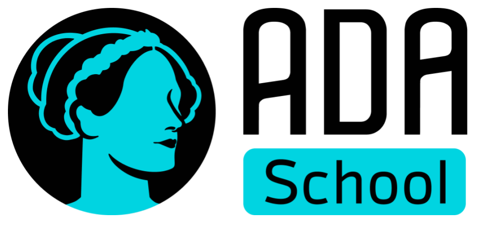
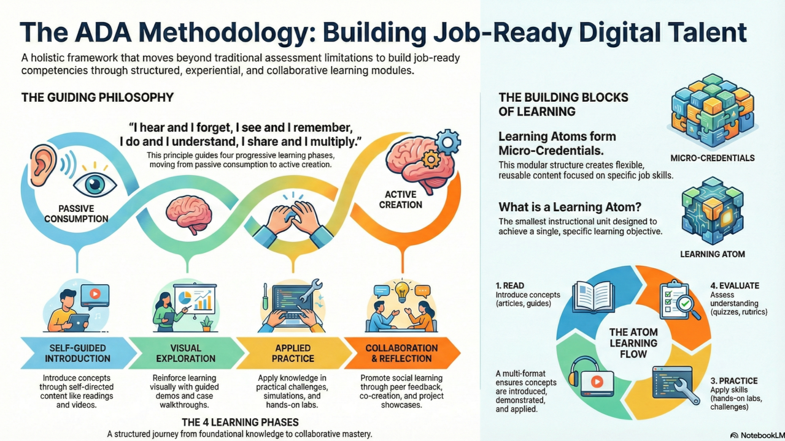
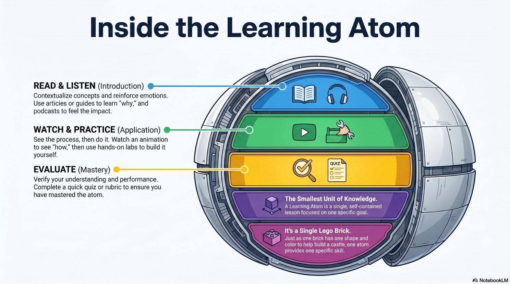
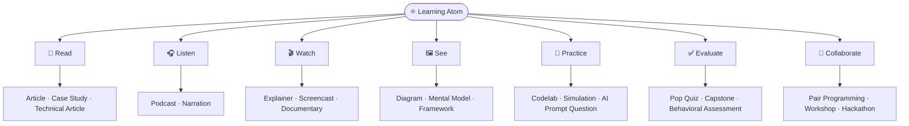
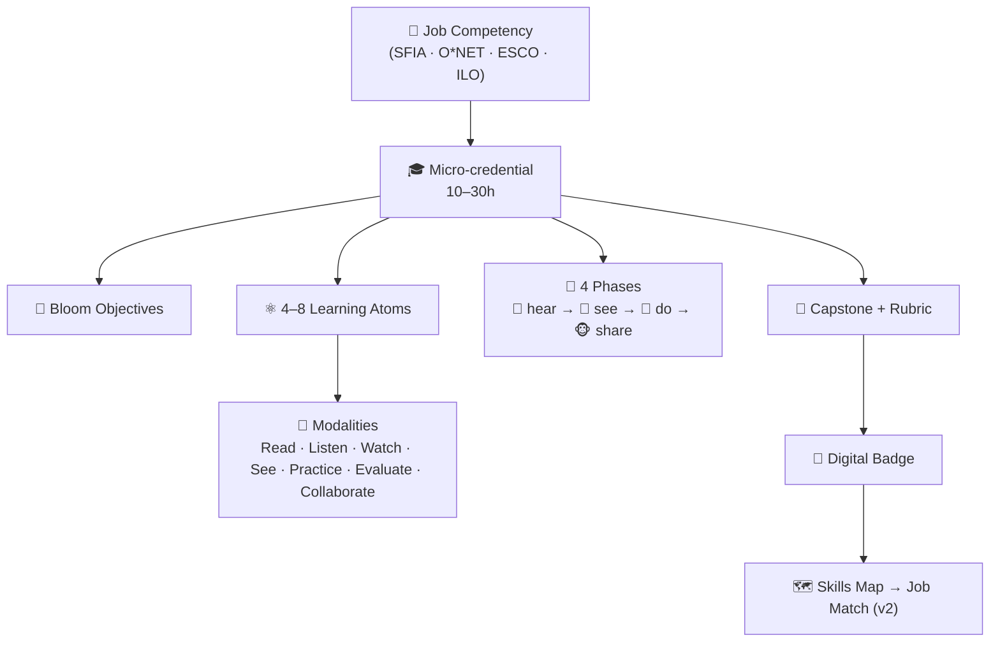
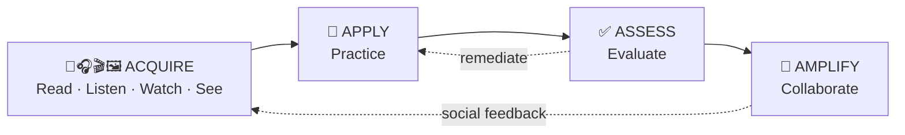

<p align="center">
  
</p>

<h1 align="center">🚀 ADA Methodology<br/>(Applied Digital Apprenticeship)</h1>

<p align="center">
  Innovate, learn, and apply. An open methodology to develop job-ready digital talent.
  <br />
  <br />
  🌐 <a href="https://github.com/ada-school/ada-methodology/blob/main/README-ES.md">Versión en Español</a> 🇨🇴 | <a href="https://github.com/ada-school/ada-methodology/blob/main/README-PT-BR.md">Versão em Português</a> 🇧🇷
</p>

<p align="center">
  
  
  
  
</p>

<br />

<p align="center">
  🎓 <strong>New here?</strong> Learn & master the methodology by building one →
  <a href="LEARN.md"><strong>LEARN.md</strong></a> (a self-paced ADA micro-credential).
</p>

---

## 🎯 Pedagogical Principle

> “I hear and I forget, I see and I remember, I do and I understand, I share and I multiply.”

The **ADA methodology** promotes **experiential and progressive learning**, focused on developing **real-world job competencies**. Learning is structured in **modular micro-credentials**, each composed of **learning atoms**, the smallest instructional unit supported by collaborative and reflective learning spaces.

---

## 🗺️ The Methodology at a Glance

<p align="center">
  
</p>

**ADA is a holistic framework that moves beyond traditional assessment limitations to build
job-ready competencies through structured, experiential, and collaborative learning.** It
works at two levels:

- **The guiding philosophy** — learning is a journey from **passive consumption → active
  creation**, expressed through four progressive phases (*hear → see → do → share*). Each
  phase deliberately raises the learner's agency: from self-guided introduction, to visual
  exploration, to applied practice, to collaboration and reflection.
- **The building blocks** — **Learning Atoms** (the smallest instructional unit, each with
  one objective) combine into **Micro-Credentials** (10–30h, job-ready units). This modular
  structure makes content **flexible, reusable, and focused on specific job skills**, and
  every atom runs a multi-format flow (**Read → Listen → Watch → See → Practice →
  Evaluate → Collaborate**) so concepts are introduced, demonstrated, applied, and proven.

> In **v2**, each atom and credential is additionally typed with the **KSA framework**
> (Knowledge · Skills · Abilities) and mapped to a **skills map** so learners can match the
> minimum bar for a real job opportunity. See [`specs/`](specs/).

---

##  ⚛ Learning Atom: The Foundational Modular Unit

Each **learning atom** addresses a **single learning objective**, and integrates theory, practice, and evaluation aligned to Bloom’s Taxonomy. Think of it as the **smallest self-contained unit of knowledge — a single Lego brick**: one brick has one shape and color and helps build a castle; one atom provides one specific skill.

<p align="center">
  
</p>

An atom is built from **7 modalities** grouped as **Acquire → Apply → Assess → Amplify**:

| Modality | Group | Pedagogical Purpose | Sub-type Examples |
| -------- | ----- | ------------------- | ----------------- |
| 📖 **Read** | Acquire | Introduce and contextualize concepts | Article, Technical Article, Scientific Paper, Case Study, Chronicle, Journal |
| 🎧 **Listen** | Acquire | Reinforce concepts emotionally | Podcast, Narration, Audio Story, Musical, Interview |
| 🎬 **Watch** | Acquire | Demonstrate ideas or processes | Explainer, Short, Reel, Tutorial/Screencast, Documentary, Series |
| 🖼️ **See** | Acquire | Encode structure & relationships | Diagram, Mental Model, Framework, Infographic, Mind Map, Flowchart |
| 🧪 **Practice** | Apply | Apply skills in realistic contexts | Lab, Codelab, Test Challenge, Simulation, Role-Play, AI Prompt Question |
| ✅ **Evaluate** | Assess | Measure & evidence learning | Pop Quiz (formative), Quiz (summative), Mini-Rubric, Capstone, Behavioral Assessment |
| 🤝 **Collaborate** | Amplify | Learn socially; show dispositions | Pair Programming, Workshop, Hackathon, Reading Club, Showcase, Mentorship |



> 🔗 See the **full, detailed map** of every sub-type with diagrams: [**Learning Atom Topology**](specs/learning-atom-topology.md).
> 🔗 See also: [Learning Atom Template](templates/learning-atom-template.md)

---

## 🧱 ADA Micro-Credential Structure

ADA micro-credentials are short learning experiences (10–30 hours) designed to develop specific, high-impact job skills. Each includes 4–8 **learning atoms** and follows a structured instructional design.



### Standard Components:

1. **Micro-credential title**: Clear, competency-aligned.
2. **Target job competency**: Based on frameworks like SFIA, O\*NET, ESCO.
3. **Prerequisites**: Required knowledge or skills.
4. **Learning objectives**: Based on Bloom’s Taxonomy.
5. **Learning atoms**: Modular and reusable units.
6. **Lab or practical experience**: Applied learning.
7. **Assessment**: Rubric-based with Human or AI evaluation.
8. **Capstone project**: A shareable, portfolio-ready deliverable.

> 🔗 See: [Micro-Credential Template](templates/micro-credential-ada-template.md)

---

## 🔄 ADA Learning Phases

### 🙉 Phase 1: *Self-Guided Introduction*

> “I hear and I forget.” — Confucius

> **Goal:** Introduce concepts through self-directed content
> Includes: readings, podcasts, videos, short case studies, and comprehension checks.

---

### 🙈 Phase 2: *Visual Exploration*

> “I see and I remember.” — Confucius

> **Goal:** Reinforce learning visually and experimentally
> Includes: animations, role-play scenarios, case walkthroughs, and guided demos.

---

### 🙊 Phase 3:  *Applied Practice*

> “I do and I understand.” — Confucius

> **Goal:** Apply knowledge in practical challenges
> Includes: hands-on labs, tools, simulations, and rubric-based assessments.

---

### 🐵 Phase 4: *Collaboration and Reflection*

> “I share and I multiply.” — ADA Methodology

> **Goal:** Promote collaborative and social learning
> Includes: peer feedback, co-creation, virtual meetups, forums, and project showcases.

---

## 🌀 ADA Atom-Based Learning Flow



This sequence creates **adaptive, inclusive, and skill-focused learning experiences**.

---

## 🎓 Learning Outcomes

Learners completing ADA micro-credentials will demonstrate:

* Conceptual mastery of relevant topics.
* Practical application of job-related skills.
* Evaluation and reflection capabilities.
* Portfolio-ready evidence of learning.
* Collaborative learning engagement.

---

## 🤝 Human and Collaborative Dimension

ADA learning methodology emphasizes the **human element**, promoting:

* Mentor-led sessions.
* Expert guest talks.
* Peer-to-peer feedback.
* Interdisciplinary team challenges.
* Community co-creation.
* Presentation and public speaking opportunities.

---

## 📘 Example in Practice

> 🔗 View the full [**ART Micro-Credential Example**](examples/art_microcredential_template.md)

This example outlines how to structure atoms around a real job competency using Bloom's levels, from understanding diffusion models to creating image-generating applications.

---

## 🧬 ADA v2 — KSA Framework & Job Matching

ADA is evolving to a **v2** that makes the methodology **competency-precise** and
**job-matchable**, without removing anything from v1. It adds the **KSA framework —
Knowledge, Skills, Abilities** — so every objective is *typed* and taught/assessed
accordingly, plus a **skills map** that tells a learner exactly what to earn to meet a
specific job's minimum bar, and a **Gen AI authoring workflow** to design it all.

* 🧠 **Knowledge** — the *know-what / know-why* (concepts, facts) → Read · Listen · Watch.
* 🛠️ **Skill** — the *know-how* (technical **and** human procedures) → Practice · labs.
* 🌱 **Ability** — the *can-do / will-do* (durable dispositions & **attitudes**) → Collaborate · reflect, across multiple occasions.

```
JOB POSTING → [Gen AI + human validation] → TARGET KSA PROFILE
            → diff with learner → SKILLS MAP (what to earn) → JOB-MATCH %
            → design micro-credentials & atoms → earn verified badges → JOB-READY
```

> 🔗 Specifications: [**`specs/`**](specs/) · Start with the
> [ADA v2 KSA Framework](specs/ada-v2-ksa-framework.md).
> 🔗 For AI assistants working in this repo: [**`CLAUDE.md`**](CLAUDE.md).

**Worked KSA examples** (technical, human, and attitude competencies):

* 🛠️ [Technical skill — REST API Fundamentals](examples/ksa-technical-skill-rest-api.md)
* 🤝 [Human skill — Giving & Receiving Feedback](examples/ksa-human-skill-feedback.md)
* 🌱 [Attitude — Adaptability & Growth Mindset](examples/ksa-attitude-adaptability.md)
* 🗺️ [End-to-end — Job posting → skills map → job-ready](examples/skills-map-job-match-frontend.md)
* 🌱 [**Full course** — Growth Mindset micro-credential](examples/growth-mindset-micro-credential/README.md) · 🖥️ [open the interactive `course.html`](examples/growth-mindset-micro-credential/course.html)
* 🐍 [**Full course** — Python Variables micro-credential (beginner)](examples/python-variables-micro-credential/README.md) · 🖥️ [open the interactive `course.html`](examples/python-variables-micro-credential/course.html)
* 🗣️ [**Full course** — Effective Communication micro-credential](examples/effective-communication-micro-credential/README.md) · 🖥️ [open the interactive `course.html`](examples/effective-communication-micro-credential/course.html)
* 🧭 [**Full course** — Self-Learning micro-credential (online + AI)](examples/self-learning-micro-credential/README.md) · 🖥️ [open the interactive `course.html`](examples/self-learning-micro-credential/course.html)
* 🧩 [**Full course** — Problem Solving micro-credential](examples/problem-solving-micro-credential/README.md) · 🖥️ [open the interactive `course.html`](examples/problem-solving-micro-credential/course.html)

---

## 🧭 From Job Profile to Learning Pathway

ADA is a **dynamic learning system**: you pick a **real role with placement demand** (e.g.
*Data Scientist*) and the methodology **deconstructs it into a connected pathway of
micro-credentials** so the skills you earn add up to that role.

The key practice is **how we discover the skills in the first place** — we *triangulate* three
sources and let **AI synthesize** while **humans validate**:

1. 📚 **Frameworks** — O\*NET, ESCO, SFIA, ILO ISCO for a canonical, citable baseline.
2. 📈 **Live market** — real job postings and demand signals for what employers ask *now*.
3. 👀 **Real work observation of high performers** — DACUM panels, work shadowing, and
   Behavioral Event Interviews to capture what experts *actually do* and the **differentiators**
   (often durable Abilities/attitudes) that decide real performance.

A role then becomes a **measurable tree**:

```
ROLE → DUTIES → TASKS → KSA (at a high-performer bar, 0–4)
     → LEARNING ATOMS (measurable units + evidence) → MICRO-CREDENTIALS
     → sequenced PATHWAY → SKILLS MAP + JOB-MATCH % (your measurable gap)
```

Each KSA carries a **target level and observable performance criteria** drawn from real work,
so a "pass" means *can do the job like a strong performer* — and the **skills gap is always a
number** that tells the learner exactly what to earn next.

> 🔗 Methodology & AI prompts: [**Role-to-Credential Mapping**](specs/role-to-credential-mapping.md)
> · Worked example: [**Data Processing → Data Scientist pathway**](examples/role-data-scientist-pathway.md).

---

## 🛠 How to Build an ADA Micro-Credential

1. Identify a **real-world job competency**.
2. Define **learning objectives** across Bloom’s levels.
3. Design **learning atoms** for each objective.
4. Develop **hands-on labs or simulations**.
5. Create **formative and summative evaluations**.
6. Specify a **final deliverable**.
7. Integrate **collaborative opportunities**.

> 🔗 Use the [Step-by-Step Guide](guides/curriculum-design-guide.md)

---

## 🧭 Curriculum Designer Resources

* 🎓 [**Learn ADA (start here)** — master the methodology by building a credential.](LEARN.md)
* [Step-by-Step Guide](guides/curriculum-design-guide.md).
* [Learning Atom Template.](templates/learning-atom-template.md)
* [Example Learning Atoms.](examples/learning-atom-art.md)
* [Micro-Credential Template.](templates/micro-credential-ada-template.md)
* [Example Micro-Credential.](examples/art_microcredential_template.md)

### 🧬 v2 (KSA · Skills Map · Gen AI)

* [ADA v2 KSA Framework (start here).](specs/ada-v2-ksa-framework.md)
* [Role-to-Credential Mapping (job profile → pathway, AI + high-performer observation).](specs/role-to-credential-mapping.md)
* [Learning Atom Topology (modalities & sub-types, with diagrams).](specs/learning-atom-topology.md)
* [KSA Taxonomy.](specs/ksa-taxonomy.md)
* [Skills Map & Job Matching.](specs/skills-map-and-job-matching.md)
* [Gen AI Authoring Workflow.](specs/genai-authoring-workflow.md)
* [Micro-Credential v2 Schema.](specs/micro-credential-v2-schema.md)
* [KSA Examples: technical / human / attitude / job-match.](examples/skills-map-job-match-frontend.md)
* [Role pathway example: Data Processing → Data Scientist.](examples/role-data-scientist-pathway.md)
* [Full worked course: Growth Mindset micro-credential](examples/growth-mindset-micro-credential/README.md) (with interactive [`course.html`](examples/growth-mindset-micro-credential/course.html)).
* [Full worked course: Python Variables micro-credential](examples/python-variables-micro-credential/README.md) — a beginner technical skill (with interactive [`course.html`](examples/python-variables-micro-credential/course.html)).
* 🎓 [Full worked course: ADA Methodology Designer micro-credential](examples/ada-methodology-designer-micro-credential/README.md) — get certified to design ADA credentials (with interactive [`course.html`](examples/ada-methodology-designer-micro-credential/course.html)).
* 🗣️ [Full worked course: Effective Communication micro-credential](examples/effective-communication-micro-credential/README.md) — a near-universal human skill (with interactive [`course.html`](examples/effective-communication-micro-credential/course.html)).
* 🧭 [Full worked course: Self-Learning micro-credential](examples/self-learning-micro-credential/README.md) — learn anything online & with AI, the meta-skill (with interactive [`course.html`](examples/self-learning-micro-credential/course.html)).
* 🧩 [Full worked course: Problem Solving micro-credential](examples/problem-solving-micro-credential/README.md) — define, diagnose & decide (with interactive [`course.html`](examples/problem-solving-micro-credential/course.html)).

---

## 📄 Certification & Recognition

Graduates receive:

* AI or human-evaluated feedback.
* Shareable capstone project.
* **LinkedIn-compatible digital badge**.
* Recognition of verified, job-ready skills.

---

## 💬 How to Contribute

Any educator or organization can:

* Suggest improvements → [Open an Issue](https://github.com/ada-school/ada-methodology/issues).
* Create and publish your own micro-credentials.
* Adapt and translate resources.

> 📘 See: [Contribution Guide](https://github.com/ada-school/ada-methodology/blob/main/CONTRIBUTING.md)

---

## 🏫 For Educational Institutions

Are you part of a school, bootcamp, or learning initiative?

You’re invited to:

* Adopt the ADA Methodology.
* Co-create learning experiences.
* Help people master skills that matter.
* Share your work with the community.

📧 Contact us: [ada@ada-school.org](mailto:ada@ada-school.org)

---

## 📜 License

This framework is licensed under [Creative Commons Attribution-ShareAlike 4.0 (CC BY-SA 4.0)](https://creativecommons.org/licenses/by-sa/4.0/).

✅ You may:

* Use, adapt, and distribute freely
* Attribute **Ada School** as the source
* Share improvements under the same license

---

<p align="center">
  
  <br />
  <strong>Made with 💙 by <a href="https://ada-school.org/" target="_blank">Ada School</a></strong>
</p>

---
