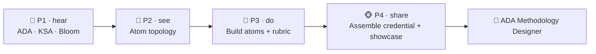

# 🎓 Worked Example — ADA Methodology Designer Micro-Credential (full course)

  
  
  
  

A **complete, ready-to-run ADA micro-credential** that certifies someone as an **ADA Methodology
Designer** — a person who can deconstruct a real organizational skill need into a KSA-typed,
Bloom-aligned, topology-rich micro-credential with a capstone, rubric, and skills map. It is
**self-referential**: it uses the ADA Methodology to teach the ADA Methodology (*learn ADA by doing
ADA*), and the learner's capstone is **a real ADA credential they design**.

> 🖥️ **See it live:** open [`course.html`](course.html) in any browser for an interactive,
> navigable version (sidebar, progress, embedded diagrams, copyable prompts).

> 📄 This course is the example folder for the repo's onboarding doc
> [`../../LEARN.md`](../../LEARN.md) — the same curriculum, packaged like the other worked courses.

This is the **train-the-designer** counterpart to the content courses
[Growth Mindset](../growth-mindset-micro-credential/README.md) (a durable *Ability*) and
[Python Variables](../python-variables-micro-credential/README.md) (a technical *Skill*): instead of
teaching a job skill, it teaches the **skill of designing ADA credentials** for any job skill.

Conforms to [`../../specs/micro-credential-v2-schema.md`](../../specs/micro-credential-v2-schema.md) ·
modalities from [`../../specs/learning-atom-topology.md`](../../specs/learning-atom-topology.md) ·
KSA from [`../../specs/ksa-taxonomy.md`](../../specs/ksa-taxonomy.md).

---

## 🧭 What this teaches

Most "instructional design" training stops at theory. This course makes the ADA design craft
**trainable and certifiable**: the learner debriefs every core concept (KSA, the 0–4 proficiency
scale, Bloom's cognitive + affective taxonomies, the 7-modality learning-atom topology), then
**authors learning atoms of each KSA type**, **builds an assessment rubric**, and finally
**assembles a complete, job-ready micro-credential from the templates** — reviewed by a peer and a
mentor.

| | |
| --- | --- |
| **Title** | ADA Methodology Designer |
| **Duration** | ~20 hours · 3–4 weeks |
| **Primary KSA** | 🛠️ Skill — *design learning atoms* and *assemble a full micro-credential* |
| **Target competency** | O\*NET 25-9031.00 Instructional Coordinators · ESCO *"develop curriculum", "design pedagogical approaches"* · SFIA **LEDA** (learning & development), **KNOW** |
| **Badge** | 🏅 *ADA Methodology Designer* |
| **Prerequisites** | None beyond comfort reading English docs. A subject you know well (to design a credential about) helps. |

---

## 📚 Course contents

| # | File | What it is |
| - | ---- | ---------- |
| — | [`micro-credential.md`](micro-credential.md) | The full micro-credential spec (YAML schema, objectives, KSA map, phase planner) |
| 1 | [`atoms/atom-1-the-ada-big-picture.md`](atoms/atom-1-the-ada-big-picture.md) | 🙉 P1 · 🧠 K — The ADA big picture (skill need → atoms → capstone → badge → skills map) |
| 2 | [`atoms/atom-2-ksa-in-depth.md`](atoms/atom-2-ksa-in-depth.md) | 🙉 P1 · 🧠 K — KSA in depth (types, 0–4 scale, affective domain, classification) |
| 3 | [`atoms/atom-3-blooms-taxonomy-objectives.md`](atoms/atom-3-blooms-taxonomy-objectives.md) | 🙉 P1 · 🧠 K + 🛠️ S — Bloom's taxonomy & writing measurable objectives |
| 4 | [`atoms/atom-4-learning-atom-topology.md`](atoms/atom-4-learning-atom-topology.md) | 🙈 P2 · 🧠 K — The 7-modality learning-atom topology & how to select modalities |
| 5 | [`atoms/atom-5-build-atoms-of-each-ksa-type.md`](atoms/atom-5-build-atoms-of-each-ksa-type.md) | 🙊 P3 · 🛠️ S + 🌱 A — Author one Knowledge, one Skill, one Ability atom |
| 6 | [`atoms/atom-6-design-the-assessment.md`](atoms/atom-6-design-the-assessment.md) | 🙊 P3 · 🛠️ S — Build the 5-criteria Assessment Rubric + badge/skills-map |
| 7 | [`atoms/atom-7-capstone-assemble-the-credential.md`](atoms/atom-7-capstone-assemble-the-credential.md) | 🐵 P4 · 🛠️ S + 🌱 A — Capstone: assemble a complete ADA credential + showcase |
| — | [`capstone.md`](capstone.md) | Capstone brief + how it maps to KSA |
| — | [`rubrics.md`](rubrics.md) | All rubrics (knowledge-mini, skill, design-judgment, capstone-5) |
| — | [`skills-map.md`](skills-map.md) | Badge → skills map and how it starts an L&D / instructional-design pathway |

> 🧰 **The deliverables compound:** each atom produces an artifact (objectives, atoms, a rubric)
> that becomes part of the learner's capstone credential — they finish the course holding a real,
> reusable ADA micro-credential they designed.

---

## 🔄 Phase journey

---

## 🤖 How it was authored (and how to reuse it)

This course follows the Gen AI authoring workflow in
[`../../specs/genai-authoring-workflow.md`](../../specs/genai-authoring-workflow.md):
competency → KSA → atoms → modalities → rubrics → badge. Conventions used throughout:

- **🖼️ Diagrams** are live **Mermaid** diagrams *and*, where useful, a reusable
  **image-generation prompt** in a `prompt` block — feed it to any image model for an on-brand asset.
- **🧩 Templates** are referenced by relative link so the learner fills the *actual* repo templates.
- **✅ Activities** include answer keys / checklists so the course is self-paced and self-checkable.

> ⚠️ **Human-in-the-loop (methodology guardrail):** a designer's competency mappings, sources, and
> badge decisions must be **validated by a human** mentor/employer before they count. AI accelerates
> the design but is never authoritative on its own. See [`../../CLAUDE.md`](../../CLAUDE.md) §5.
