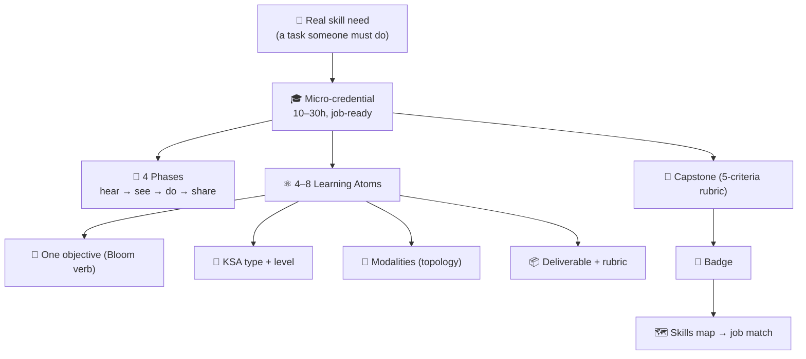
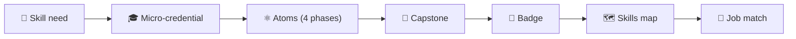

## ⚛ Learning Atom 1 — *The ADA Big Picture*

**Phase:** 🙉 1 · Self-Guided Introduction (*hear*) · **KSA:** 🧠 Knowledge · **Target level:** L2
· **Component id:** `K-ada-architecture`

### 🎯 Learning objective

- **Explain** how ADA's building blocks fit together — from a real job skill all the way to a
  verifiable badge written into a learner's skills map.

### 🧩 Prerequisites

- None. Curiosity about how learning gets designed, and ideally one skill you know well (you'll
  design a credential about it later).

### 🧭 Atom description

Before you can design ADA credentials, you need the map: what the pieces are and how they connect.
This atom gives you that mental model so every later decision (which KSA type, which Bloom verb,
which modality, which rubric) has a place to live.

---

### 📖 Reading — *The ADA stack* (≈ 6 min)

ADA (**Applied Digital Apprenticeship**) packages learning as **micro-credentials**: focused,
**10–30-hour, job-ready units**. Each micro-credential is built from **4–8 Learning Atoms** and
sequenced through **4 Learning Phases** that follow the Confucius progression
*hear → see → do → share*.

Every **atom** develops one **objective**, typed by **KSA** and aimed at a **proficiency level**,
taught through **modalities** chosen from the topology, and proven by a **deliverable + rubric**. The
micro-credential ends in a **capstone** (an integrative, job-like task), which earns a **badge**,
which writes proven KSA levels into the learner's **skills map** — the graph that gets **matched
against real jobs**.

The four phases, and what each is for:

| Phase | Confucius | Goal | Typical content |
| ----- | --------- | ---- | --------------- |
| 🙉 1 Self-Guided Introduction | *I hear and I forget* | meet the concepts | readings, podcasts, videos, comprehension checks |
| 🙈 2 Visual Exploration | *I see and I remember* | make it concrete | diagrams, mental models, demos, case walkthroughs |
| 🙊 3 Applied Practice | *I do and I understand* | build the skill | labs, codelabs, simulations, rubric-scored practice |
| 🐵 4 Collaboration & Reflection | *I share and I multiply* | prove & transfer | peer review, showcase, capstone, reflection |

**Key takeaways**

- [ ] A micro-credential is a **10–30h, job-ready unit** made of **4–8 atoms**.
- [ ] An **atom** = one objective · a KSA type+level · modalities · a deliverable + rubric.
- [ ] The **4 phases** move the learner from passive to active: hear → see → do → share.
- [ ] A **capstone → badge → skills map** turns learning into **job-matchable evidence**.

---

### 🖼️ See — the path from skill need to job match

---

### ✅ Evaluate — Pop quiz (formative, `knowledge-mini`)

1. How many hours and how many atoms define a typical micro-credential?
2. Put the four phases in order with their Confucius lines.
3. What does a badge write into, and what is that used for?

Answer key

1. **10–30 hours**; **4–8 atoms**.
2. 🙉 hear (*I hear and I forget*) → 🙈 see (*I see and I remember*) → 🙊 do (*I do and I
   understand*) → 🐵 share (*I share and I multiply*).
3. Into the **skills map** (proven KSA levels), used for **job matching**.

---

### 📦 Deliverable

- A 4–5 sentence "explain-back" of the ADA stack in your own words, plus a quick sketch (or copy) of
  the architecture diagram annotated with where *your* future credential's pieces will go.

### 🧠 Final reflection

- Which piece feels least familiar right now — KSA, Bloom, the topology, or rubrics? You'll meet
  each in the next atoms; note your starting question for each.

### 🔗 Sources to verify (human-in-the-loop)

- [`../../../README.md`](../../../README.md) — the canonical ADA methodology.
- [`../../../specs/ada-v2-ksa-framework.md`](../../../specs/ada-v2-ksa-framework.md) — the v2 spine.

### 🧩 Connections

- **Successors:** Atom 2 (KSA in depth), then Atom 3 (Bloom) and Atom 4 (topology).
