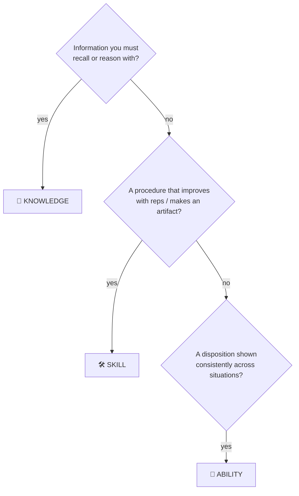

## ⚛ Learning Atom 2 — *KSA in Depth (Knowledge · Skills · Abilities)*

**Phase:** 🙉 1 · Self-Guided Introduction (*hear*) · **KSA:** 🧠 Knowledge · **Target level:** L3
· **Component id:** `K-ksa-framework`

### 🎯 Learning objective

- **Classify** any competency as Knowledge, Skill, or Ability, and set a **0–4** target level using
  the shared proficiency scale.

### 🧩 Prerequisites

- Atom 1 (the ADA big picture).

### 🧭 Atom description

KSA is the competency *spine* of ADA v2. Mistype a competency and everything downstream breaks — you
end up "teaching" an attitude with a quiz, or "assessing" a skill by asking the learner to define a
term. This atom builds the classification engine you'll use in every design from now on.

---

### 📖 Reading — *The competency spine* (≈ 10 min)

KSA gives every objective a **type**, so it's taught and assessed the way it actually develops.

**🧠 Knowledge — the *know-what* / *know-why*.** Cognitive, factual, conceptual understanding you
can recall and reason with (HTTP status codes; color theory; what psychological safety is).
*Develops through* Read · Listen · Watch · See. *Assessed with* quizzes, concept checks, "explain it
back". *Bloom home:* Remember, Understand.

**🛠️ Skill — the *know-how*.** Procedural proficiency built through **deliberate, repeated
practice**; observable and improvable. Technical (build a REST endpoint) or human (facilitate a
retro). *Develops through* Practice — labs, codelabs, simulations, role-play, reps. *Assessed with*
performance tasks and rubrics on a produced artifact. *Bloom home:* Apply, Analyze, Create.

**🌱 Ability — the *can-do* / *will-do* (durable capacities & attitudes).** Enduring dispositions
that shape *how consistently and how well* someone applies knowledge and skills across changing
contexts: adaptability, resilience, collaboration, growth mindset, attention to detail. *Develops
through* repeated authentic practice **+ reflection + feedback over time**. *Assessed with*
behavioral rubrics, reflective journals, peer/mentor **360** across **multiple occasions** — **never
a single quiz**. *Bloom home:* all levels, paired with the **affective domain**.

> **Skill vs. Ability — the practical test:** if it improves mainly through *reps and procedure*,
> it's a **Skill**. If it's a *disposition expressed consistently across situations* (and reads as
> an "attitude" in a job posting), it's an **Ability**. Many competencies have both layers — model
> both when it matters.

**🪜 The shared 0–4 proficiency scale** (so gaps are computable):

| Level | Label | Knowledge | Skill | Ability |
| ----- | ----- | --------- | ----- | ------- |
| 0 | None | no exposure | cannot perform | not observed |
| 1 | Aware | recalls basics | performs with full guidance | shows it occasionally, prompted |
| 2 | Working | explains & relates | performs routine cases solo | reliable in familiar contexts |
| 3 | Proficient | reasons about trade-offs | handles novel/complex; mentors | shows it under pressure / new contexts |
| 4 | Expert | synthesizes, teaches | sets best practice | role-models & develops it in others |

> **Job-readiness rule of thumb:** most entry roles need **L2** on core KSA and **L1** on adjacent.

**🌀 The affective domain (for Abilities):** Receive → Respond → Value → Organize → Internalize.
This is how an attitude *deepens* — from noticing it, to acting when prompted, to valuing it, to
organizing behavior around it, to it becoming "who you are."

**Key takeaways**

- [ ] **K** = know-what/why · **S** = know-how · **A** = durable disposition/attitude.
- [ ] One **0–4 scale** across all three makes gaps computable for job matching.
- [ ] Abilities are assessed **behaviorally across ≥3 occasions**, never a quiz.
- [ ] Tag each atom's **primary** KSA type; list secondaries.

---

### 🖼️ See — classify with the decision flow



A reusable prompt to generate an on-brand version of this diagram:

```prompt
Create a clean, modern educational decision-tree infographic titled "Is it Knowledge, Skill, or
Ability?". Three diamond decision nodes leading to three labeled outcomes: 🧠 Knowledge (a brain /
book icon), 🛠️ Skill (a wrench / hands icon), 🌱 Ability (a growing plant icon). Use ADA brand
colors (Indigo #1E2A6E, Turquoise #15B5C6, Gold #E0A53C accents) on a light background, flat vector
style, generous white space, legible sans-serif. 16:9.
```

---

### 🧪 Practice — *Worksheet: classify 8 competencies* (Design Exercise)

For each, write **K / S / A** and a **0–4** target, with one sentence of reasoning. Tie-breakers: a
tool/method/task → **S** (with a **K** prerequisite); an adjective about the person → **A**; a
concept/standard → **K**.

1. "Knows SQL join types"  2. "Writes a SQL query that answers a question"  3. "Detail-oriented"
4. "Explains what idempotency means"  5. "Facilitates a sprint retro"  6. "Coachable / takes
feedback"  7. "Builds a Figma prototype"  8. "Understands GDPR principles"

<details>
<summary>Sample key</summary>

1. K · L2 — a concept to recall/relate.
2. S · L2 — a procedure that makes an artifact.
3. A · L2 — an adjective about the person.
4. K · L2 — explain a concept.
5. S · L2 (+ A empathy/facilitation) — a repeatable procedure with a dispositional layer.
6. A · L2 — a disposition shown across situations.
7. S · L2 — a tool-based procedure.
8. K · L1–2 — principles to understand.

</details>

---

### ✅ Evaluate — Mini-rubric (`knowledge-mini`)

Accuracy of type · correct tie-breaker reasoning · sensible level. **Pass = 2+ on each.**

### 📦 Deliverable

- Your 8 classifications **with one sentence of reasoning each**, applying the tie-breakers.

### 🧠 Final reflection

- Pick a competency from a real job posting you've seen. Was it actually K, S, or A — and would the
  posting's "assessment" (if any) have matched the type?

### 🔗 Sources to verify (human-in-the-loop)

- [`../../../specs/ksa-taxonomy.md`](../../../specs/ksa-taxonomy.md) — the canonical KSA reference.
- O\*NET Content Model (Knowledge / Skills / Abilities descriptors).

### 🧩 Connections

- **Predecessor:** Atom 1. **Successors:** Atom 3 (Bloom verbs by type), Atom 5 (build one of each).
