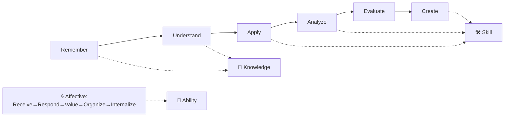

## ⚛ Learning Atom 3 — *Bloom's Taxonomy & Measurable Objectives*

**Phase:** 🙉 1 · Self-Guided Introduction (*hear*) · **KSA:** 🧠 Knowledge → 🛠️ Skill ·
**Target level:** L2 · **Component ids:** `K-bloom`, `S-write-objectives`

### 🎯 Learning objective

- **Write** measurable learning objectives using Bloom verbs, each **tagged with a KSA type** and a
  target level.

### 🧩 Prerequisites

- Atom 2 (KSA in depth) — you'll tag each objective with a KSA type.

### 🧭 Atom description

Objectives are the contract of a credential: they say exactly what the learner will be able to *do*.
Bloom gives you the verbs that make objectives measurable, and the KSA tag keeps each objective
honest about how it must be taught and assessed. This is the first atom where you start **producing**
design artifacts.

---

### 📖 Reading — *Bloom, the verb engine of objectives* (≈ 9 min)

**Bloom's revised taxonomy (cognitive domain, 2001)** orders thinking from simple to complex. Each
level has signature **verbs** you use to write objectives you can actually measure:

| Level | Means | Sample verbs | Pairs with KSA |
| ----- | ----- | ------------ | -------------- |
| **Remember** | recall facts | define, list, name, recall, label | 🧠 K |
| **Understand** | explain meaning | explain, summarize, classify, compare | 🧠 K |
| **Apply** | use it in a new situation | use, implement, run, solve, demonstrate | 🛠️ S |
| **Analyze** | break down, find structure | differentiate, debug, compare, test | 🛠️ S / 🧠 K |
| **Evaluate** | judge against criteria | critique, justify, assess, review | 🛠️ S |
| **Create** | produce something new | design, build, compose, assemble | 🛠️ S |

A good objective = **a Bloom verb + an observable thing + (often) a condition/standard**. Avoid
fuzzy verbs that can't be measured: *know, understand-as-feeling, be familiar with, appreciate,
learn about.* Replace them with what the learner will **do**.

- 👎 "Understand variables." → 👍 "**Explain** how a name is bound to a value." (Understand · 🧠 K)
- 👎 "Know testing." → 👍 "**Write** a unit test that verifies a function." (Apply · 🛠️ S)

**The affective domain (Krathwohl)** is Bloom's companion for **Abilities/attitudes**:
Receive → Respond → Value → Organize → Internalize. Use it when the objective is a disposition:
*"**Values** feedback as fuel and seeks it proactively."* (Value · 🌱 A).

> **Rule:** the Bloom level should match the KSA type. Knowledge lives in Remember/Understand;
> Skills in Apply/Analyze/Create; Abilities span all levels **plus** the affective domain — and are
> never assessed by a recall quiz.

**Key takeaways**

- [ ] Every objective needs a **measurable Bloom verb** + an **observable** result.
- [ ] Tag each objective with its **KSA type** and **target level**.
- [ ] Match the Bloom level to the KSA type (K→Remember/Understand, S→Apply/Analyze/Create).
- [ ] For Abilities, reach for the **affective** verbs (Value, Internalize).

---

### 🖼️ See — Bloom ↔ KSA alignment

---

### 🧪 Practice — *Rewrite & tag* (Design Exercise)

Rewrite these into measurable objectives, then tag **Bloom level + KSA**:

1. "Students will know about REST."  2. "Learners get good at giving feedback."
3. "Understand Python data types."  4. "Be adaptable."

Sample key

1. "**Explain** what makes an API RESTful." (Understand · 🧠 K)
2. "**Structure** a feedback message using SBI." (Apply · 🛠️ S) + "**Value** candor delivered with
   care." (Value · 🌱 A)
3. "**Identify** core types and **predict** `type()` results." (Understand · 🧠 K)
4. "**Re-plan** calmly when requirements change, across ≥3 occasions." (affective Value · 🌱 A)

---

### ✅ Evaluate — Mini-rubric (`skill`)

Verb is measurable · level matches the KSA type · objective is observable. **Pass = 2+ on each.**

### 📦 Deliverable

- **5 objectives** for a topic you care about (ideally the subject of your future capstone
  credential), each tagged `Bloom · KSA · level`. Keep these — you'll reuse them in Atom 7.

### 🧠 Final reflection

- Which of your 5 objectives is hardest to *assess*? Often that signals a mistyped KSA (e.g. an
  Ability hiding inside a "Skill" objective).

### 🔗 Sources to verify (human-in-the-loop)

- Anderson & Krathwohl (2001), *A Taxonomy for Learning, Teaching, and Assessing* (revised Bloom).
- [`../../../specs/ksa-taxonomy.md`](../../../specs/ksa-taxonomy.md) — "Bloom home" rows.
- [`../../../templates/micro-credential-ada-template.md`](../../../templates/micro-credential-ada-template.md) — objectives section.

### 🧩 Connections

- **Predecessor:** Atom 2. **Successor:** Atom 4 (choose modalities to teach each objective).
