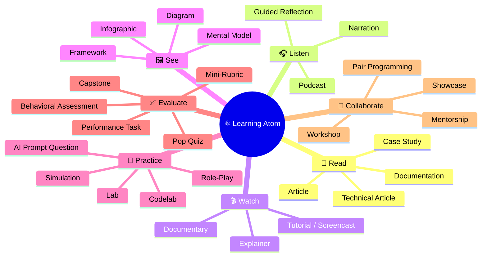

## ⚛ Learning Atom 4 — *The Learning Atom Topology*

**Phase:** 🙈 2 · Visual Exploration (*see*) · **KSA:** 🧠 Knowledge · **Target level:** L2
· **Component id:** `K-topology`

### 🎯 Learning objective

- **Select** topology modalities (and sub-types) that fit an atom's **KSA type and phase**.

### 🧩 Prerequisites

- Atoms 2–3 (KSA + objectives) — modality choice follows from the KSA type.

### 🧭 Atom description

The topology is the **menu** you design atoms from. Knowing it well is the difference between
defaulting to "a video and a quiz" for everything and deliberately choosing modalities that actually
develop the target KSA. This atom is in Phase 2 (*see*) because the best way to internalize the
topology is visually.

---

### 📖 Reading — *The menu you design from* (≈ 8 min)

A Learning Atom is the **smallest instructional unit**: one objective, taught through a chosen mix of
**modalities**, producing a deliverable assessed by a rubric. The topology organizes learning into
**7 modalities** in four purpose-groups:

| Group | Modality | Verb | Purpose | KSA affinity |
| ----- | -------- | ---- | ------- | ------------ |
| **Acquire** | 📖 Read | I read | concepts via text | 🧠 K |
| **Acquire** | 🎧 Listen | I hear | concepts via sound | 🧠 K · 🌱 A |
| **Acquire** | 🎬 Watch | I see | ideas/processes in motion | 🧠 K |
| **Acquire** | 🖼️ See | I picture | structure & relationships | 🧠 K |
| **Apply** | 🧪 Practice | I do | build skill by doing | 🛠️ S |
| **Assess** | ✅ Evaluate | I prove | measure & evidence | all |
| **Amplify** | 🤝 Collaborate | I share | learn socially, show dispositions | 🌱 A · 🛠️ S |

Each modality has many **sub-types** (the leaves). A few per modality: Read → *Article, Technical
Article, Case Study, Documentation, Cheat Sheet*; Listen → *Podcast, Narration, Guided Reflection*;
Watch → *Explainer, Tutorial/Screencast, Documentary*; See → *Diagram, Mental Model, Framework,
Infographic, Flowchart*; Practice → *Lab, Codelab, Simulation, Role-Play, AI Prompt Question, Project
Task*; Evaluate → *(Diagnostic / Formative / Summative)* *Pop Quiz, Mini-Rubric, Performance Task,
Behavioral Assessment, Capstone*; Collaborate → *Pair Programming, Workshop, Hackathon, Mentorship,
Showcase, Retrospective*.

> **AI is cross-cutting**, not a dimension: Gen AI can power a *Practice* atom (AI Prompt Question),
> an *Evaluate* atom (AI Q&A check), or a tutor in any modality.

**Key takeaways**

- [ ] There are **7 modalities** grouped as Acquire · Apply · Assess · Amplify.
- [ ] Each modality has many **sub-types** — pick the specific leaf, not just the group.
- [ ] **Match modality to KSA type**: K→Acquire, S→Practice, A→See+Practice+Collaborate.
- [ ] Offer **≥2 Acquire options** on Knowledge atoms for accessibility.

---

### 🖼️ See — the full topology (mind map)

**Choosing modalities by KSA type** (the rule that matters most):

| KSA target | Lead modalities | Evaluation |
| ---------- | --------------- | ---------- |
| 🧠 Knowledge | Read · Listen · Watch · See (offer ≥2 for accessibility) | Pop Quiz / AI Q&A |
| 🛠️ Skill | Watch a demo → **Practice** (lab/codelab) | Performance Task + Mini-Rubric |
| 🌱 Ability | **See** (model it) + **Practice** (role-play) + **Collaborate** | Behavioral Assessment (≥3) + Reflection |

---

### 🧪 Practice — *Design exercise: pick modalities*

For each atom goal, list 2–3 modality **sub-types** and the evaluation:

1. 🧠 "Explain HTTP status codes."  2. 🛠️ "Build a CRUD endpoint."  3. 🌱 "Collaborate across
disciplines."

Sample key

1. 📖 Technical Article + 🖼️ Infographic + ✅ Pop Quiz.
2. 🎬 Screencast + 🧪 Codelab + ✅ Performance Task (+ Mini-Rubric).
3. 🖼️ Mental Model + 🧪 Role-Play + 🤝 Group Project + ✅ Behavioral Assessment ×3.

---

### ✅ Evaluate — Pop quiz (formative, `knowledge-mini`)

1. Name the 7 modalities and their KSA affinity.
2. Why should you never assess an Ability with a quiz?
3. What's the minimum you should pair on a Skill atom?

Answer key

1. 📖 Read, 🎧 Listen, 🎬 Watch, 🖼️ See (all 🧠 K) · 🧪 Practice (🛠️ S) · ✅ Evaluate (all) ·
   🤝 Collaborate (🌱 A · 🛠️ S).
2. Abilities are dispositions shown **across situations**; a one-shot recall quiz can't evidence
   consistency — use behavioral assessment across ≥3 occasions.
3. At least one **Acquire/Demo** modality paired with one **Practice** sub-type.

---

### 📦 Deliverable

- A modality plan (sub-types + evaluation) for **3 atom goals** of different KSA types — ideally
  three of the objectives you wrote in Atom 3.

### 🧠 Final reflection

- Which modality do you over-rely on? Designers have defaults; naming yours helps you diversify.

### 🔗 Sources to verify (human-in-the-loop)

- [`../../../specs/learning-atom-topology.md`](../../../specs/learning-atom-topology.md) — the
  complete catalog with every sub-type and decision flow.

### 🧩 Connections

- **Predecessor:** Atom 3. **Successor:** Atom 5 (turn these plans into real atoms).
