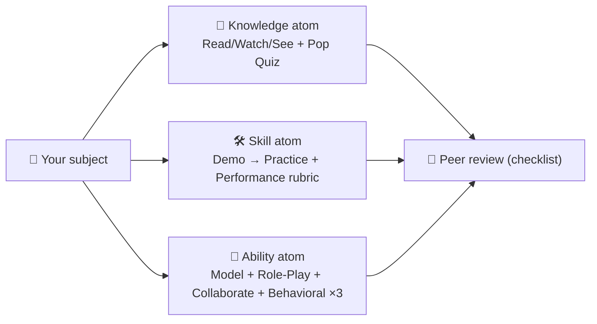

## ⚛ Learning Atom 5 — *Build One Atom of Each KSA Type*

**Phase:** 🙊 3 · Applied Practice (*do*) · **KSA:** 🛠️ Skill + 🌱 Ability · **Target level:** L3
· **Component ids:** `S-design-atoms`, `A-design-judgment`

### 🎯 Learning objective

- **Design** three complete learning atoms — one **Knowledge**, one **Skill**, one **Ability** —
  each with topology-correct modalities and a matching evaluation.

### 🧩 Prerequisites

- Atoms 2–4 (KSA, objectives, topology). Have the [Learning Atom
  Template](../../../templates/learning-atom-template.md) open.

### 🧭 Atom description

This is the core craft of an ADA designer: authoring atoms. You'll feel the difference between the
three KSA types in your hands — a Knowledge atom is built to *acquire and check*, a Skill atom to
*demo and do*, an Ability atom to *model, practice, collaborate, and observe over time*. This is also
the first of three occasions where your **design judgment** (`A-design-judgment`) is observed.

---

### 🧭 What to do (Design Exercise)

Pick a single subject you know well (e.g. "Git basics", "writing clear emails", "data viz"). Using
the [Learning Atom Template](../../../templates/learning-atom-template.md), author **three atoms**
about it — one per KSA type:

For **each** atom, fill in: objective (Bloom + KSA + level) · prerequisites · modalities (from the
topology) · learning activities · deliverable · evaluation · reflection. Match the modality to the
KSA type — that's what's being assessed.

---

### 🤝 Collaborate — peer review (Async Peer Review)

Trade your three atoms with a peer (or self-review against this checklist):

- [ ] Exactly **one objective** with a Bloom verb + KSA type + level.
- [ ] Modalities are **from the topology** and **fit the KSA type**.
- [ ] Knowledge atom offers **≥2 Acquire options**; Skill atom pairs **Demo + Practice**;
      Ability atom uses **See + Practice + Collaborate** with a **behavioral** evaluation (≥3).
- [ ] The evaluation actually measures the objective (no quiz for an Ability).

---

### ✅ Evaluate — Performance task (`skill`)

Your three atoms are scored with the `skill` mini-rubric (correct mechanics · modality–KSA fit ·
evaluation match). The peer review you *give* is one of the 3 observed occasions for
`A-design-judgment` (did you center the learner and give specific, kind, useful feedback?).

### 📦 Deliverable

- **3 finished atoms** (K, S, A) on one subject + the peer-review checklist you applied. These
  become atoms in your capstone credential (Atom 7).

### 🧠 Final reflection

- Which KSA type was hardest to design for? Most new designers find **Ability** atoms hardest —
  they require modeling, repetition, and behavioral evidence rather than content delivery.

### 🔗 Sources to verify (human-in-the-loop)

- [`../../../templates/learning-atom-template.md`](../../../templates/learning-atom-template.md) —
  the template you fill.
- Imitate real atoms in the
  [Growth Mindset](../../growth-mindset-micro-credential/atoms) and
  [Python Variables](../../python-variables-micro-credential/atoms) courses.

### 🧩 Connections

- **Predecessor:** Atom 4. **Successor:** Atom 6 (how to assess the atoms you just built).
