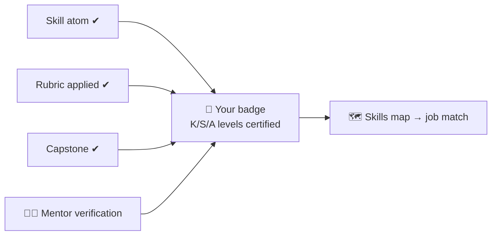

## ⚛ Learning Atom 6 — *Design the Assessment*

**Phase:** 🙊 3 · Applied Practice (*do*) · **KSA:** 🛠️ Skill · **Target level:** L2
· **Component id:** `S-build-rubric`

### 🎯 Learning objective

- **Build** the standard 5-criteria **Assessment Rubric**, plus the evidence → badge → skills-map map
  for a credential.

### 🧩 Prerequisites

- Atom 5 (you'll assess the atoms you designed). Atom 2 (KSA → instrument fit).

### 🧭 Atom description

A credential is only as fair and useful as its assessment. This atom turns "I think they learned it"
into evidence: the right instrument per KSA type, a weighted capstone rubric with distinct bands, and
a badge that writes specific KSA levels into the skills map.

---

### 📖 Reading — *Right tool for each KSA* (≈ 5 min)

Match the instrument to the type: **Knowledge** → quiz / concept check; **Skill** → performance task
+ mini-rubric on an artifact; **Ability** → **behavioral rubric across ≥3 occasions** + reflection +
360. The **capstone** is summative and graded with the **5-criteria Assessment Rubric**, weighted to
100 points across four proficiency bands.

| KSA | Best instrument | Evidence |
| --- | --------------- | -------- |
| 🧠 Knowledge | Pop quiz / concept check / AI Q&A | correct recall & explanation |
| 🛠️ Skill | Performance task + mini-rubric | a working artifact |
| 🌱 Ability | Behavioral rubric (≥3 occasions) + reflection + 360 | consistent behavior over time |
| 🚀 Capstone (all) | 5-criteria Assessment Rubric (100 pts) | integrative, job-like deliverable |

**Key takeaways**

- [ ] Pick the instrument from the **KSA type**, not habit.
- [ ] Capstone rubric = **5 criteria × 4 bands**, weighted to **100 pts**.
- [ ] Bands must be **distinct and observable** (a grader can tell them apart).
- [ ] The badge writes **specific KSA levels** into the skills map.

---

### 🧪 Practice — build the standard Assessment Rubric (Design Exercise)

Tailor the descriptors to your subject (keep the bands and weights):

| Criteria | Excellent (100–90%) | Competent (89–80%) | Developing (79–70%) | Initial (69% or less) | Weight |
| :--- | :--- | :--- | :--- | :--- | :--- |
| **Relevance (competency alignment)** | [describe mastery] | [describe] | [describe] | [describe] | **20 pts** |
| **Application of skills** | [describe] | [describe] | [describe] | [describe] | **25 pts** |
| **Problem-solving & creativity** | [describe] | [describe] | [describe] | [describe] | **20 pts** |
| **Clarity & communication** | [describe] | [describe] | [describe] | [describe] | **15 pts** |
| **Collaboration & reflection** | [describe] | [describe] | [describe] | [describe] | **20 pts** |
| **TOTAL** | | | | | **100 pts** |

Then write the **evidence → badge** logic and the **skills-map** fragment:



```yaml
badge:
  name: "[Your badge]"
  evidence_required: ["[atom-x]", "capstone"]
  issued_on: verified-evidence
  components: { "[K-id]": 2, "[S-id]": 2, "[A-id]": 2 }
```

---

### ✅ Evaluate — Performance task (`skill`)

Bands are distinct & observable · weights total 100 · a pass rule is stated · the badge maps to KSA
levels. This is a second observed occasion for `A-design-judgment` (is the assessment *fair* and
learner-respecting?).

### 📦 Deliverable

- A completed Assessment Rubric + at least one mini-rubric + the badge/skills-map fragment for your
  subject. Reuse these in the capstone (Atom 7).

### 🧠 Final reflection

- Could two different graders use your rubric and land within ~10%? If not, your bands aren't
  distinct enough yet.

### 🔗 Sources to verify (human-in-the-loop)

- The standardized rubric in
  [`../../../templates/micro-credential-ada-template.md`](../../../templates/micro-credential-ada-template.md).
- [`../../../specs/skills-map-and-job-matching.md`](../../../specs/skills-map-and-job-matching.md).

### 🧩 Connections

- **Predecessor:** Atom 5. **Successor:** Atom 7 (assemble everything into one credential).
