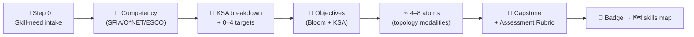

## ⚛ Learning Atom 7 — *Capstone: Assemble the Full ADA Credential*

**Phase:** 🐵 4 · Collaboration & Reflection (*share*) · **KSA:** 🛠️ Skill + 🌱 Ability ·
**Target level:** L3 · **Component ids:** `S-assemble-mc`, `A-design-judgment`

### 🎯 Learning objective

- **Create** a complete, job-ready ADA micro-credential for a **real organizational skill need**,
  using **all** the templates, then **showcase** it for peer + mentor review.

### 🧩 Prerequisites

- All prior atoms. You should already have: 5 tagged objectives (Atom 3), 3 atoms (Atom 5), and an
  Assessment Rubric + badge fragment (Atom 6).

### 🧭 Atom description

This is where the course pays off: you assemble your accumulated artifacts into one coherent,
deliverable credential — the same artifact a working ADA designer ships. It's a Phase 4 atom because
the work is proven socially: a showcase and a peer review, validated by a mentor.

---

### 🧭 The build (use every template)

1. **Open the [Micro-Credential Template](../../../templates/micro-credential-ada-template.md)** and
   complete **Step 0 (skill-need intake)** → **Step 1 (competency)** → **Step 2 (KSA breakdown)** →
   **Step 3 (objectives)**. Reuse your Atom 3 objectives.
2. **Design 4–8 atoms** using the
   [Learning Atom Template](../../../templates/learning-atom-template.md) (reuse and extend your
   three atoms from Atom 5). Add a [Codelab](../../../templates/codelab-ada-template.md) if your
   skill is technical.
3. **Add the capstone + the 5-criteria Assessment Rubric** from Atom 6.
4. **Define the badge → skills map** so completion is job-matchable.
5. **Run the Design Conformance Checklist** at the end of the template.
6. **Showcase** (5 min): the skill need, your KSA breakdown, one atom you're proud of, and how the
   badge closes a real job gap. Exchange a **peer review**.

---

### 📦 What to submit

- [ ] A completed **micro-credential** doc (Step 0 → badge), **4–8 atoms**, a **capstone brief**, a
      **5-criteria Assessment Rubric**, and a **badge → skills-map** fragment.
- [ ] Conformance checklist passed; one **peer review** given; a **showcase** delivered.
- [ ] Re-take the diagnostic from [`../micro-credential.md`](../micro-credential.md) and note your
      deltas.

---

### 🎤 Showcase structure (≈ 5 minutes)

1. **The skill need** (45s) — whose job, which task, why now.
2. **KSA breakdown** (60s) — the components and target levels.
3. **One atom** (90s) — the one you're proudest of, and why its modalities fit its KSA type.
4. **Badge → job gap** (60s) — what the skills map writes, and the requirement it closes.
5. **Human-in-the-loop** (15s) — what a mentor/employer must validate before it counts.

---

### ✅ Evaluate — Capstone (`capstone-5`)

Graded with the standard 5-criteria Assessment Rubric in [`../rubrics.md`](../rubrics.md) /
[`../capstone.md`](../capstone.md). This is the third and decisive observed occasion for
`A-design-judgment` (learner empathy + framework rigor + honest human-in-the-loop flags).

### 📦 Deliverable

- Your **complete, portfolio-ready ADA micro-credential** + showcase + the peer review you gave.

### 🧠 Final reflection

- Compare your before/after diagnostic. Which component moved most? What would you redesign on a
  second pass — and what does that tell you about your design defaults?

### 🔗 Sources to verify (human-in-the-loop)

- All three templates in [`../../../templates/`](../../../templates/).
- [`../capstone.md`](../capstone.md) · [`../rubrics.md`](../rubrics.md) · [`../skills-map.md`](../skills-map.md).

### 🧩 Connections

- **Predecessor:** Atom 6. **Outcome:** 🏅 *ADA Methodology Designer* badge → an L&D /
  instructional-design pathway (see [`../skills-map.md`](../skills-map.md)).
