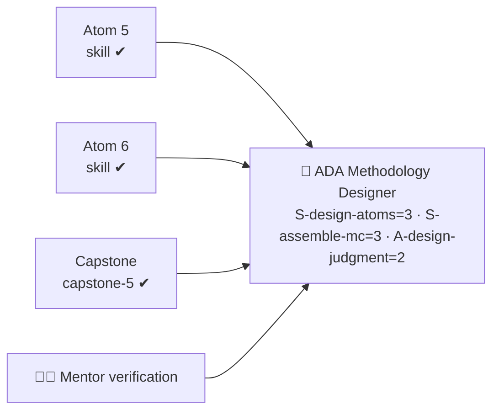

# 📊 Rubrics — ADA Methodology Designer Micro-Credential

All assessment instruments used across the course. Atoms reference these by `rubric` flavor:
`knowledge-mini`, `skill`, `capstone-5` (plus a `design-judgment` behavioral lens applied throughout).

---

## 🔹 `knowledge-mini` — concept checks (Atoms 1, 2, 4)

Quick formative check; used for the pop quizzes and the KSA classification worksheet.

| Criterion | Excellent (3) | Adequate (2) | Needs improvement (1) |
| --------- | ------------- | ------------ | --------------------- |
| **Accuracy** | All answers correct; classifies K/S/A and levels reliably | Mostly correct | Repeats a misconception (e.g. quiz-assessing an Ability) |
| **Vocabulary** | Uses terms correctly (KSA, Bloom level, modality, affective) | Roughly right | Vague / wrong terms |
| **Self-application** | Connects the concept to their own design-in-progress | Generic example | None |

> Pass = 2+ on each. Knowledge here is **L2–L3** — it enables the design Skills that follow.

---

## 🔹 `skill` — performance mini-rubric (Atoms 3, 5, 6)

For writing objectives, authoring the three atoms, and building the rubric.

| Criterion | Excellent (3) | Adequate (2) | Needs improvement (1) |
| --------- | ------------- | ------------ | --------------------- |
| **Correct mechanics** | Objectives measurable; atoms complete; rubric weights total 100 | Minor gaps | Incomplete or non-functional |
| **KSA fit** | Bloom level + modalities + instrument all match the KSA type | One slip | Mismatched (e.g. quiz for an Ability) |
| **Topology use** | Specific sub-types chosen deliberately from the topology | Generic but valid | Defaults to "video + quiz" everywhere |
| **Measurability** | A second designer could grade with the same result | Mostly clear | Bands/criteria too vague to apply |

> Pass = 2+ on each → **L2–L3** evidence for the relevant design Skill component.

---

## 🔹 `design-judgment` — the instructional-judgment lens (Atoms 5–7) ⭐

The lens that builds the **Ability** `A-design-judgment`. A habit, not a single moment — observed
across the **3 assessed occasions** (peer review in Atom 5, the assessment design in Atom 6, the
capstone in Atom 7).

| Criterion | Excellent (3) | Adequate (2) | Needs improvement (1) |
| --------- | ------------- | ------------ | --------------------- |
| **Learner empathy** | Choices clearly center the learner (accessibility, scaffolding, fairness) | Generally learner-aware | Designer-/content-centric |
| **Framework rigor** | Competencies linked honestly to SFIA/O\*NET/ESCO; sources cited | Some linkage | Unanchored claims |
| **Human-in-the-loop** | Explicitly flags what a mentor/employer must validate | Mentions it | Treats AI/own output as authoritative |

> Consistent 2+ across occasions supports **L2** for `A-design-judgment`.

---

## ✨ `capstone-5` — Assessment Rubric (standard ADA capstone)

The capstone is scored on **five criteria** across **four proficiency bands**, weighted to a total of
**100 points**. Each criterion's band sets how much of its weight is earned. **Pass = ≥ 70% overall
with at least *Developing* on every criterion**, mentor-verified (human-in-the-loop).

| Criteria | Excellent (100–90%) | Competent (89–80%) | Developing (79–70%) | Initial (69% or less) | Weight |
| :--- | :--- | :--- | :--- | :--- | :--- |
| **Relevance (competency alignment)** | Anchored to a real skill need and a named framework; alignment is tight from intake to badge. | Relevant and framework-linked; minor gaps. | Loosely relevant; framework link weak or generic. | Off-target or unanchored to any real need. | **20 pts** |
| **Application of skills** | KSA typing, Bloom objectives, modality fit, and rubric design are all correct and consistent. | Mostly correct with minor errors. | Several gaps (mistyped KSA, fuzzy verbs, modality mismatch, vague bands). | Minimal or incorrect application of the methodology. | **25 pts** |
| **Problem-solving & creativity** | Atoms are well-sequenced and inventive; the capstone genuinely simulates the real job task. | Sound, conventional design that works. | Uneven sequence; thin or generic capstone. | Incoherent sequence or missing capstone. | **20 pts** |
| **Clarity & communication** | Docs are clear, on-template, and professional; showcase is crisp and persuasive. | Generally clear and on-template. | Uneven clarity or off-template in places. | Unclear, incomplete, or not on-template. | **15 pts** |
| **Collaboration & reflection** | Insightful peer review given; honest reflection; human-in-the-loop points explicitly flagged. | Adequate peer review and reflection. | Minimal review / reflection. | Missing peer review or reflection. | **20 pts** |
| **TOTAL** | | | | | **100 pts** |

> **Badge pass:** atom-level `skill` checks ≥ 2 each AND Assessment Rubric weighted ≥ 70%
> (at least *Developing* on every criterion), **mentor-verified** (human-in-the-loop).

---

## 🧮 Evidence → badge logic

