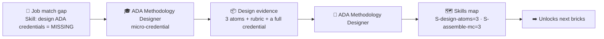
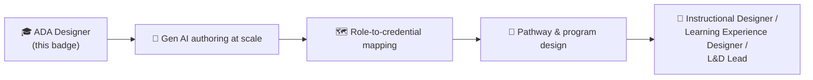

# 🗺️ Skills Map — what the badge unlocks

How the **🏅 ADA Methodology Designer** badge writes into a learner's skills map and starts an
instructional-design / L&D pathway. Conforms to
[`../../specs/skills-map-and-job-matching.md`](../../specs/skills-map-and-job-matching.md).

---

## 🏅 What the badge certifies

On verified completion, the badge sets these components in the learner's skills map:

| Component | Type | Level earned |
| --------- | ---- | ------------ |
| `S-design-atoms` | 🛠️ Skill | **3** |
| `S-assemble-mc` | 🛠️ Skill | **3** |
| `S-write-objectives` | 🛠️ Skill | 2 |
| `S-build-rubric` | 🛠️ Skill | 2 |
| `A-design-judgment` | 🌱 Ability | 2 |
| `K-ksa-framework` | 🧠 Knowledge | 3 |
| `K-ada-architecture` | 🧠 Knowledge | 2 |
| `K-bloom` | 🧠 Knowledge | 2 |
| `K-topology` | 🧠 Knowledge | 2 |

```yaml
# fragment merged into the learner's skills map on badge issuance
badge: ada-methodology-designer
issued_on: verified-evidence
components:
  S-design-atoms: 3
  S-assemble-mc: 3
  S-write-objectives: 2
  S-build-rubric: 2
  A-design-judgment: 2
  K-ksa-framework: 3
  K-ada-architecture: 2
  K-bloom: 2
  K-topology: 2
```

---

## 🎯 Why this matters for job matching

This is a **capability** badge for the people who *build* ADA credentials. It moves a learner from
"can follow a template" to "can design a job-matchable learning unit from a raw skill need."

| Requirement (`must_have`) | Before | After badge |
| ------------------------- | ------ | ----------- |
| Curriculum / learning design (Skill ≥ 2) | ❌ 0 | ✅ 3 |
| Competency mapping & KSA typing (Knowledge ≥ 2) | ❌ 0 | ✅ 3 |
| Assessment & rubric design (Skill ≥ 2) | ⚠️ unproven | ✅ 2 |
| Learner-centered design judgment (Ability ≥ 1) | ⚠️ unproven | ✅ 2 |



---

## 🔗 Where this fits a role pathway

`S-design-atoms` and `S-assemble-mc` are the **core bricks** of an instructional-design / L&D role
pathway built with
[`../../specs/role-to-credential-mapping.md`](../../specs/role-to-credential-mapping.md). A natural
sequence after this badge:



Pair it with the [Gen AI Authoring Workflow](../../specs/genai-authoring-workflow.md) to design
faster, and with [Role-to-Credential Mapping](../../specs/role-to-credential-mapping.md) to scale
from single credentials to full role pathways — see the
[Data Scientist pathway](../role-data-scientist-pathway.md) for how bricks stack into a role.

> ⚠️ Per the methodology, AI-suggested matches and AI-generated designs are **decision support**, not
> authoritative — a mentor/employer validates the evidence before the badge counts (human-in-the-loop).
