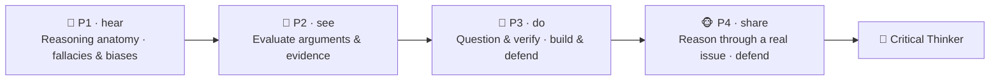

# 🧠 Worked Example — Critical Thinking Micro-Credential (full course)

  
  
  
  

A **complete, ready-to-run ADA micro-credential** for one of the most valuable — and most-claimed,
least-taught — competencies of the AI era: **thinking critically**. It is a *fully populated* example
built end-to-end with the ADA Methodology (KSA + 4 phases + learning-atom topology): every atom has
**real reading text**, **curated videos**, **Mermaid diagrams**, **image-generation prompts**,
hands-on drills, and rubrics.

> 🖥️ **See it live:** open [`course.html`](course.html) in any browser for an interactive, navigable
> version of this course (sidebar, progress, embedded videos, diagrams, copyable prompts).

Critical thinking is a **cognitive skill** that spans the full KSA spectrum: a small **Knowledge** base
(the anatomy of reasoning; fallacies & biases), three core **Skills** (evaluate arguments & evidence,
question & verify, and construct & defend a reasoned argument), and the durable **Abilities** that
power them (intellectual humility and a curious, skeptical stance). It pairs naturally with
[Problem Solving](../problem-solving-micro-credential/README.md) (where you apply the reasoning) and
[Self-Learning](../self-learning-micro-credential/README.md) (where you judge sources and AI output).

Conforms to [`../../specs/micro-credential-v2-schema.md`](../../specs/micro-credential-v2-schema.md) ·
modalities from [`../../specs/learning-atom-topology.md`](../../specs/learning-atom-topology.md) ·
KSA from [`../../specs/ksa-taxonomy.md`](../../specs/ksa-taxonomy.md).

---

## 🧭 What this teaches

In a world flooded with content, confident AI answers, and persuasive nonsense, the ability to **tell
good reasoning from bad** is a superpower. This course makes it concrete and certifiable: learners
learn to **deconstruct an argument** (claims, premises, assumptions, inference), **spot fallacies and
biases**, **evaluate evidence and sources**, **ask sharp questions**, and **build and defend a
well-reasoned position** — finishing by reasoning through a real, contested issue and defending their
conclusion.

| | |
| --- | --- |
| **Title** | Critical Thinking: Reason, Evaluate & Judge |
| **Duration** | ~12 hours · 2–3 weeks |
| **Primary KSA** | 🛠️ Skill — *evaluate arguments & evidence* and *question & verify*, plus the 🌱 Abilities that sustain them |
| **Target competency** | O\*NET process skills: **Critical Thinking** (2.A.2.a), **Active Learning** (2.A.2.a), **Judgment & Decision Making** (2.B.4.e) · ESCO transversal *"think critically", "think analytically"* |
| **Badge** | 🏅 *Critical Thinker* |
| **Prerequisites** | None. A contested topic or claim you care about helps for practice. |

---

## 📚 Course contents

| # | File | What it is |
| - | ---- | ---------- |
| — | [`micro-credential.md`](micro-credential.md) | The full micro-credential spec (YAML schema, objectives, KSA map, phase planner) |
| 1 | [`atoms/atom-1-what-is-critical-thinking.md`](atoms/atom-1-what-is-critical-thinking.md) | 🙉 P1 · 🧠 K — What critical thinking is (claims, arguments, standards) |
| 2 | [`atoms/atom-2-fallacies-and-biases.md`](atoms/atom-2-fallacies-and-biases.md) | 🙉 P1 · 🧠 K — Logical fallacies & reasoning biases (how thinking fails) |
| 3 | [`atoms/atom-3-evaluate-arguments-and-evidence.md`](atoms/atom-3-evaluate-arguments-and-evidence.md) | 🙈 P2 · 🛠️ S — Evaluate arguments & evidence (deconstruct + judge) |
| 4 | [`atoms/atom-4-question-and-verify.md`](atoms/atom-4-question-and-verify.md) | 🙊 P3 · 🛠️ S — Question & verify (Socratic questions · sources · steelmanning) |
| 5 | [`atoms/atom-5-build-and-defend-an-argument.md`](atoms/atom-5-build-and-defend-an-argument.md) | 🙊 P3 · 🛠️ S + 🌱 A — Build & defend a reasoned argument |
| 6 | [`atoms/atom-6-capstone-reason-through-a-real-issue.md`](atoms/atom-6-capstone-reason-through-a-real-issue.md) | 🐵 P4 · 🛠️ S + 🌱 A — Capstone: reason through a real issue + peer review |
| — | [`capstone.md`](capstone.md) | Capstone brief + how it maps to KSA |
| — | [`rubrics.md`](rubrics.md) | All rubrics (knowledge-mini, skill, behavioral, capstone-5) |
| — | [`skills-map.md`](skills-map.md) | Badge → skills map and how it boosts almost every role |

> 🤝 **Practiced for real:** the Abilities (intellectual humility, skeptical curiosity) are assessed
> **behaviorally across ≥3 occasions** (never a quiz), and the capstone ends in a defense + peer review.

---

## 🔄 Phase journey

---

## 🤖 How it was authored (and how to reuse it)

This course follows the Gen AI authoring workflow in
[`../../specs/genai-authoring-workflow.md`](../../specs/genai-authoring-workflow.md):
competency → KSA → atoms → modalities → rubrics → badge. Conventions used throughout:

- **🎬 Videos** are written as a `youtube` block with the real URL + caption (the interactive site
  embeds them as a click-to-play player).
- **🖼️ Diagrams** are provided two ways: a live **Mermaid** diagram *and* a reusable
  **image-generation prompt** in a `prompt` block.
- **✅ Activities** include argument-mapping worksheets, source audits, checklists, and rubrics so the
  course is self-paced and practicable.

> ⚠️ **Human-in-the-loop (methodology guardrail):** the links and references below are **curated
> starting points** — a mentor/instructor should verify each one before delivery. The Abilities here
> require human/peer observation across occasions. See [`../../CLAUDE.md`](../../CLAUDE.md) §5.
