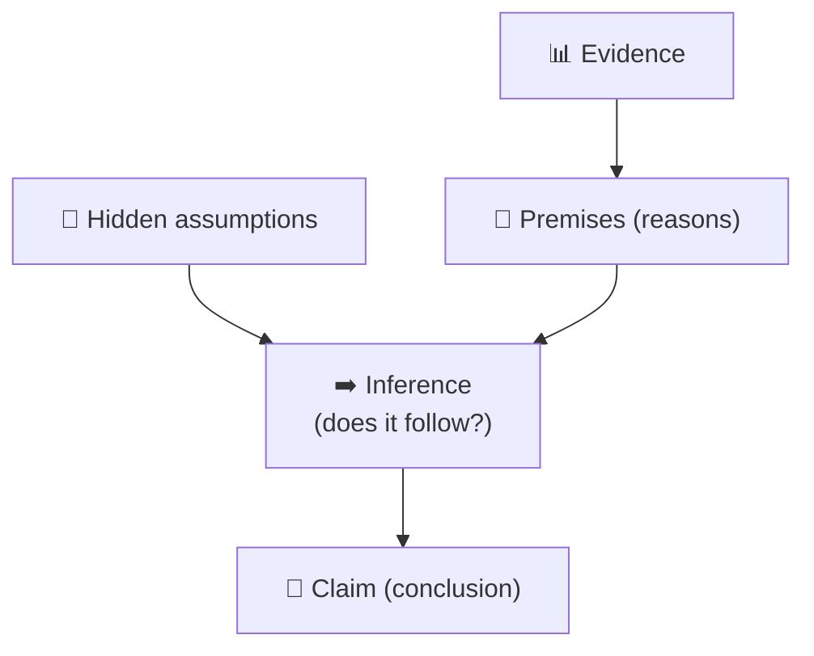
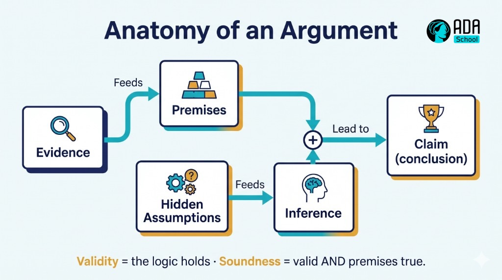

## ⚛ Learning Atom 1 — *What Critical Thinking Is*

**Phase:** 🙉 1 · Self-Guided Introduction (*hear*) · **KSA:** 🧠 Knowledge · **Target level:** L2
· **Component id:** `K-reasoning`

### 🎯 Learning objective

- **Explain** the parts of an argument and **distinguish** validity from soundness, using the standards
  of good thinking.

### 🧩 Prerequisites

- None. Bring one belief you hold strongly — we'll examine *why* you hold it.

### 🧭 Atom description

"Critical thinking" gets used to mean "disagreeing" or "being negative." It's neither. It's the
disciplined habit of **evaluating reasoning** — yours and others' — against clear standards, so your
conclusions track what's actually true and well-supported. This atom gives you the vocabulary and the
mental model the whole course builds on.

---

### 📖 Reading — *Reasoning has parts you can inspect* (≈ 7 min)

Critical thinking is **thinking about thinking in order to improve it.** Instead of accepting a
conclusion because it's loud, familiar, or flattering, you examine *how it was reached.* To do that you
need to see the moving parts.

**The anatomy of an argument.** An *argument* (in this sense) isn't a quarrel — it's a **claim
supported by reasons**:

- **Claim (conclusion):** what someone wants you to accept. *"We should switch tools."*
- **Premises (reasons):** the support offered. *"The new tool is cheaper and faster."*
- **Assumptions:** unstated things that must be true for the argument to work. *"Cheaper + faster
  matters more than the switching cost."* Hidden assumptions are where most bad arguments hide.
- **Inference:** the logical step *from* premises *to* claim. Is the jump justified?
- **Evidence:** the data backing the premises. Is it real, relevant, and sufficient?

**Validity vs. soundness** (a crucial distinction):

- An argument is **valid** if the conclusion *follows logically* from the premises — *regardless of
  whether the premises are true.* ("All cats can fly; Felix is a cat; therefore Felix can fly" is
  **valid** but false.)
- An argument is **sound** if it is valid **and** its premises are actually **true.** Sound arguments
  are the goal. So you check two separate things: *Is the logic good?* and *Are the premises true?*

**Deductive vs. inductive.** *Deductive* reasoning aims for certainty (if premises true + valid →
conclusion guaranteed). *Inductive* reasoning aims for probability (evidence makes the conclusion
*likely* — most real-world reasoning is inductive, so you weigh **strength**, not proof).

**Standards of good thinking.** When you assess any reasoning, check it against (after Paul & Elder):
**clarity** (is it clear?), **accuracy** (is it true?), **relevance** (does it bear on the issue?),
**logic** (does it hang together?), **depth & breadth** (does it handle complexity and other views?),
and **fairness** (is it free of distortion and self-interest?).

> **The mindset:** critical thinking starts with a question, not a conclusion. *"What's the claim?
> What's the evidence? Does the conclusion really follow? What am I assuming?"*

**Key takeaways**

- [ ] An argument = **claim + premises + (hidden) assumptions + inference + evidence.**
- [ ] **Validity** = the logic holds; **soundness** = valid **and** premises are true.
- [ ] Most real reasoning is **inductive** — judge **strength**, not proof.
- [ ] Assess thinking against **clarity, accuracy, relevance, logic, depth, fairness.**

---

### 🎬 Watch — critical thinking, explained (pick one, ~5–6 min)

```youtube
https://www.youtube.com/watch?v=dItUGF8GdTw
TED-Ed — "5 tips to improve your critical thinking" (Samantha Agoos).
```

```youtube
https://www.youtube.com/watch?v=6OLPL5p0fMg
"Critical thinking / what it is and isn't" — a short explainer (verify before delivery).
```

---

### 🖼️ See — the anatomy of an argument





> 🖼️ *Generated image — produced from the prompt below.*

A reusable prompt to generate an on-brand version of this diagram:

```prompt
Create a clean, modern educational infographic titled "Anatomy of an Argument": Evidence feeds
Premises; Hidden Assumptions feed the Inference; Premises + Inference lead to the Claim (conclusion).
Add a caption: "Validity = the logic holds · Soundness = valid AND premises true." Use ADA brand
colors (Indigo #1E2A6E, Turquoise #15B5C6, Gold #E0A53C accents) on a light background, flat vector
style, legible sans-serif, no text errors. 16:9.
```

---

### ✅ Evaluate — Pop quiz (formative, `knowledge-mini`)

1. What's the difference between a valid argument and a sound one?
2. Why are *hidden assumptions* so important to find?
3. Give two of the standards you'd use to judge a piece of reasoning.

<details>
<summary>Answer key</summary>

1. **Valid** = the conclusion follows logically from the premises (even if premises are false);
   **sound** = valid **and** the premises are actually true.
2. Because an argument can look fine on the surface while resting on an unstated assumption that is
   false or contested — that's where reasoning quietly breaks.
3. Any two of: **clarity, accuracy, relevance, logic, depth, breadth, fairness.**

</details>

---

### 📦 Deliverable

- Take your strongly-held belief. Write it as an **argument**: state the **claim**, your **premises**,
  one **hidden assumption**, and the **evidence**. Note whether it's deductive or inductive.

### 🧠 Final reflection

- Which standard (clarity/accuracy/relevance/logic/depth/fairness) does your own reasoning most often
  skip?

### 🔗 Sources to verify (human-in-the-loop)

- Paul & Elder, *The Miniature Guide to Critical Thinking* (standards & elements of reasoning).
- Walton, *Informal Logic* (arguments, premises, inference).
- Stanford Encyclopedia of Philosophy — *Critical Thinking* entry.

### 🧩 Connections

- **Successors:** Atom 2 (how reasoning fails), Atom 3 (evaluate real arguments).
