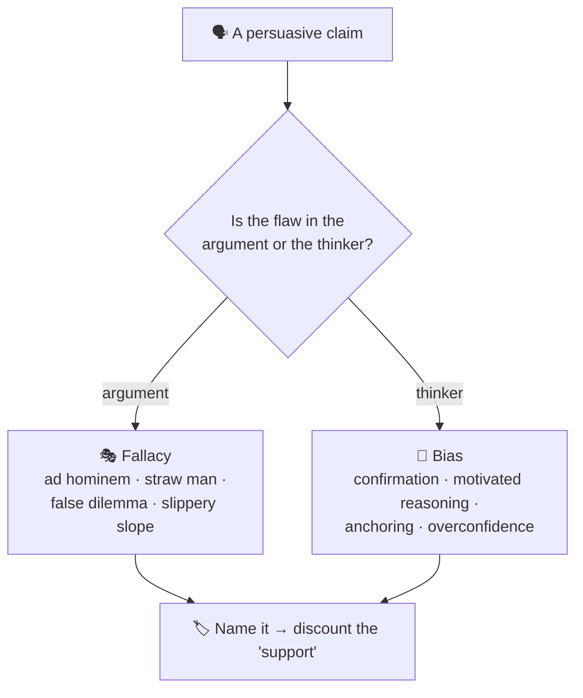
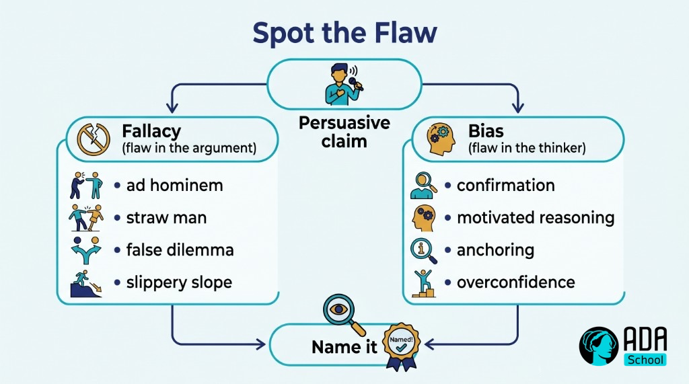

## ⚛ Learning Atom 2 — *Logical Fallacies & Reasoning Biases*

**Phase:** 🙉 1 · Self-Guided Introduction (*hear*) · **KSA:** 🧠 Knowledge · **Target level:** L2
· **Component id:** `K-fallacies-biases`

### 🎯 Learning objective

- **Recognize** common logical fallacies and reasoning biases and **explain** how each distorts an
  argument.

### 🧩 Prerequisites

- Atom 1 (the anatomy of an argument). Fallacies are specific ways the inference or premises go wrong.

### 🧭 Atom description

Bad reasoning often *sounds* convincing — that's exactly why it works. This atom is a field guide to
the most common ways arguments fail: **fallacies** (flaws in the logic) and **biases** (flaws in the
thinker). Once you can name them, you'll start seeing them everywhere: in ads, headlines, debates,
AI output, and your own first drafts.

---

### 📖 Reading — *A field guide to bad arguments* (≈ 8 min)

**Logical fallacies** — flaws in the *argument*:

- **Ad hominem** — attacking the person, not their argument. *"You can't trust her budget analysis,
  she's young."*
- **Straw man** — distorting someone's position into a weaker one and attacking that. (The antidote,
  *steelmanning*, comes in Atom 4.)
- **False dilemma** — presenting two options as the only ones. *"Either we cut the budget or we go
  bankrupt."* (Usually there are more.)
- **Slippery slope** — claiming one step inevitably leads to an extreme outcome, with no support.
- **Appeal to authority (misused)** — "an expert said so" when the person isn't a relevant expert, or
  experts disagree. (Real expertise *is* evidence — misuse is citing irrelevant or fake authority.)
- **Appeal to emotion / popularity** — using fear, pity, or "everyone's doing it" instead of reasons.
- **Hasty generalization** — a sweeping conclusion from too few examples (anecdote ≠ data).
- **Circular reasoning (begging the question)** — the conclusion is hidden in the premises. *"It's the
  best because nothing's better."*
- **Post hoc / correlation–causation** — assuming that because B followed A, A caused B.
- **Whataboutism / red herring** — dodging by pointing at something irrelevant.

**Reasoning biases** — flaws in the *thinker* (these attack you before you even build the argument):

- **Confirmation bias** — seeking/believing what fits your existing view; ignoring the rest.
- **Motivated reasoning** — reasoning toward the conclusion you *want* to be true.
- **Anchoring** — over-relying on the first piece of information.
- **Availability** — overweighting vivid or recent examples.
- **Dunning–Kruger / overconfidence** — the less you know, the more certain you can feel.
- **In-group bias** — trusting claims from "your side" and discounting "the other side."

**Two meta-points:**

1. **It's easiest to spot fallacies in arguments you disagree with — and hardest in your own.** The
   real skill is turning the lens on *yourself*. (That's the intellectual-humility Ability, built in
   Atoms 5–6.)
2. **Spotting a fallacy doesn't make the conclusion false.** A badly-argued claim can still be true —
   it just hasn't been *supported*. ("Fallacy fallacy": rejecting a conclusion only because one
   argument for it was weak.)

> **The move:** when something is persuasive, pause and ask *"is this a reason, or a trick?"* — then
> name the specific fallacy or bias.

**Key takeaways**

- [ ] **Fallacies** are flaws in the argument (ad hominem, straw man, false dilemma, slippery slope…).
- [ ] **Biases** are flaws in the thinker (confirmation, motivated reasoning, anchoring, overconfidence…).
- [ ] You spot flaws fastest in *others'* arguments — train the lens on **your own.**
- [ ] A weak argument doesn't prove the conclusion **false** (avoid the "fallacy fallacy").

---

### 🎬 Watch — how reasoning goes wrong (~5–11 min)

```youtube
https://www.youtube.com/watch?v=AmM1qWAjQEk
"Logical fallacies, explained" — a short explainer (verify before delivery).
```

---

### 🖼️ See — fallacy vs. bias





> 🖼️ *Generated image — produced from the prompt below.*

A reusable prompt to generate an on-brand version:

```prompt
Create a clean, modern infographic titled "Spot the Flaw": a persuasive claim branches into "Fallacy
(flaw in the argument)" listing ad hominem, straw man, false dilemma, slippery slope, and "Bias (flaw
in the thinker)" listing confirmation, motivated reasoning, anchoring, overconfidence; both lead to
"Name it". Use ADA brand colors (Indigo #1E2A6E, Turquoise #15B5C6, Gold #E0A53C), light background,
flat vector, legible sans-serif. 16:9.
```

---

### ✅ Evaluate — Pop quiz (formative, `knowledge-mini`)

1. Name the fallacy: *"We either ban phones in class or grades will collapse."*
2. What's the difference between a fallacy and a bias?
3. What is the "fallacy fallacy"?

<details>
<summary>Answer key</summary>

1. **False dilemma** (false dichotomy) — it presents only two options when others exist.
2. A **fallacy** is a flaw in the *argument's* logic/structure; a **bias** is a systematic flaw in how
   the *thinker* processes information.
3. Concluding a claim is **false** just because one argument for it was fallacious — a weak argument
   doesn't disprove the conclusion.

</details>

---

### 📦 Deliverable

- Find **three** real examples (ad, headline, social post, or AI answer) and label the **fallacy or
  bias** in each, with one sentence explaining why.

### 🧠 Final reflection

- Which bias most often shapes *your* conclusions (confirmation? motivated reasoning?)? When did it
  last cost you?

### 🔗 Sources to verify (human-in-the-loop)

- *Your Logical Fallacy Is* (yourlogicalfallacyis.com) and *Thou Shalt Not Commit Logical Fallacies*.
- Kahneman, *Thinking, Fast and Slow* (reasoning biases).
- Walton, *Informal Logic* (fallacy theory — note context matters).

### 🧩 Connections

- **Predecessor:** Atom 1. **Successors:** Atom 3 (evaluate real arguments), Atom 4 (steelman instead
  of straw man).
