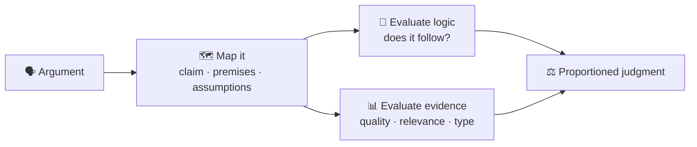
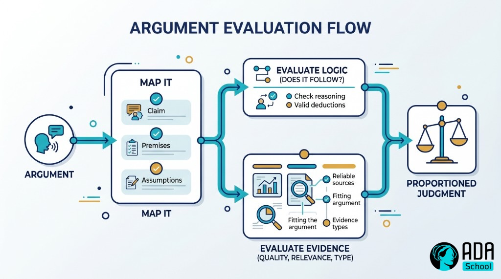

## ⚛ Learning Atom 3 — *Evaluate Arguments & Evidence*

**Phase:** 🙈 2 · Visual Exploration (*see*) · **KSA:** 🛠️ Skill · **Target level:** L2
· **Component id:** `S-evaluate-arguments`

### 🎯 Learning objective

- **Deconstruct** an argument and **evaluate** its evidence and logical strength.

### 🧩 Prerequisites

- Atoms 1–2. This is where the vocabulary becomes a repeatable analysis.

### 🧭 Atom description

This atom turns the concepts into a procedure: take any argument, break it into its parts, and judge
each part. It's in Phase 2 (*see*) because you learn it by watching it modeled, then doing it on a real
piece of writing. By the end you'll have a checklist you can run on any claim.

---

### 📖 Reading — *A procedure for judging any argument* (≈ 8 min)

**Step 1 — Map the argument.** Find and label the parts (Atom 1):

- What's the **main claim** (conclusion)? (Look for "therefore," "so," "we should…")
- What **premises** support it? List them.
- What's **assumed but unstated**? (The make-or-break step — surface the hidden premises.)
- What **evidence** is offered for each premise?

**Step 2 — Evaluate the logic.** Does the conclusion actually **follow**?

- Is the inference **valid/strong**, or is there a gap (a fallacy from Atom 2)?
- Are there **counter-examples** that would break it?
- Does it **overreach** — claiming more than the premises support? (e.g., "some" quietly becomes "all").

**Step 3 — Evaluate the evidence.** Premises are only as good as their support:

- **Quality:** Is the source credible and relevant (Atom 4)? Primary or hearsay? Recent enough?
- **Quantity/representativeness:** Enough cases, or a hasty generalization? Is the sample biased?
- **Relevance:** Does the evidence actually bear on *this* claim, or is it a red herring?
- **Type:** Is it data, expert judgment, anecdote, or assertion? (Anecdote ≠ data.)
- **Correlation vs. causation:** If a causal claim is made, is causation actually shown, or just
  correlation?

**Step 4 — Weigh and judge.** Critical thinking is not "find one flaw, reject everything." Weigh the
**overall strength**: How strong is the support? How serious are the flaws? What would change your
assessment? Reach a **proportioned** judgment — "well-supported," "partly supported," "unsupported" —
rather than a binary.

> **Charity first.** Before attacking, restate the argument in its **strongest, fairest** form (you'll
> formalize this as *steelmanning* in Atom 4). Evaluating a fair version is the honest — and more
> useful — move.

**A pocket checklist:** *Claim? Premises? Hidden assumptions? Does it follow? Is the evidence good and
relevant? What would change my mind?*

**Key takeaways**

- [ ] **Map** the argument (claim, premises, assumptions, evidence) before judging.
- [ ] Evaluate **logic** (does it follow? any fallacy/gap?) and **evidence** (quality, quantity,
  relevance, type) separately.
- [ ] Beware **overreach** and **correlation≠causation.**
- [ ] Reach a **proportioned** judgment; evaluate the **strongest** version (charity).

---

### 🖼️ See — the evaluation flow





> 🖼️ *Generated image — produced from the prompt below.*

A reusable prompt to generate an on-brand version:

```prompt
Create a clean, modern infographic of an "argument evaluation flow": Argument → Map it (claim,
premises, assumptions) → two parallel checks "Evaluate logic (does it follow?)" and "Evaluate evidence
(quality, relevance, type)" → "Proportioned judgment". Use ADA brand colors (Indigo #1E2A6E, Turquoise
#15B5C6, Gold #E0A53C), light background, flat vector, legible sans-serif. 16:9.
```

---

### 🧪 Practice — *Deconstruct a real argument* (Worksheet + Case Study)

Pick a real **opinion piece, ad, or persuasive post** (200–600 words). Then:

1. **Map it.** Write the main claim, the premises, and at least one **hidden assumption.**
2. **Logic check.** Does the conclusion follow? Name any **fallacy** or gap (Atom 2).
3. **Evidence check.** For each premise, rate the evidence (quality / relevance / type) and flag any
   anecdote-as-data or correlation-as-causation.
4. **Judgment.** Write a 3–4 sentence **proportioned** verdict: how well-supported is the claim, and
   what evidence would change your mind?
5. **Steelman preview.** State the argument's strongest possible version (even if you disagree).

---

### ✅ Evaluate — Performance task (`skill`)

Submit your deconstruction. Scored on:

| Criterion | Excellent (3) | Adequate (2) | Needs work (1) |
| --------- | ------------- | ------------ | -------------- |
| **Mapping** | Accurately identifies claim, premises, hidden assumptions | Mostly identifies parts | Misreads the argument |
| **Logic evaluation** | Correctly assesses inference; names real gaps/fallacies | Some evaluation | Misses or invents flaws |
| **Evidence evaluation** | Judges quality/relevance/type; catches anecdote/causation issues | Some judging | Takes evidence at face value |
| **Proportioned judgment** | Weighed, fair, states what would change view | Some nuance | Binary / one-sided |

> Pass = 2+ each → **L2** evidence for `S-evaluate-arguments`.

### 📦 Deliverable

- Your mapped + evaluated argument with the proportioned verdict and the steelman.

### 🧠 Final reflection

- Was the argument stronger or weaker than it first *felt*? What drove the gap — logic or evidence?

### 🔗 Sources to verify (human-in-the-loop)

- Weston, *A Rulebook for Arguments*.
- Browne & Keeley, *Asking the Right Questions*.
- Booth, Colomb & Williams, *The Craft of Research* (evidence quality).

### 🧩 Connections

- **Predecessor:** Atom 2. **Successor:** Atom 4 (question & verify the claims and sources you found).
