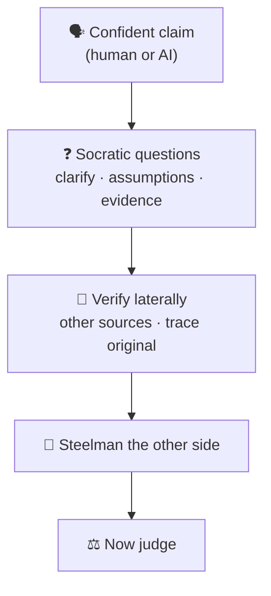
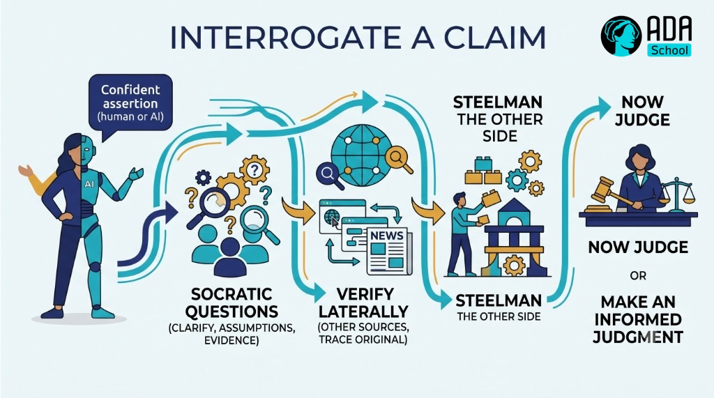

## ⚛ Learning Atom 4 — *Question & Verify*

**Phase:** 🙊 3 · Applied Practice (*do*) · **KSA:** 🛠️ Skill · **Target level:** L2
· **Component id:** `S-question-verify`

### 🎯 Learning objective

- **Apply** Socratic questioning and source/credibility evaluation to test a claim — and **steelman**
  it before judging.

### 🧭 Atom description

Evaluating an argument that's handed to you is half the job. The other half is **actively
interrogating** a claim: asking the questions that expose hidden assumptions, checking whether the
sources hold up, and fairly representing the opposing view. This is the most practical, repeatable
critical-thinking habit — and it's exactly what keeps you from being fooled by confident AI output.

---

### 📖 Reading — *Three tools: question, verify, steelman* (≈ 8 min)

**Tool 1 — Socratic questioning.** A small set of questions does most of the work. Run a claim through:

- **Clarify:** *What exactly do you mean? Can you give an example?*
- **Probe assumptions:** *What are you taking for granted here? What if the opposite were true?*
- **Probe evidence:** *How do you know? What's the source? Is there evidence against it?*
- **Probe alternatives:** *What's another way to see this? Who would disagree, and why?*
- **Probe implications:** *If that's true, what follows? Is that consequence acceptable?*
- **Question the question:** *Is this even the right question to be asking?*

**Tool 2 — Evaluate the source (the "verify" step).** Don't just read *vertically* (deeper into one
page) — read **laterally**: open new tabs and check what *other* sources say about the claim and the
author. Fact-checkers do this. Quick lenses (a riff on the **CRAAP** test):

- **Currency** — how recent is it? Does recency matter for this claim?
- **Relevance** — does it actually address *this* question?
- **Authority** — who wrote it, and what's their relevant expertise / track record? Who funds them?
- **Accuracy** — is it supported by evidence and corroborated elsewhere? Can you trace the original
  source (or is it "a study says…" with no link)?
- **Purpose** — is it informing, selling, or persuading? What's the incentive?

For AI output specifically: treat it as a **confident first draft, not a source.** Ask it for its
sources, then verify those sources actually exist and say what it claims (Atom 2's biases apply to
models too).

**Tool 3 — Steelman before you strike.** The opposite of a straw man. Restate the *other side's*
argument in its **strongest, most charitable** form — so strong its supporters would say "yes, exactly."
*Then* engage. Steelmanning does three things: it keeps you honest, it earns trust, and it often reveals
that the other side has a point you missed (the intellectual-humility Ability in action).

> **The habit:** confident claim → *clarify → probe assumptions & evidence → verify laterally →
> steelman → then judge.*

**Key takeaways**

- [ ] A few **Socratic questions** (clarify, assumptions, evidence, alternatives, implications) crack
  most claims open.
- [ ] **Verify laterally** — check other sources about the claim *and* the author; trace the original.
- [ ] Use a source lens (**currency, relevance, authority, accuracy, purpose**).
- [ ] **Steelman** the opposing view before you argue against it.

---

### 🖼️ See — interrogate a claim





> 🖼️ *Generated image — produced from the prompt below.*

A reusable prompt to generate an on-brand version:

```prompt
Create a clean, modern infographic "Interrogate a Claim": a confident claim (human or AI) flows
through "Socratic questions (clarify, assumptions, evidence)" → "Verify laterally (other sources, trace
original)" → "Steelman the other side" → "Now judge". Use ADA brand colors (Indigo #1E2A6E, Turquoise
#15B5C6, Gold #E0A53C), light background, flat vector, legible sans-serif. 16:9.
```

---

### 🧪 Practice A — *Socratic + lateral verification* (Worksheet)

Take a **claim you've seen shared recently** (news, social, or workplace). Then:

1. Write **6 Socratic questions** about it (one per category above).
2. **Read laterally:** find 2–3 *independent* sources on the claim. What do they agree/disagree on?
   Can you trace the **original** source?
3. Run the source through the **CRAAP** lens (authority, accuracy, purpose at minimum).
4. **Steelman** the strongest opposing view in 3–4 sentences.

### 🧪 Practice B — *Interrogate an AI answer* (AI Prompt Question)

Ask an AI a debatable question, then verify it:

```prompt
You are my critical-thinking sparring partner. I'll give you a claim. Do NOT just agree.
1) State the single strongest argument FOR it.
2) State the single strongest argument AGAINST it (steelman).
3) List the key assumptions both sides depend on.
4) Tell me exactly what evidence I should check to decide, and where to find it.
Claim: """[paste a debatable claim]"""
```

Then **fact-check the AI's response** with lateral reading. Note at least one thing it got wrong,
overstated, or couldn't source.

---

### ✅ Evaluate — Performance task (`skill`)

Submit Practice A + B. Pass = sharp, category-spanning questions; **real** lateral verification (named
independent sources, original traced); a fair steelman; and a documented AI fact-check. → **L2**
evidence for `S-question-verify`.

### 📦 Deliverable

- Your question set, verification notes (with sources), steelman, and AI fact-check.

### 🧠 Final reflection

- Did verifying change your view of the claim? Did the AI sound *more* confident than it deserved to be?

### 🔗 Sources to verify (human-in-the-loop)

- Caulfield, *Web Literacy for Student Fact-Checkers* (SIFT / lateral reading) — free, open.
- Stanford History Education Group — lateral reading research.
- Paul & Elder, *The Art of Socratic Questioning*.

### 🧩 Connections

- **Predecessor:** Atom 3. **Successor:** Atom 5 (now build your *own* defensible argument).
