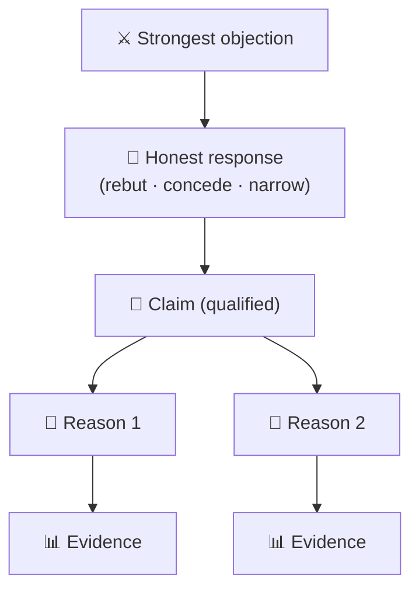
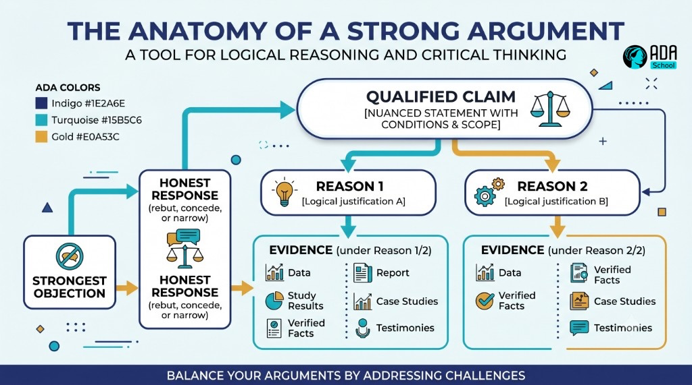

## ⚛ Learning Atom 5 — *Build & Defend a Reasoned Argument*

**Phase:** 🙊 3 · Applied Practice (*do*) · **KSA:** 🛠️ Skill + 🌱 Abilities · **Target level:** L2
· **Component ids:** `S-construct-argument`, `A-intellectual-humility`, `A-skepticism-curiosity`

### 🎯 Learning objective

- **Create** a well-reasoned argument (claim → reasons → evidence → counterarguments) — and demonstrate
  **intellectual humility** and **skeptical curiosity** while defending it.

### 🧭 Atom description

Now you flip from critic to builder. Evaluating others is easier than constructing something that
*survives* evaluation. This atom teaches **argument mapping** and the discipline of **engaging
counterarguments** — and it's where the two Abilities get assessed, because how you handle being
challenged reveals whether the humility and curiosity are real.

---

### 📖 Reading — *Build something that survives scrutiny* (≈ 7 min)

**The structure of a strong argument:**

1. **Claim** — state your position clearly and precisely (avoid vague or overreaching claims).
2. **Reasons** — 2–4 distinct reasons, each one a complete thought, not a restatement of the claim.
3. **Evidence** — back each reason with the *best available* evidence (verified per Atom 4).
4. **Counterarguments** — name the **strongest** objections (steelman them) and respond honestly.
   This is what separates a reasoned argument from a rant. You can: rebut it, or **concede** it and
   show your claim still holds (or narrow your claim — that's a win, not a loss).
5. **Qualified conclusion** — state your claim with the **right confidence**: "strongly," "on balance,"
   "tentatively." Calibration is a sign of good thinking, not weakness.

**Argument mapping** — sketch it before you write: claim at the top, reasons branching below, evidence
under each, objections off to the side with your responses. Seeing it as a structure exposes weak
branches and missing support.

**The two Abilities, made visible.** This atom is where dispositions show up under pressure:

- **🌱 Intellectual humility** — you hold your claim *open*: you invite the strongest objections,
  acknowledge uncertainty, give credit to opposing points, and **change your position when the evidence
  warrants.** The willingness to say *"good point — I was wrong about that part"* is the whole game.
- **🌱 Skeptical curiosity** — you keep questioning, including your *own* claim: *"What would prove me
  wrong? What am I still assuming? What don't I know yet?"*

> **The mark of a strong thinker:** not winning every exchange, but holding **calibrated** beliefs —
> confident where evidence is strong, tentative where it's thin, and willing to update.

**Key takeaways**

- [ ] Strong argument = **claim → reasons → evidence → counterarguments → qualified conclusion.**
- [ ] **Engage the strongest objection** honestly (rebut, concede, or narrow your claim).
- [ ] **Calibrate** your confidence to your evidence.
- [ ] Defend with **humility** (update when warranted) and **curiosity** (keep questioning yourself).

---

### 🖼️ See — an argument map





> 🖼️ *Generated image — produced from the prompt below.*

A reusable prompt to generate an on-brand version:

```prompt
Create a clean, modern "argument map" infographic: a qualified Claim at top, two Reasons branching
below, Evidence under each reason, and a side branch "Strongest objection → Honest response (rebut,
concede, or narrow)" feeding back into the claim. Use ADA brand colors (Indigo #1E2A6E, Turquoise
#15B5C6, Gold #E0A53C), light background, flat vector, legible sans-serif. 16:9.
```

---

### 🧪 Practice — *Build it, then defend it* (Essay + Simulation + Forum)

1. **Map & write.** Pick a position you hold. Build the full structure: claim, 2–4 reasons, evidence
   (verified), the **strongest** counterargument with your honest response, and a **qualified**
   conclusion. ~400–600 words.
2. **Simulate the defense.** Have a peer (or the AI) attack your argument hard. Respond in real time.
3. **Post & defend in the forum.** Share your argument; respond to ≥2 peers' challenges and challenge
   ≥2 others' arguments — using the steelman + Socratic habits from Atom 4.

> 🤝 **This is a behavioral-assessment occasion.** Mentors observe *how* you defend: Do you steelman
> challengers? Do you concede good points? Do you update your claim when the evidence warrants? Do you
> keep questioning your own position?

---

### ✅ Evaluate — Behavioral assessment (`behavioral`, Abilities)

Observed across this atom + the forum + the capstone (≥3 occasions):

| Ability | Look-for (evidence) |
| ------- | ------------------- |
| 🌱 Intellectual humility | Invites the strongest objections; concedes valid points; **revises** position when warranted; calibrates confidence |
| 🌱 Skeptical curiosity | Questions own assumptions; asks "what would prove me wrong?"; pursues the strongest version of every side |

Rated **Emerging / Developing / Proficient** on the behavioral rubric in [`rubrics.md`](rubrics.md)
(not a quiz — evidenced over time). The **argument quality** (structure, counterargument handling) is
scored on the `skill` rubric.

### 📦 Deliverable

- Your argument map + written argument, plus a short note: "what I changed after the defense, and why."

### 🧠 Final reflection

- What objection landed hardest? Did you update, narrow, or hold your claim — and was that the honest call?

### 🔗 Sources to verify (human-in-the-loop)

- Toulmin, *The Uses of Argument* (claim/grounds/warrant/rebuttal).
- Graff & Birkenstein, *They Say / I Say* (engaging counterarguments).
- *The Scout Mindset* (Galef) — calibration & intellectual humility.

### 🧩 Connections

- **Predecessor:** Atom 4. **Successor:** Atom 6 (apply the whole stack to a real, contested issue).
