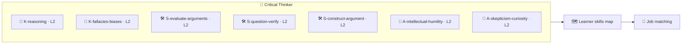

# 🗺️ Skills Map — Critical Thinking

How the **🏅 Critical Thinker** badge writes to a learner's skills map, and why it raises the floor on
almost every role. See the methodology in
[`../../specs/skills-map-and-job-matching.md`](../../specs/skills-map-and-job-matching.md).

---

## 🧩 What the badge writes to the map

On earning the badge, these KSA components are recorded with verified evidence:

| Component | Type | Level | Evidence |
| --------- | ---- | ----- | -------- |
| `K-reasoning` | 🧠 Knowledge | L2 | Pop quiz + applied in capstone |
| `K-fallacies-biases` | 🧠 Knowledge | L2 | Pop quiz + applied in capstone |
| `S-evaluate-arguments` | 🛠️ Skill | **L2** | Atom 3 performance task |
| `S-question-verify` | 🛠️ Skill | **L2** | Atom 4 performance task |
| `S-construct-argument` | 🛠️ Skill | **L2** | Atom 5 + capstone |
| `A-intellectual-humility` | 🌱 Ability | L2 | Behavioral, ≥3 occasions |
| `A-skepticism-curiosity` | 🌱 Ability | L2 | Behavioral, ≥3 occasions |

---

## 🎯 Why this badge is a near-universal multiplier

Critical thinking is a **transversal** competency: O\*NET lists it as a core *process skill* required —
at varying levels — by essentially every occupation. It also **amplifies other skills** on the map:

| Pairs with | Combined effect |
| ---------- | --------------- |
| 🧩 [Problem Solving](../problem-solving-micro-credential/README.md) | Reason rigorously about diagnoses and options before deciding |
| 🧭 [Self-Learning](../self-learning-micro-credential/README.md) | Judge source quality and AI output while learning |
| 🗣️ [Effective Communication](../effective-communication-micro-credential/README.md) | Build clear, well-reasoned, defensible messages |
| 🌱 [Growth Mindset](../growth-mindset-micro-credential/README.md) | Treat being wrong as information, not threat |

---

## 🧮 Worked matching example

A role posting asks for *"strong analytical and critical-thinking skills; able to evaluate evidence and
make sound, well-reasoned judgments."*

| Requirement | Map evidence | Status |
| ----------- | ------------ | ------ |
| Evaluate evidence & arguments | `S-evaluate-arguments` @ L2 | ✅ met |
| Question & verify claims/sources | `S-question-verify` @ L2 | ✅ met |
| Sound, defensible judgments | `S-construct-argument` @ L2 + `A-intellectual-humility` @ L2 | ✅ met |
| Open-minded, evidence-driven | `A-skepticism-curiosity` + `A-intellectual-humility` (behavioral) | ✅ met |

→ A learner holding this badge **meets the critical-thinking minimums** for the role, with *verifiable
evidence* (capstone brief + behavioral observations) rather than a self-claimed bullet point.

> ⚠️ **Human-in-the-loop:** AI-suggested matches are provisional until a mentor/employer validates the
> evidence — per [`../../CLAUDE.md`](../../CLAUDE.md) §5.
