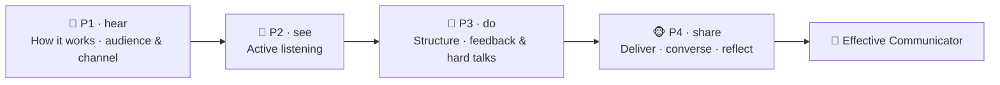

# 🗣️ Worked Example — Effective Communication Micro-Credential (full course)

  
  
  
  

A **complete, ready-to-run ADA micro-credential** for one of the most-requested workplace
competencies: **communicating effectively**. It is a *fully populated* example built end-to-end with
the ADA Methodology (KSA + 4 phases + learning-atom topology): every atom has **real reading text**,
**curated video links**, **Mermaid diagrams**, **image-generation prompts**, role-plays, and rubrics.

> 🖥️ **See it live:** open [`course.html`](course.html) in any browser for an interactive,
> navigable version of this course (sidebar, progress, embedded videos, diagrams, copyable prompts).

This is a **human-skill** course that spans the full KSA spectrum: a small **Knowledge** base (how
communication works, audience & channel), two core **Skills** (active listening, structuring clear
messages), the **Skill** of navigating feedback / difficult conversations, and the durable
**Abilities** that make it stick (empathy and assertive, respectful expression). It complements the
[Growth Mindset](../growth-mindset-micro-credential/README.md) (a durable *Ability*) and
[Python Variables](../python-variables-micro-credential/README.md) (a technical *Skill*) courses.

Conforms to [`../../specs/micro-credential-v2-schema.md`](../../specs/micro-credential-v2-schema.md) ·
modalities from [`../../specs/learning-atom-topology.md`](../../specs/learning-atom-topology.md) ·
KSA from [`../../specs/ksa-taxonomy.md`](../../specs/ksa-taxonomy.md).

---

## 🧭 What this teaches

Almost every job posting asks for "strong communication skills" — and almost no one defines what
that *means* or how to *train* it. This course makes it concrete and certifiable: learners build a
working model of how communication succeeds and fails, learn to **listen actively**, **structure a
clear message** (in writing and out loud), and **handle feedback and hard conversations** with
empathy and appropriate assertiveness — finishing with a real communication performance they deliver
and peer-review.

| | |
| --- | --- |
| **Title** | Effective Communication: Listen, Structure & Connect |
| **Duration** | ~12 hours · 2–3 weeks |
| **Primary KSA** | 🛠️ Skill — *listen actively* and *structure clear messages*, plus the 🌱 Abilities that sustain them |
| **Target competency** | O\*NET basic/social skills: **Active Listening** (2.A.1.b), **Speaking** (2.A.1.d), **Writing** (2.A.1.c), **Social Perceptiveness** (2.B.1.a) · ESCO transversal *"communicate effectively", "use active listening"* |
| **Badge** | 🏅 *Effective Communicator* |
| **Prerequisites** | None. A real context (team, class, project) to practice in helps. |

---

## 📚 Course contents

| # | File | What it is |
| - | ---- | ---------- |
| — | [`micro-credential.md`](micro-credential.md) | The full micro-credential spec (YAML schema, objectives, KSA map, phase planner) |
| 1 | [`atoms/atom-1-how-communication-works.md`](atoms/atom-1-how-communication-works.md) | 🙉 P1 · 🧠 K — How communication works (the model, noise & barriers) |
| 2 | [`atoms/atom-2-audience-and-channel.md`](atoms/atom-2-audience-and-channel.md) | 🙉 P1 · 🧠 K — Audience analysis & choosing the right channel |
| 3 | [`atoms/atom-3-active-listening.md`](atoms/atom-3-active-listening.md) | 🙈 P2 · 🛠️ S + 🌱 A — Active, empathetic listening (model + practice) |
| 4 | [`atoms/atom-4-structure-your-message.md`](atoms/atom-4-structure-your-message.md) | 🙊 P3 · 🛠️ S — Structure clear messages (BLUF · SBI · Pyramid) |
| 5 | [`atoms/atom-5-feedback-and-difficult-conversations.md`](atoms/atom-5-feedback-and-difficult-conversations.md) | 🙊 P3 · 🛠️ S + 🌱 A — Feedback & difficult conversations (role-play) |
| 6 | [`atoms/atom-6-communication-capstone.md`](atoms/atom-6-communication-capstone.md) | 🐵 P4 · 🛠️ S + 🌱 A — Capstone: deliver, converse, reflect + peer review |
| — | [`capstone.md`](capstone.md) | Capstone brief + how it maps to KSA |
| — | [`rubrics.md`](rubrics.md) | All rubrics (knowledge-mini, skill, behavioral, capstone-5) |
| — | [`skills-map.md`](skills-map.md) | Badge → skills map and how it boosts almost every role |

> 🤝 **Practiced with people:** communication is a social skill — atoms use role-plays, peer review,
> and a live showcase, and the Abilities are assessed **behaviorally across ≥3 occasions** (never a quiz).

---

## 🔄 Phase journey

---

## 🤖 How it was authored (and how to reuse it)

This course follows the Gen AI authoring workflow in
[`../../specs/genai-authoring-workflow.md`](../../specs/genai-authoring-workflow.md):
competency → KSA → atoms → modalities → rubrics → badge. Conventions used throughout:

- **🎬 Videos** are written as a `youtube` block with the real URL + a caption (the interactive site
  embeds them as a click-to-play player).
- **🖼️ Diagrams** are provided two ways: a live **Mermaid** diagram *and* a reusable
  **image-generation prompt** in a `prompt` block — feed it to any image model for an on-brand asset.
- **✅ Activities** include scripts, checklists, and rubrics so the course is self-paced and practicable.

> ⚠️ **Human-in-the-loop (methodology guardrail):** the external links and references below are
> **curated starting points**. A mentor/instructor should verify each link, licensing, and currency
> before delivery — AI-suggested sources are never authoritative on their own. Abilities here require
> human/peer observation across occasions. See [`../../CLAUDE.md`](../../CLAUDE.md) §5.
