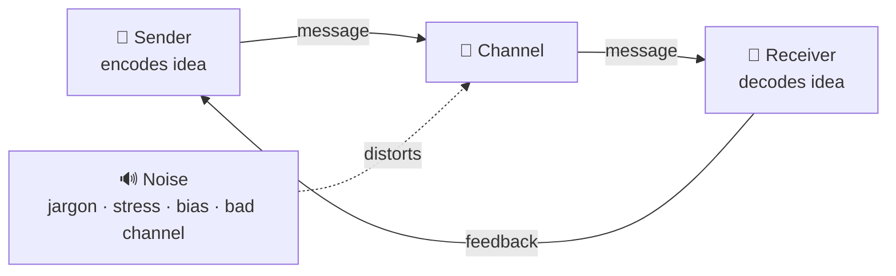
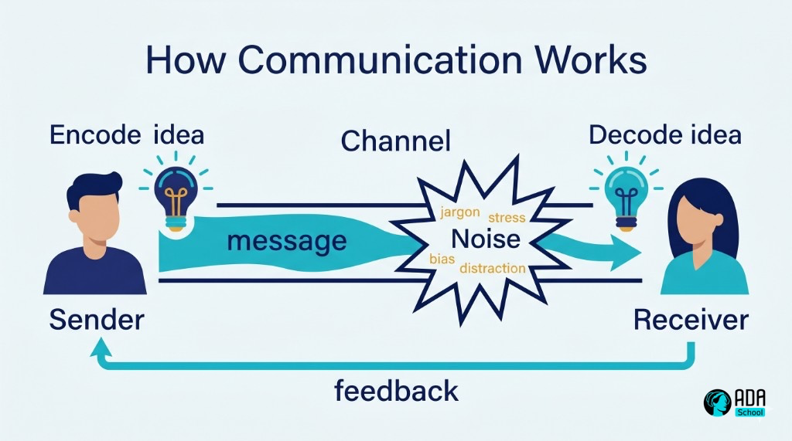

## ⚛ Learning Atom 1 — *How Communication Works*

**Phase:** 🙉 1 · Self-Guided Introduction (*hear*) · **KSA:** 🧠 Knowledge · **Target level:** L2
· **Component id:** `K-comm-model`

### 🎯 Learning objective

- **Explain** the communication process model and **name** the common barriers ("noise") that make
  messages fail.

### 🧩 Prerequisites

- None. Just situations where you've been misunderstood — we'll explain why.

### 🧭 Atom description

"Strong communication" sounds vague until you see the *mechanism*. This atom gives you a simple model
of how a message travels from one mind to another, and where it breaks. Once you can name the failure
points, you can fix them deliberately — that's the whole rest of the course.

---

### 📖 Reading — *A message is a relay, not a transfer* (≈ 6 min)

We like to think communication is **transferring** an idea from our head to someone else's. It isn't.
You **encode** an idea into words/tone/body language; it travels through a **channel**; the other
person **decodes** it through their own experience, mood, and assumptions. What they reconstruct is
never exactly what you meant — the question is how *close* you can get.

The classic **sender → message → channel → receiver → feedback** model (Shannon–Weaver, extended by
Schramm) adds two crucial ideas:

- **Noise** — anything that distorts the message: literal noise, jargon, vague words, a bad channel,
  stress, bias, distraction, cultural difference, or unstated assumptions.
- **Feedback** — the receiver's response that tells you whether it landed. Communication without
  feedback is just *broadcasting*; you don't actually know if you communicated.

A few consequences worth internalizing:

- **Meaning lives in the receiver, not the message.** "But I *said* it clearly" is irrelevant if they
  didn't reconstruct your meaning. Effectiveness is measured at *their* end.
- **Most conflict is decoding error**, not disagreement. People often agree but *think* they disagree
  because words carried different meanings.
- **You can only manage noise you can name.** That's why the next atoms target specific sources:
  wrong channel/audience (Atom 2), not listening (Atom 3), unstructured messages (Atom 4), and
  emotional noise in hard conversations (Atom 5).

A handy distinction: **verbal** (the words), **paraverbal** (tone, pace, volume), and **nonverbal**
(face, posture, gesture). When they conflict, people believe the nonverbal/paraverbal — so "I'm fine"
in a flat tone reads as *not* fine.

**Key takeaways**

- [ ] Communication is **encode → channel → decode → feedback**, not a clean transfer.
- [ ] **Noise** is anything that distorts the message; **feedback** confirms it landed.
- [ ] **Meaning is reconstructed by the receiver** — effectiveness is judged at their end.
- [ ] Verbal, paraverbal, and nonverbal must **align** or the nonverbal wins.

---

### 🎬 Watch — Communication, clearly explained (pick one, ~5–12 min)

```youtube
https://www.youtube.com/watch?v=eIho2S0ZahI
Julian Treasure — "How to speak so that people want to listen" (TED).
```

```youtube
https://www.youtube.com/watch?v=R1vskiVDwl4
Celeste Headlee — "10 ways to have a better conversation" (TED).
```

---

### 🖼️ See — the communication model with noise





> 🖼️ *Generated image — produced from the prompt below.*

A reusable prompt to generate an on-brand version of this diagram:

```prompt
Create a clean, modern educational infographic titled "How Communication Works". Show a Sender
encoding an idea (lightbulb), an arrow labeled "message" passing through a Channel, into a Receiver
decoding the idea, with a return arrow labeled "feedback". Add a "Noise" burst (jargon, stress, bias,
distraction) distorting the channel. Use ADA brand colors (Indigo #1E2A6E, Turquoise #15B5C6, Gold
#E0A53C accents) on a light background, flat vector style, legible sans-serif, no photoreal faces. 16:9.
```

---

### ✅ Evaluate — Pop quiz (formative, `knowledge-mini`)

1. Where does the *meaning* of a message ultimately live — in the message or the receiver?
2. Give two examples of "noise" that are not literal sound.
3. What turns "broadcasting" into actual communication?

<details>
<summary>Answer key</summary>

1. In the **receiver**, who decodes it through their own context — so effectiveness is judged there.
2. Any two: jargon, vague wording, stress, bias, distraction, wrong channel, cultural difference,
   unstated assumptions.
3. **Feedback** — checking that the message was reconstructed as intended.

</details>

---

### 📦 Deliverable

- Recall a recent miscommunication. In 4–6 sentences, locate the **noise** (which source?) and the
  missing/late **feedback**, and name one change that would have prevented it.

### 🧠 Final reflection

- When your verbal and nonverbal signals last disagreed, which did people believe? What does that tell
  you about where to put attention?

### 🔗 Sources to verify (human-in-the-loop)

- Shannon & Weaver, *A Mathematical Theory of Communication* (the source model).
- Schramm, *The Process and Effects of Mass Communication* (shared field of experience).
- Mehrabian, *Silent Messages* (verbal/paraverbal/nonverbal — note the often-misquoted "7%" rule).

### 🧩 Connections

- **Successors:** Atom 2 (audience & channel — managing two big noise sources), Atom 3 (listening).
