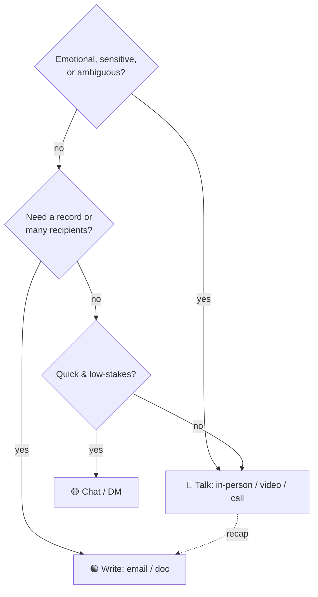
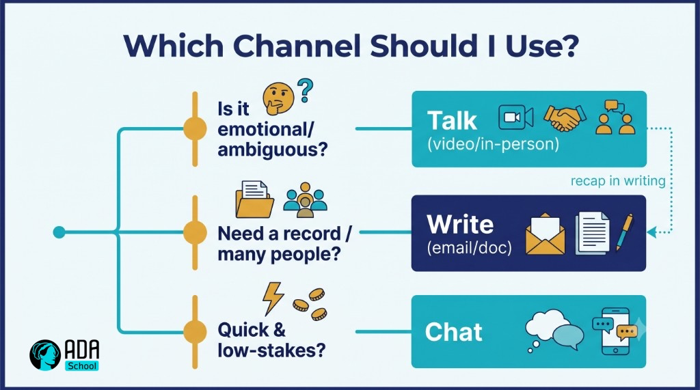

## ⚛ Learning Atom 2 — *Audience & Channel*

**Phase:** 🙉 1 · Self-Guided Introduction (*hear*) · **KSA:** 🧠 Knowledge · **Target level:** L2
· **Component id:** `K-audience-channel`

### 🎯 Learning objective

- **Analyze** an audience and **choose** an appropriate channel for a given message.

### 🧩 Prerequisites

- Atom 1 (the communication model) — channel and audience are two of the biggest noise sources.

### 🧭 Atom description

The same words can succeed or fail depending on *who* hears them and *how* they're delivered. A great
message sent on the wrong channel (a complex decision buried in a chat message; bad news by email) is
a failed message. This atom gives you two quick analyses to run before you communicate anything that
matters.

---

### 📖 Reading — *Right message, right person, right pipe* (≈ 7 min)

**1) Analyze the audience.** Before composing, answer four questions:

- **Who** are they (role, seniority, relationship to you)?
- **What do they already know** (so you don't over- or under-explain)?
- **What do they care about** (their goals, pressures, "what's in it for them")?
- **What do you want them to *do*** after (the call to action)?

Adapt vocabulary, level of detail, and framing to the answers. An exec wants the decision and the
"so what"; a teammate wants the how; a customer wants the benefit and reassurance.

**2) Choose the channel by *media richness*.** Channels differ in how much nuance they carry:

| Richness | Channel | Best for |
| -------- | ------- | -------- |
| 🔴 Richest | In-person / video call | emotion, conflict, negotiation, ambiguity, relationship building |
| 🟠 Rich | Phone / voice | quick nuance, tone matters, back-and-forth |
| 🟡 Lean | Chat / DM | quick coordination, simple questions, low stakes |
| 🟢 Leaner | Email | records, async detail, non-urgent, multiple recipients |
| 🔵 Leanest | Doc / announcement | one-to-many reference, durable information |

**Rules of thumb**

- **Match richness to stakes/ambiguity.** Emotional or ambiguous → richer (talk). Simple/record-worthy
  → leaner (write). *Hard feedback over chat* is the classic mismatch.
- **Sync vs. async.** Synchronous (call/meeting) for fast convergence and rapport; asynchronous
  (email/doc) to respect time, allow thinking, and create a record. Don't call a meeting an email
  could do — or email a decision a 5-minute call would settle.
- **Follow rich with lean.** After an important conversation, send a short written recap so the
  decisions persist and everyone decodes the same thing.

**Key takeaways**

- [ ] Run the **4-question audience analysis** (who · know · care · do) before composing.
- [ ] Match **channel richness** to the message's **stakes and ambiguity**.
- [ ] **Talk** for emotion/ambiguity; **write** for records/detail/many recipients.
- [ ] **Recap rich conversations in writing** so meaning persists.

---

### 🖼️ See — choosing a channel





> 🖼️ *Generated image — produced from the prompt below.*

A reusable prompt to generate an on-brand version:

```prompt
Create a clean, modern decision-tree infographic titled "Which Channel Should I Use?". Branch from
"Is it emotional/ambiguous?" to "Talk (video/in-person)", from "Need a record / many people?" to
"Write (email/doc)", and "Quick & low-stakes?" to "Chat". Include a small dotted arrow "recap in
writing" from Talk to Write. Use ADA brand colors (Indigo #1E2A6E, Turquoise #15B5C6, Gold #E0A53C),
light background, flat vector, legible sans-serif. 16:9.
```

---

### 🧪 Practice — *Audience & channel worksheet*

For each scenario, write the **audience analysis (who/know/care/do)** and the **channel** you'd pick,
with one sentence of reasoning:

1. You must tell a teammate their part of the project slipped the deadline.
2. You're announcing a new process to 40 people.
3. You need a quick yes/no on a meeting time.
4. You're proposing a budget to a busy executive.

<details>
<summary>Sample key</summary>

1. **Talk** (video/in-person) — sensitive, relational; recap in writing after.
2. **Write** (doc/announcement) — one-to-many, durable reference; offer a Q&A channel.
3. **Chat** — quick, low-stakes.
4. **Write** a one-page BLUF memo (exec cares about decision + impact) → **then** a short meeting if
   needed. (You'll build that message in Atom 4.)

</details>

---

### ✅ Evaluate — Pop quiz (formative, `knowledge-mini`)

1. Which channel for delivering difficult, emotional news — and why?
2. What are the four audience-analysis questions?
3. Why send a written recap after an important meeting?

<details>
<summary>Answer key</summary>

1. A **rich** channel (in-person/video/call): emotion and ambiguity need tone, nuance, and immediate
   feedback.
2. **Who** they are · **what they know** · **what they care about** · **what you want them to do.**
3. So decisions **persist** and everyone **decodes the same meaning** (reduces later noise).

</details>

---

### 📦 Deliverable

- Your completed worksheet for the 4 scenarios (audience analysis + channel + reasoning).

### 🧠 Final reflection

- What's your *default* channel? Where does that default cost you (e.g., chatting things that deserve
  a call)?

### 🔗 Sources to verify (human-in-the-loop)

- Daft & Lengel, *Media Richness Theory*.
- Minto, *The Pyramid Principle* (audience-first structuring — preview of Atom 4).

### 🧩 Connections

- **Predecessor:** Atom 1. **Successors:** Atom 3 (listen to the audience), Atom 4 (structure for them).
