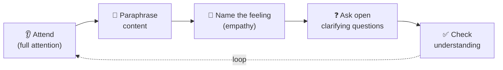

## ⚛ Learning Atom 3 — *Active Listening*

**Phase:** 🙈 2 · Visual Exploration (*see*) · **KSA:** 🛠️ Skill + 🌱 Ability · **Target level:** L2
· **Component ids:** `S-active-listening`, `A-empathy`

### 🎯 Learning objective

- **Listen actively** — attend fully, paraphrase, ask clarifying questions, and check understanding —
  while showing empathy for the speaker.

### 🧩 Prerequisites

- Atoms 1–2. A partner (or a willing colleague/friend) for the practice.

### 🧭 Atom description

Most people think communication is about *talking*. The highest-leverage skill is the opposite:
listening so well the other person feels understood. This atom is in Phase 2 (*see*) because you learn
listening best by **watching it modeled** and then **doing it** in a low-stakes pair. It builds a
Skill (a technique) *and* an Ability (empathy) at once.

---

### 🎬 Watch — what great listening looks like (~5–10 min)

```youtube
https://www.youtube.com/watch?v=R1vskiVDwl4
Celeste Headlee — "10 ways to have a better conversation" (TED).
```

```youtube
https://www.youtube.com/watch?v=saXfavo1OQo
"Active Listening" — a short skills explainer (verify before delivery).
```

---

### 📖 Reading — *Listening is a skill you perform* (≈ 6 min)

There are levels of listening: **ignoring → pretending → selective → attentive → empathetic**. Most
workplace listening stalls at "selective" (waiting to talk, half-listening). Active listening is a
deliberate performance with observable moves:

- **Attend.** Put the phone away, face them, make eye contact, leave a beat of silence. Your body says
  "you have my attention" before any word.
- **Paraphrase / reflect.** Say back the *content* in your words: *"So the deadline moved and now the
  test plan is at risk — is that right?"* This proves you decoded correctly and lets them correct you.
- **Name the feeling (empathy).** Reflect the *emotion*, tentatively: *"Sounds frustrating."* Naming
  emotion lowers it and signals you see the person, not just the task.
- **Ask open, clarifying questions.** Prefer "what" and "how" over "why" (why feels accusatory).
  *"What would make this easier?"* beats *"Why didn't you flag it?"*
- **Don't fix yet.** Resist jumping to solutions. People first need to feel heard; advice given too
  early reads as dismissal.
- **Check understanding.** Summarize and confirm before moving on or responding.

Two anti-patterns to kill: **the autobiographical hijack** ("Oh that happened to me too, when I…")
and **solution-first** (fixing before understanding). Both move the spotlight off the speaker.

> **Empathy vs. agreement.** Reflecting a feeling ("that sounds stressful") is *not* agreeing or
> conceding — it's acknowledging their experience. You can empathize and still disagree.

**Key takeaways**

- [ ] Active listening is **observable**: attend · paraphrase · name feeling · ask open Qs · check.
- [ ] **Paraphrasing** proves (and corrects) your decoding — the core move.
- [ ] **Name the emotion** to show empathy; it lowers the temperature.
- [ ] **Don't fix first.** Understand, then (if wanted) help.

---

### 🖼️ See — the active-listening loop



---

### 🧪 Practice — *Paired listening drill* (Role-Play + Pair)

In pairs, 12–15 minutes total:

1. **Speaker (3 min):** talk about a real (mild) frustration or a project decision.
2. **Listener:** use only active-listening moves — **no advice**. Paraphrase, name the feeling, ask
   open questions, check understanding.
3. **Swap.** Then debrief 2 min: *"When did you feel most understood?"*

Solo option: watch a 5-min interview, pause, and write the paraphrase + feeling-name + one open
question you'd offer.

---

### ✅ Evaluate — Skill mini-rubric (`skill`) + first behavioral occasion

Self/peer-score the drill:

| Criterion | Excellent (3) | Adequate (2) | Needs work (1) |
| --------- | ------------- | ------------ | -------------- |
| **Attending** | Full attention, no interrupting | Mostly attentive | Distracted / interrupts |
| **Paraphrasing** | Accurate, in own words; invites correction | Some reflecting | Repeats verbatim or none |
| **Empathy (🌱)** | Names feeling; speaker felt understood | Some acknowledgment | Jumps to self/solution |
| **Questions** | Open, clarifying, non-leading | Mix | Closed/leading only |

> Pass = 2+ each. This is **occasion 1 of 3** for the Ability `A-empathy` (also observed in Atoms 5–6).

### 📦 Deliverable

- A short note from your partner (or self-reflection) on **when they felt most understood**, plus the
  filled mini-rubric.

### 🧠 Final reflection

- Which move is hardest for you — staying silent, paraphrasing, or not fixing? Pick one to practice
  this week.

### 🔗 Sources to verify (human-in-the-loop)

- Covey, *The 7 Habits* — Habit 5, "Seek first to understand."
- Rogers & Farson, *Active Listening* (1957).
- Headlee, *We Need to Talk*.

### 🧩 Connections

- **Predecessor:** Atom 2. **Successors:** Atom 4 (now structure what *you* say), Atom 5 (listening
  under pressure).
