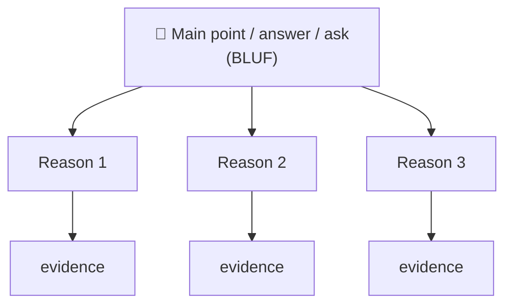
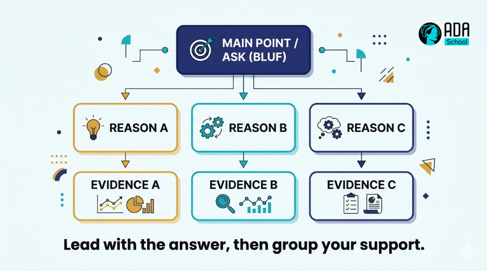

## ⚛ Learning Atom 4 — *Structure Your Message (BLUF · SBI · Pyramid)*

**Phase:** 🙊 3 · Applied Practice (*do*) · **KSA:** 🛠️ Skill · **Target level:** L2
· **Component id:** `S-structure-message`

### 🎯 Learning objective

- **Structure** a clear message — in writing and out loud — using **BLUF**, **SBI**, and the
  **Pyramid Principle**.

### 🧩 Prerequisites

- Atom 2 (audience analysis) — structure serves the audience.

### 🧭 Atom description

Clarity isn't a personality trait; it's a structure. Three reusable frameworks cover most workplace
messages: lead with the point (BLUF), give specific behavioral feedback (SBI), and organize support
top-down (Pyramid). This atom turns "I'll just wing the email/update" into a fast, repeatable move.

---

### 📖 Reading — *Three structures that make you clear* (≈ 8 min)

**1) BLUF — Bottom Line Up Front.** Put the conclusion / ask / decision in the **first sentence**,
then support it. Readers are busy and skim; burying the point in paragraph three guarantees it's
missed. Compare:

- 👎 *"Following up on yesterday's discussion, there were several considerations, and after looking
  into the vendor options and timelines… [200 words] …so we should probably go with Option B."*
- 👍 *"**Recommendation: choose Option B (ships 2 weeks sooner, same cost).** Details below."*

**2) The Pyramid Principle (Minto).** Structure any explanation top-down: **answer/main point →
grouped supporting arguments → evidence**. Each level summarizes the one below. It's BLUF applied
recursively, and it's how you turn a messy brain-dump into a logical flow. Use signposting: *"There
are three reasons… First… Second… Third…"*

**3) SBI — Situation · Behavior · Impact** (for feedback or describing an issue). Keep it specific
and non-judgmental:

- **Situation:** when/where — *"In this morning's standup…"*
- **Behavior:** the observable action (not character) — *"…you cut off Maria twice before she
  finished."*
- **Impact:** the effect — *"…so we lost her point and she went quiet for the rest of the meeting."*

SBI keeps feedback about **behavior**, not labels ("you're rude"), which is what makes it hearable.
(You'll use SBI live in Atom 5.)

**General clarity habits:** one idea per sentence; concrete words over abstractions; cut filler and
hedging; define jargon or drop it; end with a clear **call to action** ("Can you confirm by Friday?").
For spoken messages: state the headline, preview the structure ("two things"), then deliver.

**Key takeaways**

- [ ] **BLUF:** lead with the point/ask; support after.
- [ ] **Pyramid:** main point → grouped reasons → evidence; signpost the structure.
- [ ] **SBI:** Situation → Behavior (observable) → Impact — for issues/feedback.
- [ ] Always end with a **clear call to action.**

---

### 🖼️ See — the pyramid





> 🖼️ *Generated image — produced from the prompt below.*

A reusable prompt to generate an on-brand version:

```prompt
Create a clean, modern infographic of the "Pyramid Principle" for communication: a top box "Main
point / ask (BLUF)" connected down to three "Reason" boxes, each connected to an "Evidence" box.
Caption: "Lead with the answer, then group your support." Use ADA brand colors (Indigo #1E2A6E,
Turquoise #15B5C6, Gold #E0A53C), light background, flat vector, legible sans-serif. 16:9.
```

---

### 🧪 Practice — *Rewrite for clarity* (Worksheet + AI Prompt Question)

1. **BLUF rewrite.** Take a rambling update (yours or this one) and rewrite it so the **first
   sentence** carries the point; trim 30% of the words.
2. **Pyramid a recommendation.** Pick a small decision and structure it: main point → 3 reasons →
   evidence. Write it as a 5–6 line message.
3. **SBI draft.** Write one piece of feedback in strict SBI (situation, behavior, impact) — you'll
   deliver it in Atom 5.
4. **AI Prompt Question.** Ask an AI: *"Rewrite this message using BLUF and the Pyramid Principle, and
   point out where I buried the lead."* Critique its output — did it actually lead with the point?

---

### ✅ Evaluate — Performance task (`skill`)

Submit your BLUF rewrite + pyramid recommendation. Scored on:

| Criterion | Excellent (3) | Adequate (2) | Needs work (1) |
| --------- | ------------- | ------------ | -------------- |
| **Lead with the point** | Point/ask in sentence 1 | Point early | Buried |
| **Logical structure** | Clear pyramid; signposted | Mostly ordered | Rambling |
| **Concision & clarity** | Tight, concrete, jargon-managed | Some filler | Wordy/vague |
| **Call to action** | Specific & clear | Present | Missing |

> Pass = 2+ each → **L2** evidence for `S-structure-message`.

### 📦 Deliverable

- Your rewritten BLUF message, your pyramid recommendation, and your SBI feedback draft.

### 🧠 Final reflection

- Where do you tend to bury the lead — emails, updates, or asks? What's the cost when you do?

### 🔗 Sources to verify (human-in-the-loop)

- Minto, *The Pyramid Principle*.
- Center for Creative Leadership — *SBI feedback model*.
- US Army / general business usage — *BLUF*.

### 🧩 Connections

- **Predecessor:** Atom 3. **Successor:** Atom 5 (deliver SBI feedback live, under pressure).
