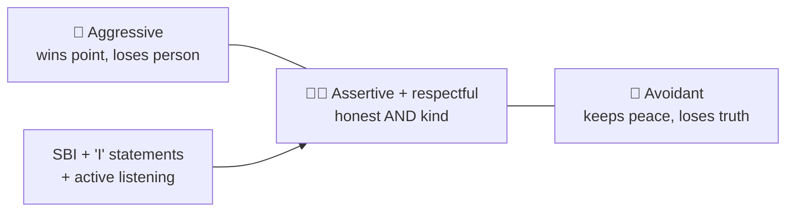

## ⚛ Learning Atom 5 — *Feedback & Difficult Conversations*

**Phase:** 🙊 3 · Applied Practice (*do*) · **KSA:** 🛠️ Skill + 🌱 Ability · **Target level:** L2
· **Component ids:** `S-feedback-difficult`, `A-assertiveness`, `A-empathy`

### 🎯 Learning objective

- **Give and receive feedback** and **de-escalate a difficult conversation**, expressing your view
  assertively *and* respectfully.

### 🧩 Prerequisites

- Atom 3 (active listening) and Atom 4 (SBI). This is where they combine under pressure.

### 🧭 Atom description

This is the highest-stakes communication moment: telling someone something they may not want to hear,
or staying composed when *you're* on the receiving end. It fuses everything so far — listen (Atom 3),
structure with SBI (Atom 4), pick a rich channel (Atom 2) — and adds the **Abilities** of empathy and
assertiveness. It's practiced through role-play because you can't learn this from reading alone.

---

### 📖 Reading — *Candor with care* (≈ 8 min)

Two failure modes bracket difficult conversations: **aggression** (blunt, blaming — wins the point,
loses the person) and **avoidance** (sugarcoating or silence — keeps the peace, loses the truth).
**Assertiveness** is the middle: say the honest thing *and* protect the relationship.

A reliable structure for **giving feedback**:

1. **Ask permission / set context.** *"Can I share something about this morning?"* Invites, not ambushes.
2. **SBI.** Situation → observable Behavior → Impact (from Atom 4). Stay on behavior, not character.
3. **Pause & listen.** Hand them the mic; use active listening (Atom 3). Their view may change yours.
4. **Move forward together.** Agree a concrete next step. *"What would help?"*

Tools that lower the temperature:

- **"I" statements** over "you" accusations: *"I felt blocked when the update was late"* vs. *"You
  never update me."* "I" statements own your experience and are far harder to argue with.
- **Nonviolent Communication (NVC):** Observation → Feeling → Need → Request. *"When the deadline
  moved without a heads-up (observation), I felt anxious (feeling) because I need predictability to
  plan (need). Could we agree to flag slips within a day? (request)."*
- **Separate the person from the problem.** Attack the issue side by side, not each other.
- **Regulate first.** If you're flooded (heart pounding), name it and take a beat — *"I want to get
  this right; can we take five?"* You cannot listen or be precise while flooded.

**Receiving feedback** is also a skill: listen without defending, paraphrase to confirm you got it,
ask for specifics, thank them, then decide what to act on. Treat it as data, not a verdict.

> **Empathy + assertiveness are not opposites.** The goal is *"I respect you enough to be honest, and
> I care enough to be kind."* Reflect their view (empathy) *and* hold your own (assertiveness).

**Key takeaways**

- [ ] Aim for the middle: **assertive (honest) + respectful (kind)** — not aggressive or avoidant.
- [ ] Give feedback with **permission → SBI → listen → next step**.
- [ ] Use **"I" statements** and **NVC** (observation/feeling/need/request) to de-escalate.
- [ ] **Regulate yourself first**; receive feedback as **data**, not a verdict.

---

### 🖼️ See — the assertiveness middle path



A reusable prompt to generate an on-brand version:

```prompt
Create a clean, modern infographic showing a spectrum with three points: "Aggressive" (left),
"Assertive + Respectful" (center, highlighted), "Avoidant/Passive" (right). Below the center, list
tools: "I-statements, SBI, active listening, NVC". Caption: "Candor with care." Use ADA brand colors
(Indigo #1E2A6E, Turquoise #15B5C6, Gold #E0A53C), light background, flat vector, legible
sans-serif. 16:9.
```

---

### 🧪 Practice — *Difficult-conversation role-plays* (Role-Play + Simulation)

In trios (speaker · receiver · observer), run **three** 6–8 min scenarios so each person plays each
role at least once:

1. **Give feedback:** a teammate keeps missing handoffs (deliver your SBI draft from Atom 4).
2. **Receive feedback:** your "manager" says your updates are too vague — practice receiving well.
3. **De-escalate:** a "stakeholder" is upset about a delay — acknowledge, use NVC, agree a next step.

The **observer** scores against the rubric and gives SBI feedback afterward (meta-practice!).

---

### ✅ Evaluate — Behavioral assessment (`behavioral`)

Scored by the observer across the role-plays — this is a key occasion for the Abilities:

| Criterion | Excellent (3) | Adequate (2) | Needs work (1) |
| --------- | ------------- | ------------ | -------------- |
| **Assertiveness (🌱)** | Honest and clear; holds position calmly | Mostly clear | Aggressive or avoidant |
| **Empathy (🌱)** | Acknowledges feeling/need; person feels respected | Some acknowledgment | Dismissive |
| **Structure (🛠️)** | Clean SBI / "I" statements / NVC | Partial | Blame/labels |
| **Listening (🛠️)** | Paraphrases, asks, adjusts | Some | Talks over |
| **Repair** | Lands a concrete next step | Vague step | None |

> Pass = 2+ each. This is **occasion 2 of 3** for `A-empathy` and `A-assertiveness` (capstone is the 3rd).

### 📦 Deliverable

- The observer's completed rubric for your role-plays + a 3–4 sentence reflection on your hardest
  moment and how you handled it.

### 🧠 Final reflection

- Do you default to aggression or avoidance under pressure? What's your one cue to find the middle?

### 🔗 Sources to verify (human-in-the-loop)

- Stone, Patton & Heen, *Difficult Conversations* (Harvard Negotiation Project).
- Patterson et al., *Crucial Conversations*.
- Rosenberg, *Nonviolent Communication*.

### 🧩 Connections

- **Predecessor:** Atom 4. **Successor:** Atom 6 (capstone — put it all together, live).
