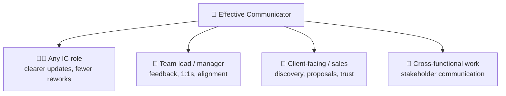

# 🗺️ Skills Map — *Effective Communicator*

How earning this badge updates a learner's **skills map** and why it's one of the highest-leverage
credentials to hold — communication is a near-universal job requirement.

> Concept reference: [`../../specs/skills-map-job-matching.md`](../../specs/skills-map-job-matching.md).

---

## 🧩 What the badge writes to the skills map

On issuance, these KSA components are recorded with evidence and level:

| Component | Type | Level | Evidence |
| --------- | ---- | ----- | -------- |
| `K-comm-model` — how communication works | 🧠 Knowledge | L2 | Atom 1 quiz |
| `K-audience-channel` — audience & channel | 🧠 Knowledge | L2 | Atom 2 quiz + worksheet |
| `S-active-listening` — listen actively | 🛠️ Skill | **L2** | Atom 3 mini-rubric + capstone |
| `S-structure-message` — structure clear messages | 🛠️ Skill | **L2** | Atom 4 performance task + capstone |
| `S-feedback-difficult` — feedback & hard conversations | 🛠️ Skill | L2 | Atom 5 behavioral + capstone |
| `A-empathy` — empathy & audience-awareness | 🌱 Ability | L2 | Behavioral, ≥3 occasions |
| `A-assertiveness` — assertive, respectful | 🌱 Ability | L2 | Behavioral, ≥3 occasions |

---

## 🎯 Why this badge matters everywhere

"Communication skills" appears in the majority of job postings across functions. Unlike most badges
that boost one role, **Effective Communicator is a multiplier** on nearly every role's effectiveness
and is frequently an explicit hiring criterion (O\*NET lists Active Listening, Speaking, and Writing
as *basic skills* required across occupations).

---

## 🧭 How it fits a learning pathway

| Stage | Credential | What it adds |
| ----- | ---------- | ------------ |
| Foundational (durable) | 🏅 **Effective Communicator** *(this one)* | listen, structure, handle hard talks |
| Pairs well with | 🏅 [Growth Mindset](../growth-mindset-micro-credential/skills-map.md) | resilience + feedback-seeking — the receiving side of communication |
| Builds toward | *Facilitation · Influencing & Negotiation · Presentation & Storytelling* | (future credentials) advanced communication |
| Role pathways | *Team Lead · Product Manager · Customer Success · Consultant · Tech Lead* | communication is a core competency in each |

> **Job-matching note:** because communication is a *transversal* competency, this badge rarely
> appears alone in a role's minimums — it **stacks** with technical badges (e.g.,
> [Python Variables](../python-variables-micro-credential/skills-map.md) → developer pathway) to make a
> candidate's profile credible end-to-end. Matching against a specific job's minimum bar still
> requires **human (mentor/employer) validation** — AI-suggested mappings are a starting point, not a
> verdict (see [`../../CLAUDE.md`](../../CLAUDE.md) §5).
