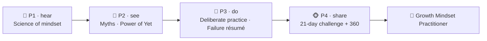

# 🌱 Worked Example — Growth Mindset Micro-Credential (full course)

  
  
  
  

A **complete, ready-to-run ADA micro-credential** about **Growth Mindset**, built end-to-end
with the ADA Methodology (KSA + 4 phases + learning-atom topology). It is a *fully populated*
example: every atom contains **real reading text**, **curated video links**, **image-generation
prompts** for diagrams, practice labs, and rubrics.

> 🖥️ **See it live:** open [`course.html`](course.html) in any browser for an interactive,
> navigable version of this course (sidebar, phase progress, embedded videos, diagrams).

Conforms to [`../../specs/micro-credential-v2-schema.md`](../../specs/micro-credential-v2-schema.md) ·
modalities from [`../../specs/learning-atom-topology.md`](../../specs/learning-atom-topology.md) ·
KSA from [`../../specs/ksa-taxonomy.md`](../../specs/ksa-taxonomy.md).

---

## 🧭 What this teaches

**Growth Mindset** — the belief that abilities can be developed through effort, strategy, and
help from others — is one of the **durable Abilities** that employers list most often
(*"learning agility", "coachable", "thrives on feedback", "growth mindset"*) yet rarely train
on purpose. This course makes it **trainable and certifiable**: it gives learners the science,
a concrete reframing **Skill**, deliberate-practice reps, and then builds the **Ability**
through authentic, repeated exposure to challenge — assessed with a **behavioral rubric +
reflection + peer 360**, never a single quiz.

| | |
| --- | --- |
| **Title** | Growth Mindset for High-Performing Professionals |
| **Duration** | ~16 hours · 3–4 weeks |
| **Primary KSA** | 🌱 Ability — *Growth Mindset* (treat failure as learning, seek challenge & feedback) |
| **Target competency** | O\*NET Work Styles (Adaptability, Persistence, Achievement/Effort) · ESCO transversal attitudes · SFIA *LEDA* (learning & development) |
| **Badge** | 🏅 *Growth Mindset Practitioner* |

---

## 📚 Course contents

| # | File | What it is |
| - | ---- | ---------- |
| — | [`micro-credential.md`](micro-credential.md) | The full micro-credential spec (YAML schema, objectives, KSA map, phase planner) |
| 1 | [`atoms/atom-1-science-of-mindset.md`](atoms/atom-1-science-of-mindset.md) | 🙉 P1 · 🧠 K — The science of mindset (readings + Dweck TED + quiz) |
| 2 | [`atoms/atom-2-myths-and-nuance.md`](atoms/atom-2-myths-and-nuance.md) | 🙈 P2 · 🧠 K — Myths & nuance: *false* growth mindset (evidence + cases) |
| 3 | [`atoms/atom-3-power-of-yet.md`](atoms/atom-3-power-of-yet.md) | 🙈 P2 · 🛠️ S — The *Power of Yet* reframing protocol |
| 4 | [`atoms/atom-4-deliberate-practice-lab.md`](atoms/atom-4-deliberate-practice-lab.md) | 🙊 P3 · 🛠️ S — Deliberate-practice lab |
| 5 | [`atoms/atom-5-failure-resume-feedback.md`](atoms/atom-5-failure-resume-feedback.md) | 🙊 P3 → 🐵 P4 · 🌱 A — Failure résumé & feedback seeking |
| 6 | [`atoms/atom-6-growth-in-the-wild-capstone.md`](atoms/atom-6-growth-in-the-wild-capstone.md) | 🐵 P4 · 🌱 A — Growth in the wild (21-day challenge) |
| — | [`capstone.md`](capstone.md) | Capstone brief + how it maps to KSA |
| — | [`rubrics.md`](rubrics.md) | All rubrics (knowledge-mini, skill, behavioral, capstone-5) |
| — | [`skills-map.md`](skills-map.md) | Badge → skills map and how it closes a job-match gap |

---

## 🔄 Phase journey

---

## 🤖 How it was authored (and how to reuse it)

This course follows the Gen AI authoring workflow in
[`../../specs/genai-authoring-workflow.md`](../../specs/genai-authoring-workflow.md):
job competency → KSA → atoms → modalities → rubrics → badge. Two conventions used throughout:

- **🎬 Videos** are written as a `youtube` block with the real URL + a caption, so the text
  file is self-describing (and the interactive site embeds them as a player).
- **🖼️ Diagrams/images** include a reusable **image-generation prompt** in a `prompt` block —
  feed it to any image model to produce the asset on brand.

> ⚠️ **Human-in-the-loop (methodology guardrail):** the external links, reports, and
> citations below are **curated starting points**. A mentor/employer should verify each link,
> licensing, and currency before delivery — AI-suggested sources are never authoritative on
> their own. See [`../../CLAUDE.md`](../../CLAUDE.md) §5.
