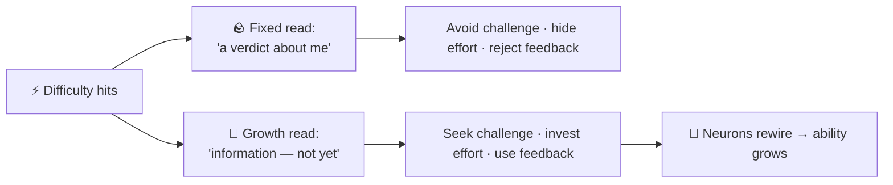

## ⚛ Learning Atom 1 — *The Science of Mindset*

**Phase:** 🙉 1 · Self-Guided Introduction (*hear*) · **KSA:** 🧠 Knowledge · **Target level:** L1
· **Component id:** `K-mindset-science`

### 🎯 Learning objective

- **Explain** the difference between a fixed and a growth mindset, and describe the
  neuroscience (neuroplasticity) that makes "abilities can grow" literally true.

### 🧩 Prerequisites

- None. Curiosity and a recent example of something you found hard to learn.

### 🧭 Atom description

Before you can *practice* a growth mindset, you need an accurate mental model of what it is —
and what it is not. This atom gives you the core science from the researchers who built the
field, so the rest of the course rests on evidence, not slogans.

---

### 📖 Reading — *What "mindset" actually means* (≈ 6 min)

> Author: ADA Methodology · concepts attributed to Carol Dweck and colleagues.

A **mindset** is a belief about where ability comes from. People with a more **fixed mindset**
tend to believe that intelligence and talent are largely *traits you either have or don't*.
People with a more **growth mindset** believe ability is more like a *muscle* — it grows with
effort, good strategy, and help from others. Almost nobody is purely one or the other; we each
hold a *blend* that shifts by domain ("I'm a math person but not a creative person") and by
situation (a public failure can push anyone toward the fixed end for a while).

Why does this belief matter? Because it changes **what you do when something gets hard** — the
exact moment that decides whether you learn. Carol Dweck's research at Stanford found that the
two mindsets produce different responses to difficulty:

- A **fixed** orientation treats a struggle as a *verdict*: "this is hard → maybe I'm not good
  at this → I should protect my image and stop." Effort feels like evidence of low ability, so
  feedback stings and challenges are avoided.
- A **growth** orientation treats the same struggle as *information*: "this is hard → I haven't
  learned it *yet* → what strategy or feedback do I need?" Effort is the path, feedback is fuel,
  and challenge is where the growth happens.

The biology backs this up. The brain is **neuroplastic**: when you practice something
difficult, neurons form and strengthen connections, and well-used pathways get myelinated so
signals travel faster. In other words, the discomfort of effortful practice is the *felt sense
of your brain physically rewiring*. This is why "I can't do this" is more accurately "I can't
do this **yet**."

A crucial nuance you'll go deeper on in Atom 2: a growth mindset is **not** "everyone can be
anything," "just try harder," or "praise all effort." It is a precise claim — *that ability is
developable, and that the response to difficulty (strategy + effort + help) is what develops
it.* Hold onto that precision; it's what separates a real practitioner from someone repeating a
poster.

**Key takeaways**

- [ ] Mindset = a belief about the *source* of ability (trait vs. developable).
- [ ] It's a *blend*, domain- and situation-specific — not a fixed label for a person.
- [ ] It matters because it changes behavior **at the point of difficulty**.
- [ ] Neuroplasticity makes "abilities can grow" a physical fact, not a metaphor.
- [ ] Growth mindset ≠ "try harder"; it = *developable ability + the right response to struggle.*

---

### 🎬 Watch — Carol Dweck, "The power of believing that you can improve" (TED, ~10 min)

```youtube
https://www.youtube.com/watch?v=_X0mgOOSpLU
Carol Dweck (Stanford) — the origin of "the power of yet" and the research behind it.
```

**Optional shorts (pick one):**

```youtube
https://www.youtube.com/watch?v=KUWn_TJTrnU
Sprouts — "Growth Mindset vs Fixed Mindset" (animated 4-min overview).
```

```youtube
https://www.youtube.com/watch?v=JC82Il2cjqA
Khan Academy — "You Can Learn Anything" (90s; neuroplasticity framing).
```

---

### 🖼️ See — Infographic: *The two mindsets at the moment of difficulty*

> Reuse this prompt with any image model to generate the on-brand visual.

```prompt
Create a clean, modern educational infographic titled "Two Mindsets, One Moment of Difficulty".
Split the canvas vertically into two columns that meet at a central icon of a brain with a
small lightning/spark. LEFT column = "Fixed mindset" using a muted grey palette; show a chain
of cards: "This is hard" -> "Maybe I'm not good at this" -> "Protect my image" -> "Avoid /
quit". RIGHT column = "Growth mindset" using ADA brand colors (Indigo #1E2A6E, Turquoise
#15B5C6, Gold #E0A53C accents on dark Ink #0A1124); show: "This is hard" -> "I haven't learned
it YET" -> "What strategy / feedback?" -> "Practice & grow". Flat vector style, generous white
space, high contrast, legible sans-serif, no photoreal faces. 16:9.
```

You can also study the relationship as a quick model:



---

### ✅ Evaluate — Pop quiz (formative, `knowledge-mini`)

Answer, then check yourself against the key.

1. True/False: "A growth mindset means anyone can become anything if they try hard enough."
2. In one sentence, what *behavioral* difference shows up at the moment a task gets hard?
3. What does neuroplasticity have to do with the word **yet**?

<details>
<summary>Answer key</summary>

1. **False** — that's a common distortion. Growth mindset claims ability is *developable* via
   strategy + effort + help, not that outcomes are unlimited or guaranteed.
2. Fixed → avoids the challenge / withdraws effort / rejects feedback; growth → engages the
   challenge / invests effort / seeks and uses feedback.
3. Effortful practice physically strengthens and myelinates neural pathways, so "I can't" is
   better stated as "I can't **yet**" — the capacity is built by the practice itself.

</details>

---

### 📦 Deliverable

- A 3–5 sentence written reflection: *one task you currently read as a "verdict," restated as a
  "not yet," with the next strategy or source of help you'd try.* (Carries into Atom 3.)

### 🧠 Final reflection

- Where in your work do you most often slip into a fixed read — and what would change if you
  treated that exact moment as information instead of a verdict?

### 🔗 Sources to verify (human-in-the-loop)

- Dweck, C. *Mindset: The New Psychology of Success* (2006/2016).
- Stanford **Mindset Kit** / PERTS — mindsetkit.org (practitioner resources).
- Blackwell, Trzesniewski & Dweck (2007), *Child Development* — the "brainology" study.
- MIT News / Brain & Cognitive Sciences — neuroplasticity & learning (verify a current piece).

### 🧩 Connections

- **Successors:** Atom 2 (myths & nuance), Atom 3 (turn the science into a move).
