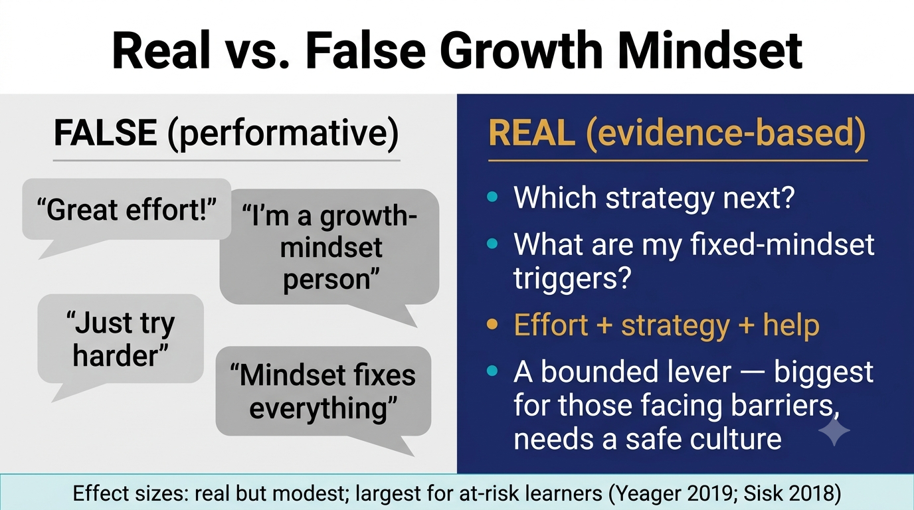

## ⚛ Learning Atom 2 — *Myths & Nuance: the "false" growth mindset*

**Phase:** 🙈 2 · Visual Exploration (*see*) · **KSA:** 🧠 Knowledge · **Target level:** L1
· **Component id:** `K-mindset-nuance`

### 🎯 Learning objective

- **Distinguish** a real, evidence-based growth mindset from the watered-down "*false* growth
  mindset," and **explain** when and for whom mindset interventions actually move outcomes.

### 🧩 Prerequisites

- Atom 1 (the core science).

### 🧭 Atom description

The biggest risk with growth mindset is *shallow adoption* — turning a precise psychological
construct into a motivational poster. This atom inoculates you against the hype by going to the
primary evidence, including the researchers' own self-corrections and the large-scale trials
and meta-analyses that map the limits.

---

### 📖 Reading — *Three myths that quietly kill a growth mindset* (≈ 7 min)

> Author: ADA Methodology · grounded in Dweck & Yeager's later work and replication research.

**Myth 1 — "Growth mindset = praising effort."** Dweck has been explicit that *praising effort
alone*, especially when a learner is stuck, can become a consolation prize ("great effort!"
after failure with no path forward). Real practice praises **effort linked to strategy and
progress**: *"that approach didn't work — which other strategy, or whose help, gets you
unstuck?"* Effort without strategy is just noise; the mindset is about the **learning process**,
not cheerleading.

**Myth 2 — "I already have a growth mindset."** Dweck calls this the *false growth mindset*:
most of us claim it, then behave from the fixed end the moment our competence feels threatened —
when we're criticized, when a peer outshines us, when we fail publicly. A growth mindset isn't a
badge you own; it's a response you choose, repeatedly, under threat. Knowing your personal
**fixed-mindset triggers** is more useful than declaring you're "a growth-mindset person."

**Myth 3 — "Mindset fixes everything."** It doesn't. Large studies show the effect is **real
but bounded**. The *National Study of Learning Mindsets* (Yeager et al., 2019, *Nature*) ran a
short online growth-mindset intervention across a nationally representative sample of U.S. high
schools and found a *modest but meaningful* improvement in grades — concentrated among
**lower-achieving students** and strongest where the **school culture** supported the message
(peers and norms made challenge-seeking safe). Meta-analyses (e.g., Sisk et al., 2018) likewise
find **small average effects** that are **larger for at-risk and disadvantaged learners**. The
honest summary: mindset is a *lever*, not a magic wand — most powerful for those facing real
barriers, and only when the surrounding environment makes effort and help-seeking safe.

**Why a professional should care.** In a team, your mindset is *contagious through systems*: how
you respond to a teammate's mistake, whether feedback is treated as attack or asset, whether
"I don't know yet" is sayable. The organizational research is blunt about this — culture either
amplifies or silences individual growth mindset.

**Key takeaways**

- [ ] Praise **strategy + progress**, not raw effort or innate talent.
- [ ] Everyone has **fixed-mindset triggers**; naming yours beats claiming a label.
- [ ] Effects are **real but modest**, **largest for at-risk learners**, and **culture-dependent**.
- [ ] Your individual mindset shapes a **team's** psychological safety to struggle out loud.

---

### 📖 Reading — Evidence & industry context (skim the primary sources)

- **Stanford / *Nature* (2019):** Yeager, Dweck et al., *A national experiment reveals where a
  growth mindset improves achievement.* The canonical large-scale RCT.
- **Meta-analysis (2018):** Sisk, Burnette et al., *To what extent and under which circumstances
  are growth mindsets important to academic achievement?* — *Psychological Science.*
- **Dweck & Yeager (2019):** *Mindsets: A View From Two Eras*, *Perspectives on Psychological
  Science* — the field's own maturation and caveats.
- **McKinsey (2020):** Brassey, van Dam et al., *The most fundamental skill: Intentional
  learning and the career advantage* — why a deliberate learning stance is an economic edge.
- **BCG / Accenture:** reskilling and learning-culture reports (e.g., Accenture, *"It's
  learning. Just not as we know it."*) — the business case for a learning workforce.
- **Y Combinator / Paul Graham:** *How to Do Great Work* (2023) — curiosity, persistence, and
  treating not-knowing as the start of the work, in a builder's voice.

> ⚠️ Verify each link, edition, and license before delivery (human-in-the-loop).

---

### 🎬 Watch — Eduardo Briceño, "How to get better at the things you care about" (TED, ~11 min)

```youtube
https://www.youtube.com/watch?v=U9FBpJVwsps
The "Learning Zone vs. Performance Zone" — why always performing blocks improvement.
```

---

### 🖼️ See — Diagram: *Real vs. false growth mindset*



> 🖼️ *Generated image — produced from the prompt below.*

```prompt
Design a two-panel comparison graphic titled "Real vs. False Growth Mindset". Panel A "FALSE
(performative)" in muted grey: speech bubbles "Great effort!", "I'm a growth-mindset person",
"Just try harder", "Mindset fixes everything". Panel B "REAL (evidence-based)" in ADA brand
colors (Indigo #1E2A6E base, Turquoise #15B5C6, Gold #E0A53C accent): "Which strategy next?",
"What are my fixed-mindset triggers?", "Effort + strategy + help", "A bounded lever — biggest
for those facing barriers, needs a safe culture". Add a thin footer band: "Effect sizes: real
but modest; largest for at-risk learners (Yeager 2019; Sisk 2018)". Flat vector, high contrast,
clean sans-serif. 16:9.
```

---

### ✅ Evaluate — AI Q&A check (formative, `knowledge-mini`)

Use this prompt with any AI tutor; it should *probe*, not lecture.

```prompt
You are a Socratic tutor checking my understanding of growth-mindset nuance. Ask me, one at a
time: (1) to give an example of "false growth mindset" from my own workplace; (2) to name two
of my personal fixed-mindset triggers; (3) to explain, using the Yeager 2019 study, who
benefits most and why culture matters. After each answer, point out any oversimplification
(e.g., "just try harder", "mindset fixes everything") and ask a sharper follow-up. Keep it under
8 exchanges and end with one misconception I should watch for.
```

**Self-check:** you pass when you can state, without notes, *one* myth, *one* of your triggers,
and the *bounded* nature of the effect.

---

### 📦 Deliverable

- A short "myth-buster" note (5–7 sentences): the myth you were most guilty of, your top two
  fixed-mindset triggers, and one sentence on who benefits most from mindset work and why.

### 🧠 Final reflection

- When was the last time you *claimed* a growth mindset but *behaved* from the fixed end? What
  triggered it?

### 🔗 Sources to verify

- Yeager et al. (2019), *Nature* 573 · Sisk et al. (2018), *Psychological Science* · Dweck &
  Yeager (2019), *Perspectives on Psychological Science* · McKinsey (2020) intentional learning
  · Accenture learning report · Paul Graham, *How to Do Great Work* (paulgraham.com).

### 🧩 Connections

- **Predecessors:** Atom 1. **Successors:** Atom 3 (the reframing move that operationalizes the
  *real* version).
