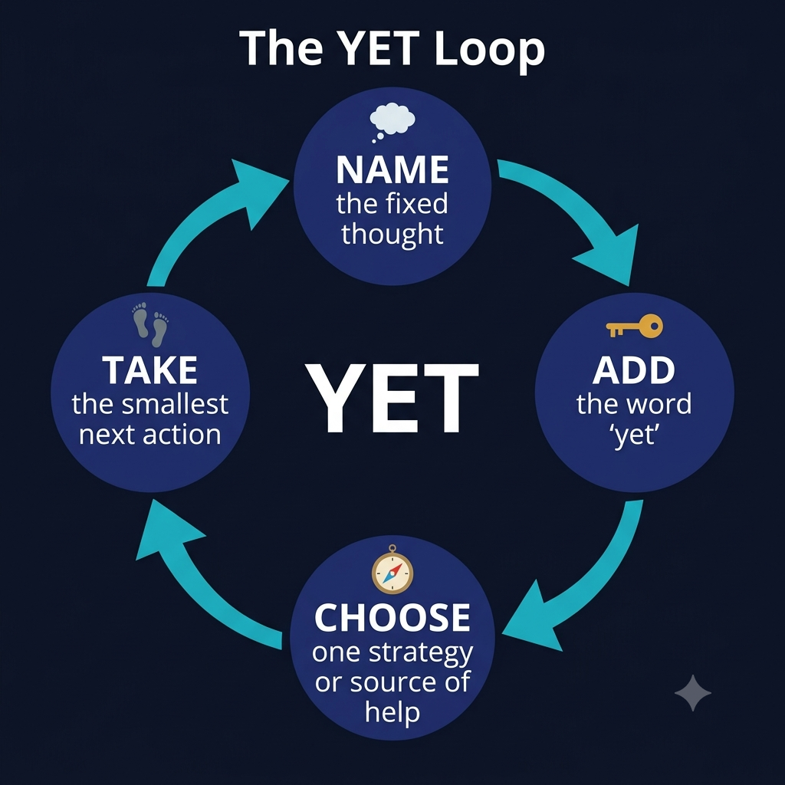
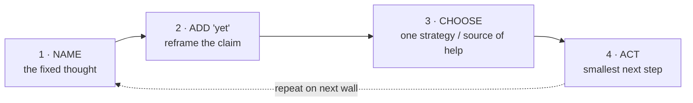

## ⚛ Learning Atom 3 — *The Power of Yet: a reframing protocol*

**Phase:** 🙈 2 · Visual Exploration (*see*) → first reps · **KSA:** 🛠️ Skill · **Target level:** L2
· **Component id:** `S-yet-reframe`

### 🎯 Learning objective

- **Apply** a concrete "power of yet" reframing move that converts a fixed-mindset reaction into
  a next learning action — on a *real* setback, on demand.

### 🧩 Prerequisites

- Atoms 1–2. A current, genuine struggle you can practice on.

### 🧭 Atom description

Knowledge doesn't change behavior; a **rehearsed move** does. This atom turns the science into a
4-step protocol you can run in under two minutes whenever you hit a wall. It's the first thing in
this course you'll be assessed on *doing*, not *knowing*.

---

### 🖼️ See — Mental model: the **YET Loop**



> 🖼️ *Generated image — produced from the prompt below.*

```prompt
Create a circular "loop" diagram titled "The YET Loop". Four nodes around a circle connected by
arrows, each with a small icon: 1) "NAME the fixed thought" (icon: thought bubble), 2) "ADD the
word 'yet'" (icon: small gold key), 3) "CHOOSE one strategy or source of help" (icon: compass),
4) "TAKE the smallest next action" (icon: footstep). Center label: "YET". Use ADA brand colors
(Indigo #1E2A6E nodes with white text, Turquoise #15B5C6 arrows, one Gold #E0A53C accent on the
'yet' step). Flat vector, clean, high contrast, dark Ink #0A1124 background. Square 1:1.
```



**The protocol, in words**

1. **Name** the fixed thought out loud or on paper, verbatim: *"I'm just not good at public
   speaking."* (Naming it strips its authority.)
2. **Add "yet"** to convert a verdict into a status: *"I'm not good at public speaking **yet**."*
   "Yet" smuggles in time, growth, and agency.
3. **Choose one** strategy or source of help — not ten. *"I'll record a 2-minute version and get
   one piece of feedback from Priya."* Strategy + help is the part Atom 2 said most people skip.
4. **Act** on the smallest next step *today*. Momentum, not a master plan, breaks the fixed
   spiral.

---

### 🎬 Watch — Demo screencast: running the YET Loop live (~5 min)

```youtube
https://www.youtube.com/watch?v=pN34FNbOKXc
Eduardo Briceño / Mindset Works — "The Power of belief: mindset and success" (model the reframe).
```

> Facilitator option: record your *own* 3-minute screencast walking through the YET Loop on a
> real example from your team — modeling beats explaining.

---

### 🧪 Practice — The Reframe Worksheet (Worksheet / Exercise)

Complete **three** rows from *your own life this week* (one work, one skill, one personal).

| Fixed thought (verbatim) | + "yet" reframe | One strategy / source of help | Smallest next action (today) |
| ------------------------ | --------------- | ----------------------------- | ---------------------------- |
| *e.g. "I can't read this codebase."* | *"…can't read this codebase **yet**."* | *Pair with the module owner for 20 min* | *Open the entry file; map 3 functions* |
| | | | |
| | | | |
| | | | |

**AI rehearsal (optional):**

```prompt
Act as a supportive but rigorous coach. I'll paste a fixed-mindset thought. Walk me through the
YET Loop: make me (1) restate it with "yet", (2) propose exactly ONE strategy AND one specific
person/resource for help, (3) commit to the smallest action I can finish today. Reject vague
strategies ("study more") and push for specifics. Then have me run it again on a second thought.
```

---

### ✅ Evaluate — Skill mini-rubric

| Criterion | Excellent (3) | Adequate (2) | Needs improvement (1) |
| --------- | ------------- | ------------ | --------------------- |
| **Accurate reframe** | "Yet" used to change a *verdict* into a *status*, not as filler | Reframe present but generic | Restates the complaint; no real shift |
| **Strategy + help** | One *specific* strategy **and** a named person/resource | Strategy or help, but vague | Missing or "just try harder" |
| **Actionability** | Next step is concrete and doable *today* | Doable but fuzzy/large | No real next step |

> Pass = **2+ on every criterion across all three rows.** This is your first **L2 Skill**
> evidence for `S-yet-reframe`.

---

### 📦 Deliverable

- The completed Reframe Worksheet (3 rows) + a 2-sentence note on which row was hardest and why.

### 🧠 Final reflection

- Which step do you skip under pressure — naming, adding *yet*, choosing help, or acting? That
  skip is your personal failure point; design around it.

### 🔗 Sources to verify

- Stanford **Mindset Kit** — "the power of yet" practitioner materials · Briceño/Mindset Works.

### 🧩 Connections

- **Predecessors:** Atoms 1–2. **Successors:** Atom 4 (scale the reframe into a practice loop),
  Atom 5 (use it on real failure).
