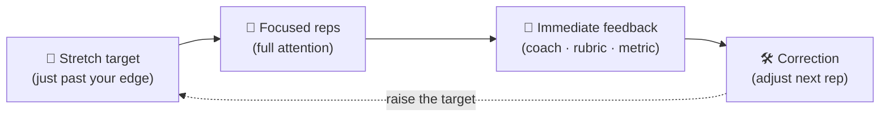

## ⚛ Learning Atom 4 — *The Deliberate-Practice Lab*

**Phase:** 🙊 3 · Applied Practice (*do*) · **KSA:** 🛠️ Skill · **Target level:** L2
· **Component id:** `S-deliberate-practice`

### 🎯 Learning objective

- **Design and run** a deliberate-practice loop on a real skill: a stretch target, focused reps,
  immediate feedback, and a correction — proving the mindset by *operationalizing* it.

### 🧩 Prerequisites

- Atoms 1–3 (you can already run the YET Loop).

### 🧭 Atom description

A growth mindset without a *method* stalls at motivation. **Deliberate practice** (Anders
Ericsson's research) is that method: it's not "more hours," it's a tight loop of *edge-of-ability
targets + full attention + immediate feedback + correction*. This lab makes the loop concrete on
a skill you actually need.

---

### 📖 Reading — *Deliberate practice, minus the 10,000-hour myth* (≈ 6 min)

> Author: ADA Methodology · grounded in Ericsson & Pool, *Peak* (2016), and Ericsson, Krampe &
> Tesch-Römer (1993).

Popular culture compressed Ericsson's work into "10,000 hours" — and got it wrong. The hours
were a *correlation in one study of violinists*, not a magic threshold, and Ericsson spent years
correcting it. The real finding is about the **structure** of practice, not the volume. Ordinary
practice plateaus: once you can do something "well enough," autopilot takes over and you stop
improving even with years of repetition (think of your driving). **Deliberate practice** breaks
the plateau with four ingredients:

1. **A specific stretch target** just beyond your current reliable ability — concrete enough to
   tell if you hit it (*"land the talk's opening in 30s without filler words,"* not "get better
   at speaking").
2. **Focused repetition** with full attention — short, intense, deliberate reps, not background
   grinding.
3. **Immediate, specific feedback** — from a coach, a rubric, a recording, tests, or a metric —
   so error is visible *now*.
4. **Correction** — adjust the next rep based on the feedback. Feedback you don't act on is
   trivia.

This is where mindset becomes muscle: the loop *requires* you to seek the edge (challenge), treat
errors as data (failure = learning), and use feedback (coachability). McKinsey's work on
*intentional learning* makes the same point for careers — the differentiator isn't talent, it's
turning everyday work into reps with feedback. Y Combinator gives founders the builder's version:
ship, measure, learn, iterate — a deliberate-practice loop pointed at a product.

**Key takeaways**

- [ ] "10,000 hours" is a myth; **structure** beats volume.
- [ ] The loop = *stretch target → focused reps → immediate feedback → correction.*
- [ ] Ordinary practice plateaus; deliberate practice keeps you at the edge on purpose.
- [ ] The loop *is* a growth mindset, made operational.

---

### 🎬 Watch — Trevor Ragan (The Learner Lab) on the practice that actually works

```youtube
https://www.youtube.com/watch?v=5eW6Eagr9XA
"The Struggle Switch" / learning how to learn — embracing productive struggle in practice.
```

---

### 🖼️ See — Diagram: the deliberate-practice loop vs. the plateau

```prompt
Create a diagram titled "Why Deliberate Practice Beats the Plateau". Top: a flat dotted line
labeled "Ordinary practice (autopilot) → plateau", with a small grey figure coasting. Bottom: a
rising staircase made of repeating loop icons; each step labeled in sequence "Stretch target →
Focused reps → Immediate feedback → Correction", climbing upward and to the right toward a gold
flag "New ceiling". Use ADA brand colors (Indigo #1E2A6E, Turquoise #15B5C6 arrows, Gold
#E0A53C flag) on a light background, flat vector, clean sans-serif, high contrast. 16:9.
```



---

### 🧪 Practice — The Lab (Lab + Pair Programming)

Run **two full loops** on a real skill you need in your role.

- **Step 0 — Pick a skill** that matters at work and is currently *uncomfortable* (e.g.,
  reviewing a PR, explaining a design, writing a test, facilitating a stand-up).
- **Step 1 — Define a stretch target** for one rep, measurable in ≤ 10 minutes.
- **Step 2 — Set the feedback source** *before* you start: a peer, a checklist/rubric, a
  recording, or a test you can run.
- **Step 3 — Rep 1:** do it. Capture feedback immediately.
- **Step 4 — Correction:** write the single change you'll make.
- **Step 5 — Rep 2:** do it again with the correction. Capture feedback again.
- **Pair step:** swap with a partner — you observe their loop and give feedback against the
  rubric; they do the same for you. (This is your `collaborate` modality.)

**Lab log template**

| | Rep 1 | Rep 2 |
| --- | --- | --- |
| Stretch target | | |
| Feedback source | | |
| What happened | | |
| Specific feedback | | |
| Correction applied | | |

---

### ✅ Evaluate — Performance task (skill rubric)

| Criterion | Excellent (3) | Adequate (2) | Needs improvement (1) |
| --------- | ------------- | ------------ | --------------------- |
| **Target quality** | Specific, measurable, genuinely at the edge | Somewhat specific | Vague ("get better") |
| **Feedback loop** | Real, immediate feedback captured both reps | Feedback once / delayed | No usable feedback |
| **Visible correction** | Rep 2 clearly changed based on feedback | Minor/uncertain change | No change between reps |
| **Reframe under struggle** | Used the YET Loop when it got hard | Some reframing | Defaulted to fixed read |

> Pass = **2+ on all four** → **L2** evidence for `S-deliberate-practice` (and partial
> `A-growth-mindset`).

---

### 📦 Deliverable

- The completed two-rep lab log + a 3-sentence note: what improved between reps, and the
  feedback that caused it.

### 🧠 Final reflection

- Where in your *normal week* could you quietly insert one deliberate-practice loop with a
  feedback source — turning routine work into reps?

### 🔗 Sources to verify

- Ericsson & Pool, *Peak* (2016) · Ericsson, Krampe & Tesch-Römer (1993), *Psychological Review*
  · McKinsey (2020), *Intentional learning* · YC Startup School (startupschool.org).

### 🧩 Connections

- **Predecessors:** Atom 3. **Successors:** Atom 5 (feedback + failure as identity), Atom 6
  (the loop, sustained for 21 days).
