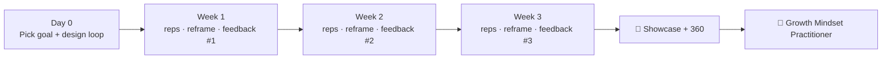

## ⚛ Learning Atom 6 — *Growth in the Wild (21-Day Challenge)* · 🚀 Capstone

**Phase:** 🐵 4 · Collaboration & Reflection (*share*) · **KSA:** 🌱 Ability · **Target level:** L3
· **Component id:** `A-growth-mindset` (+ `A-adaptability`)

### 🎯 Learning objective

- **Sustain and evidence** a growth mindset on a *real* stretch goal over 21 days — running
  deliberate-practice loops, reframing setbacks, seeking feedback, and reflecting — culminating
  in a peer-reviewed showcase.

### 🧩 Prerequisites

- All prior atoms. A genuine, slightly scary stretch goal you can move on for three weeks.

### 🧭 Atom description

An attitude is proven by **behavior across time**, so the capstone is not a presentation you make
*about* growth mindset — it's three weeks of *living it* on something that matters, documented as
you go. This is the atom that turns the badge from "knows about" into "does." It integrates every
KSA in the course.

> 📄 The full grading brief is in [`../capstone.md`](../capstone.md); rubrics in
> [`../rubrics.md`](../rubrics.md).

---

### 🧪 The challenge

1. **Choose a stretch goal (Day 0).** Real and uncomfortable: *"run my first design review,"
   "ship a feature in an unfamiliar language," "give a talk at the team demo."* It must have a
   visible outcome and room to fail.
2. **Design the loop (Day 0).** Define your stretch targets, your feedback source(s), and a
   daily 20–40 min practice block. (Reuses Atom 4.)
3. **Run it for 21 days.** Each session: one deliberate-practice rep + capture feedback. Each
   time you hit a wall, run the **YET Loop** and log it. (Reuses Atoms 3–4.)
4. **Seek feedback weekly (×3 occasions).** A specific ask to a specific person each week.
   (Reuses Atom 5.)
5. **Keep a growth journal.** A short daily/most-days entry: what you attempted, what failed,
   what you learned, the next reach. (`read: Journal / Diary` modality.)
6. **Showcase (Demo Day).** A 5-minute share to the cohort: the goal, your biggest *useful*
   failure, what the feedback changed, and your evidence. Then a **peer + mentor 360**.

This gives the **5 assessed occasions** the primary Ability requires: the curveball reframes,
three feedback asks, the sustained journal, and the showcase.

---

### 📖 Read — Growth journal (your own, Journal / Diary)

Use this lightweight daily template (most days for 21 days):

```text
Day __ / 21   ·   Goal: ____________________
- Attempted today:
- Where it got hard (and my YET Loop reframe):
- Feedback / data I got:
- What I learned → next reach:
- Mindset self-rating (1 fixed ··· 5 growth): __
```

---

### 🖼️ See — The 21-day growth arc

```prompt
Create an inspiring but professional "21-Day Growth Arc" graphic. A horizontal timeline from
Day 0 to Day 21 shaped as a gently rising, jagged line (ups AND downs — show 3–4 dips labeled
"setback → reframe"). Mark "Week 1 / 2 / 3" checkpoints with small feedback-loop icons, and 3
gold stars at the weekly "feedback ask" points. End at a gold flag "Showcase + 360". Use ADA
brand colors (Indigo #1E2A6E line on light, Turquoise #15B5C6 checkpoints, Gold #E0A53C accents)
flat vector, clean sans-serif, high contrast. 16:9.
```



---

### 🤝 Collaborate — Showcase / Demo Day + 360

- **5-min showcase** per learner (template in `capstone.md`).
- **Peer 360:** each learner rates 2 peers on the behavioral rubric and gives one strength + one
  stretch.
- **Mentor review:** validates evidence against the rubric (human-in-the-loop sign-off).

---

### ✅ Evaluate — Behavioral rubric + Capstone-5

Graded with the **behavioral rubric** (consistency across the 5 occasions, self-awareness,
response to setback/feedback) **and** the standard **Capstone-5** rubric. Full tables in
[`../rubrics.md`](../rubrics.md).

> **Badge issued** when evidence from `atom-3`, `atom-4`, `atom-5`, and this capstone is verified
> → sets `A-growth-mindset = 3`, `A-adaptability = 2`, plus the two L2 Skills in the learner's
> [skills map](../skills-map.md).

---

### 📦 Deliverable

- 21-day growth journal + deliberate-practice logs + 3 feedback-ask records + a 5-minute
  showcase (slides or recording) + completed peer 360 forms.

### 🧠 Final reflection

- Compare your Day-0 and Day-21 mindset self-ratings. What *behavior* changed — and what will
  you keep doing after the badge?

### 🔗 Sources to verify

- Stanford Mindset Kit · Ericsson, *Peak* · McKinsey *Intentional learning* · YC Startup School.

### 🧩 Connections

- **Predecessors:** all atoms. **Successors:** the learner's [skills map](../skills-map.md) and
  job match.
