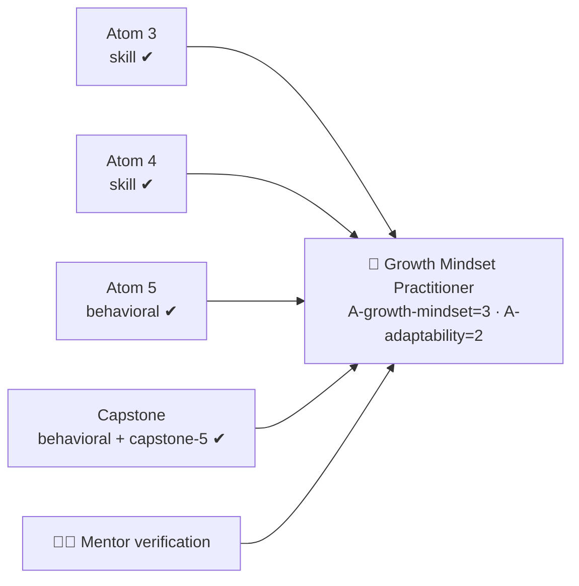

# 📊 Rubrics — Growth Mindset Micro-Credential

All assessment instruments used across the course. Atoms reference these by `rubric` flavor:
`knowledge-mini`, `skill`, `ability-behavioral`, `capstone-5`.

---

## 🔹 `knowledge-mini` — concept checks (Atoms 1–2)

Quick formative check; used for pop quizzes and AI Q&A checks.

| Criterion | Excellent (3) | Adequate (2) | Needs improvement (1) |
| --------- | ------------- | ------------ | --------------------- |
| **Accuracy** | Correct, and avoids the common myths | Mostly correct | Repeats a myth as fact |
| **Precision** | States the *bounded* claim (developable ability + response to struggle) | Roughly right | Slogan-level ("just try harder") |
| **Self-application** | Connects to a real personal example | Generic example | None |

> Pass = 2+ on each. Knowledge here is intentionally **L1** — it only enables the Abilities.

---

## 🔹 `skill` — performance mini-rubric (Atoms 3–4)

For the YET Loop reframe and the deliberate-practice lab.

| Criterion | Excellent (3) | Adequate (2) | Needs improvement (1) |
| --------- | ------------- | ------------ | --------------------- |
| **Correct move** | Executes the technique as designed (reframe / loop) | Minor gaps | Technique not really used |
| **Strategy + feedback** | Specific strategy AND a real feedback source | One present, vague | Missing |
| **Visible improvement** | Clear change/correction between attempts | Slight change | No change |
| **Reframe under struggle** | Uses YET Loop when stuck | Sometimes | Defaults to fixed read |

> Pass = 2+ on each → **L2** evidence for the relevant Skill component.

---

## 🔹 `ability-behavioral` — the attitude rubric (Atoms 5–6) ⭐

The instrument that **certifies the Ability**. An attitude cannot be proven by one moment or a
quiz — this rubric explicitly requires evidence **across the 5 assessed occasions** (2 curveball
reframes, 3 feedback asks, sustained journal, showcase).

| Criterion | Excellent (3) | Adequate (2) | Needs improvement (1) |
| --------- | ------------- | ------------ | --------------------- |
| **Consistency across occasions** | Growth behavior shown across all 5 occasions | Shown in 3–4 | Only when pushed |
| **Failure as learning** | Reframes setbacks as data; reaches again | Accepts setbacks passively | Defensive / avoids reaching |
| **Feedback seeking** | Proactively seeks specific, hard feedback and acts on it | Seeks occasionally | Avoids; only receives |
| **Self-awareness (reflection)** | Names triggers, choices, and growth with insight | Some reflection | Minimal / none |
| **Persistence / adaptability** | Stays effective and re-plans amid walls & change | Recovers slowly | Stalls or quits |

> Pass = 2+ on **every** criterion. Excellent across the board supports **L3** for
> `A-growth-mindset`.

---

## ✨ `capstone-5` — standard ADA capstone rubric

| Criterion | Excellent (5) | Good (3–4) | Needs improvement (1–2) | Weight |
| --------- | ------------- | ---------- | ----------------------- | ------ |
| **Relevance (competency alignment)** | Goal is a real, job-relevant stretch; mindset framing accurate | Mostly relevant | Weak / off-target | 20% |
| **Application of skills** | YET Loop + deliberate-practice loops used well and visibly | Adequate use | Minimal / incorrect | 25% |
| **Problem-solving & creativity** | Setbacks reframed into smart next reaches | Conventional responses | Stalled at obstacles | 20% |
| **Clarity & communication** | Journal + showcase clear, honest, well-structured | Generally clear | Unclear / sanitized | 15% |
| **Collaboration & reflection** | Strong feedback-seeking, peer 360, insightful reflection | Moderate | Minimal | 20% |

> **Badge pass:** `ability-behavioral` ≥ 2 on every criterion **across occasions** AND
> `capstone-5` weighted ≥ 60%, **mentor-verified** (human-in-the-loop).

---

## 🧮 Evidence → badge logic

