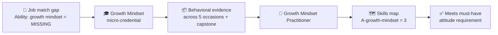

# 🗺️ Skills Map — what the badge unlocks

How the **🏅 Growth Mindset Practitioner** badge writes into a learner's skills map and closes a
real job-match gap. Conforms to
[`../../specs/skills-map-and-job-matching.md`](../../specs/skills-map-and-job-matching.md).

---

## 🏅 What the badge certifies

On verified completion, the badge sets these components in the learner's skills map:

| Component | Type | Level earned |
| --------- | ---- | ------------ |
| `A-growth-mindset` | 🌱 Ability | **3** |
| `A-adaptability` | 🌱 Ability | 2 |
| `S-yet-reframe` | 🛠️ Skill | 2 |
| `S-deliberate-practice` | 🛠️ Skill | 2 |
| `K-mindset-science` | 🧠 Knowledge | 1 |
| `K-mindset-nuance` | 🧠 Knowledge | 1 |

```yaml
# fragment merged into the learner's skills map on badge issuance
badge: growth-mindset-practitioner
issued_on: verified-evidence
components:
  A-growth-mindset: 3
  A-adaptability: 2
  S-yet-reframe: 2
  S-deliberate-practice: 2
  K-mindset-science: 1
  K-mindset-nuance: 1
```

---

## 🎯 Why this matters for job matching

Job postings reliably ask for *attitudes* — "growth mindset," "coachable," "learning agility,"
"thrives on feedback," "comfortable with ambiguity" — and these are exactly the components a
**Knowledge-only** course can never certify. A typical match before and after this badge:

| Job requirement (`must_have`) | Before | After badge |
| ----------------------------- | ------ | ----------- |
| Growth mindset / learning agility (Ability ≥ 2) | ❌ 0 | ✅ 3 |
| Adapts to change / ambiguity (Ability ≥ 2) | ⚠️ 1 | ✅ 2 |
| Seeks & acts on feedback (Skill/Ability ≥ 2) | ❌ 0 | ✅ via `A-growth-mindset` + `S-yet-reframe` |



---

## 🔗 Where this fits a role pathway

`A-growth-mindset` and `A-adaptability` are **durable, transferable** Abilities — they belong in
the *foundation layer* of almost every role pathway built with
[`../../specs/role-to-credential-mapping.md`](../../specs/role-to-credential-mapping.md). Pair
this badge with role-specific technical micro-credentials (e.g.,
[the Data Scientist pathway](../role-data-scientist-pathway.md)) so a learner matches **both**
the hard-skill *and* the attitude minimums a job demands.

> ⚠️ Per the methodology, AI-suggested matches are **decision support**, not a hiring decision —
> a mentor/employer validates the evidence before the badge counts (human-in-the-loop).
