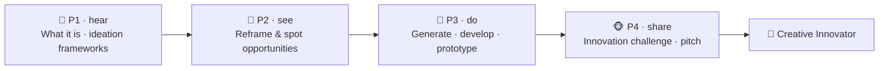

# 💡 Worked Example — Innovation & Creativity Micro-Credential (full course)

  
  
  
  

A **complete, ready-to-run ADA micro-credential** for the skill every organization says it wants and
few teach systematically: **turning fresh ideas into real value**. It is a *fully populated* example
built end-to-end with the ADA Methodology (KSA + 4 phases + learning-atom topology): every atom has
**real reading text**, **curated videos**, **Mermaid diagrams**, **image-generation prompts**,
hands-on drills, and rubrics.

> 🖥️ **See it live:** open [`course.html`](course.html) in any browser for an interactive, navigable
> version of this course (sidebar, progress, embedded videos, diagrams, copyable prompts).

Creativity and innovation make a perfect **cognitive + dispositional skill** for the KSA model: a small
**Knowledge** base (what creativity/innovation actually are; ideation frameworks), three core
**Skills** (reframe problems & spot opportunities, generate ideas, and develop/prototype/evaluate
them), and the durable **Abilities** that power them (creative confidence and curious openness). It
pairs naturally with [Critical Thinking](../critical-thinking-micro-credential/README.md) (to judge
which ideas hold up) and [Problem Solving](../problem-solving-micro-credential/README.md) (to ship the
chosen one).

Conforms to [`../../specs/micro-credential-v2-schema.md`](../../specs/micro-credential-v2-schema.md) ·
modalities from [`../../specs/learning-atom-topology.md`](../../specs/learning-atom-topology.md) ·
KSA from [`../../specs/ksa-taxonomy.md`](../../specs/ksa-taxonomy.md).

---

## 🧭 What this teaches

"Be more creative" is useless advice. This course makes creativity **a trainable, repeatable
practice**: learners learn to **reframe a problem** into opportunities, **generate many ideas** on
demand (divergent thinking), **develop and prototype** the best ones, and **evaluate** them against
real criteria (convergent thinking) — finishing by running a full innovation challenge from blank page
to pitched, prototyped concept.

| | |
| --- | --- |
| **Title** | Innovation & Creativity: From Idea to Value |
| **Duration** | ~12 hours · 2–3 weeks |
| **Primary KSA** | 🛠️ Skill — *reframe & spot opportunities* and *generate ideas*, plus the 🌱 Abilities that sustain them |
| **Target competency** | O\*NET abilities/work-styles: **Fluency of Ideas** (1.A.1.b.1), **Originality** (1.A.1.b.2), **Thinking Creatively** (4.A.2.b.1), **Innovation** (work style) · ESCO transversal *"think creatively", "use creativity"* |
| **Badge** | 🏅 *Creative Innovator* |
| **Prerequisites** | None. A real problem, product, or process you'd like to improve helps for practice. |

---

## 📚 Course contents

| # | File | What it is |
| - | ---- | ---------- |
| — | [`micro-credential.md`](micro-credential.md) | The full micro-credential spec (YAML schema, objectives, KSA map, phase planner) |
| 1 | [`atoms/atom-1-what-is-creativity-and-innovation.md`](atoms/atom-1-what-is-creativity-and-innovation.md) | 🙉 P1 · 🧠 K — What creativity & innovation are (divergent/convergent; idea → value) |
| 2 | [`atoms/atom-2-ideation-frameworks.md`](atoms/atom-2-ideation-frameworks.md) | 🙉 P1 · 🧠 K — Ideation frameworks (design thinking, SCAMPER, lateral, analogies, constraints) |
| 3 | [`atoms/atom-3-reframe-problems-and-spot-opportunities.md`](atoms/atom-3-reframe-problems-and-spot-opportunities.md) | 🙈 P2 · 🛠️ S — Reframe problems & spot opportunities ("How Might We") |
| 4 | [`atoms/atom-4-generate-ideas.md`](atoms/atom-4-generate-ideas.md) | 🙊 P3 · 🛠️ S — Generate ideas (fluency · flexibility · originality) |
| 5 | [`atoms/atom-5-develop-prototype-and-evaluate.md`](atoms/atom-5-develop-prototype-and-evaluate.md) | 🙊 P3 · 🛠️ S + 🌱 A — Develop, prototype & evaluate ideas |
| 6 | [`atoms/atom-6-capstone-innovation-challenge.md`](atoms/atom-6-capstone-innovation-challenge.md) | 🐵 P4 · 🛠️ S + 🌱 A — Capstone: run an innovation challenge + peer review |
| — | [`capstone.md`](capstone.md) | Capstone brief + how it maps to KSA |
| — | [`rubrics.md`](rubrics.md) | All rubrics (knowledge-mini, skill, behavioral, capstone-5) |
| — | [`skills-map.md`](skills-map.md) | Badge → skills map and how it boosts product, design & strategy roles |

> 🤝 **Practiced for real:** the Abilities (creative confidence, curious openness) are assessed
> **behaviorally across ≥3 occasions** (never a quiz), and the capstone ends in a pitch + peer review.

---

## 🔄 Phase journey

---

## 🤖 How it was authored (and how to reuse it)

This course follows the Gen AI authoring workflow in
[`../../specs/genai-authoring-workflow.md`](../../specs/genai-authoring-workflow.md):
competency → KSA → atoms → modalities → rubrics → badge. Conventions used throughout:

- **🎬 Videos** are written as a `youtube` block with the real URL + caption (the interactive site
  embeds them as a click-to-play player).
- **🖼️ Diagrams** are provided two ways: a live **Mermaid** diagram *and* a reusable
  **image-generation prompt** in a `prompt` block.
- **✅ Activities** include ideation worksheets, prototyping drills, selection matrices, and rubrics so
  the course is self-paced and practicable.

> ⚠️ **Human-in-the-loop (methodology guardrail):** the links and references below are **curated
> starting points** — a mentor/instructor should verify each one before delivery. The Abilities here
> require human/peer observation across occasions. See [`../../CLAUDE.md`](../../CLAUDE.md) §5.
