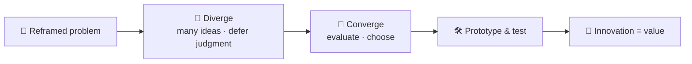
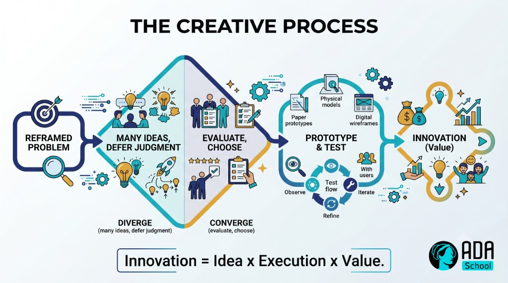

## ⚛ Learning Atom 1 — *What Creativity & Innovation Are*

**Phase:** 🙉 1 · Self-Guided Introduction (*hear*) · **KSA:** 🧠 Knowledge · **Target level:** L2
· **Component id:** `K-creativity-innovation`

### 🎯 Learning objective

- **Explain** divergent vs. convergent thinking and **how creativity becomes innovation** — and bust
  the common myths about who gets to be creative.

### 🧩 Prerequisites

- None. Bring one thing you wish worked better (a product, a process, a chore) — your raw material.

### 🧭 Atom description

Most people think creativity is a personality trait you're born with or without. It isn't. Creativity
is a **process** anyone can learn, and innovation is what happens when you carry that process all the
way to **real value.** This atom installs the core vocabulary the rest of the course builds on.

---

### 📖 Reading — *Creativity is a process, not a gift* (≈ 7 min)

**Two definitions, one relationship:**

- **Creativity** = generating ideas that are both **novel** *and* **useful/relevant** in context. (Just
  novel = random; just useful = ordinary. Creativity needs both.)
- **Innovation** = **creativity + execution that creates value.** An idea in your head isn't an
  innovation. A creative idea that's built, adopted, and makes something better — *that's* innovation.

> A useful shorthand: **Innovation = Idea × Execution × Value.** A brilliant idea with no execution is
> worth ~zero; flawless execution of a worthless idea is also ~zero.

**The two modes of thinking (you need both):**

- **Divergent thinking** — open up: generate *many* options, defer judgment, chase quantity and
  variety. This is where ideas are *born.* Measured by **fluency** (how many), **flexibility** (how
  many *kinds*), and **originality** (how rare).
- **Convergent thinking** — narrow down: evaluate, combine, and choose using criteria. This is where
  ideas get *better and real.*

The classic failure mode is mixing them: judging ideas the moment they appear kills divergence. The
discipline is to **separate** the modes — diverge fully, *then* converge.

**The creative process (a simple, repeatable loop):**

1. **Understand & reframe** the problem (Atom 3).
2. **Diverge** — generate lots of ideas (Atom 4).
3. **Converge** — select and develop the best (Atom 5).
4. **Prototype & test** — make it real enough to learn (Atom 5).
5. **Iterate** — repeat with what you learned.

**Three myths to drop now:**

- *"Creativity is a talent you have or don't."* → It's a **skill**; practice and method raise everyone's output.
- *"Great ideas arrive as flashes of genius."* → They usually **combine existing ideas** in new ways
  (often across domains) and emerge from *volume* + iteration.
- *"Constraints kill creativity."* → Constraints **focus** it. A blank page is paralyzing; a sharp
  constraint ("design it for a 5-year-old / for $5 / in one tap") sparks ideas.

**Key takeaways**

- [ ] **Creativity** = novel **and** useful; **innovation** = creativity **+ execution + value.**
- [ ] **Diverge** (generate, defer judgment) then **converge** (evaluate, choose) — never at once.
- [ ] Creativity is a **process/skill**, not a fixed gift.
- [ ] **Constraints fuel** creativity; ideas usually **combine** existing things.

---

### 🎬 Watch — creativity & innovation, explained (pick one, ~6–12 min)

```youtube
https://www.youtube.com/watch?v=16p9YRF0l-g
TED — David Kelley (IDEO): "How to build your creative confidence" (verify before delivery).
```

```youtube
https://www.youtube.com/watch?v=UAinLaT42xY
TED — Tim Brown: "Tales of creativity and play" / design thinking overview (verify before delivery).
```

---

### 🖼️ See — diverge then converge





> 🖼️ *Generated image — produced from the prompt below.*

A reusable prompt to generate an on-brand version of this diagram:

```prompt
Create a clean, modern educational infographic of the "double diamond"-style creative process:
Reframed problem → Diverge (many ideas, defer judgment) → Converge (evaluate, choose) → Prototype &
test → Innovation (value). Add a caption: "Innovation = Idea x Execution x Value." Use ADA brand
colors (Indigo #1E2A6E, Turquoise #15B5C6, Gold #E0A53C accents) on a light background, flat vector
style, legible sans-serif, no text errors. 16:9.
```

---

### ✅ Evaluate — Pop quiz (formative, `knowledge-mini`)

1. What's the difference between creativity and innovation?
2. Why must divergent and convergent thinking be kept separate?
3. True or false: constraints reduce creativity. Explain.

<details>
<summary>Answer key</summary>

1. **Creativity** = generating novel *and* useful ideas; **innovation** = taking a creative idea
   through **execution** so it creates real **value.**
2. Because judging ideas while generating them (convergent during divergent) shuts down idea flow — you
   self-censor before options exist. Diverge fully first, *then* evaluate.
3. **False.** Well-chosen **constraints focus** creativity and spark ideas; a totally blank page is
   often paralyzing.

</details>

---

### 📦 Deliverable

- Take the thing you wish worked better. Write (a) the **idea** of a better version, (b) what
  **execution** would take, and (c) the **value** it would create — your first Idea × Execution × Value.

### 🧠 Final reflection

- Do you default to diverging or converging? Which one do you cut short?

### 🔗 Sources to verify (human-in-the-loop)

- Guilford / Torrance — divergent thinking (fluency, flexibility, originality).
- IDEO / d.school — design thinking and the diverge–converge model.
- Amabile, *The Componential Theory of Creativity* (creativity = domain skills + creative thinking + motivation).

### 🧩 Connections

- **Successors:** Atom 2 (the frameworks), Atom 3 (reframe the problem).
