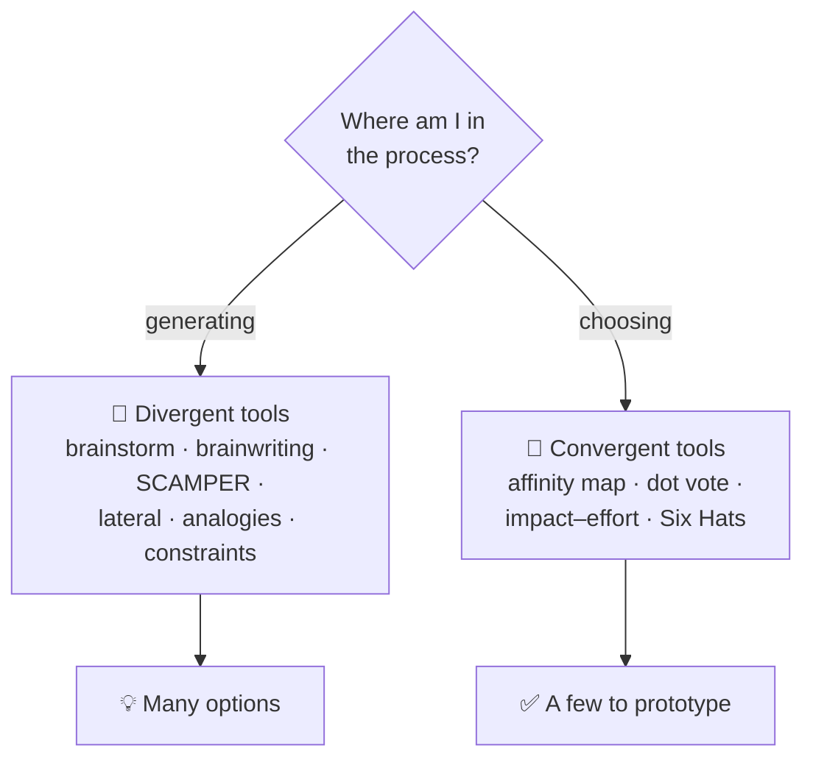
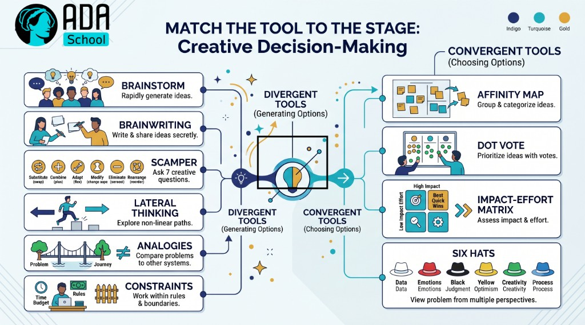

## ⚛ Learning Atom 2 — *Ideation Frameworks*

**Phase:** 🙉 1 · Self-Guided Introduction (*hear*) · **KSA:** 🧠 Knowledge · **Target level:** L2
· **Component id:** `K-ideation-frameworks`

### 🎯 Learning objective

- **Describe** the major ideation frameworks and **explain when to use each** stage of the creative
  process.

### 🧩 Prerequisites

- Atom 1 (diverge/converge, idea → value). Frameworks are tools that plug into that loop.

### 🧭 Atom description

You don't have to wait for inspiration — you can *trigger* it with structured tools. This atom is a
field guide to the most useful ideation frameworks, mapped to *when* in the process each one helps.
Knowing the menu means you'll never stare at a blank page again.

---

### 📖 Reading — *A toolkit for triggering ideas* (≈ 8 min)

**Big-picture process framework:**

- **Design thinking** (Empathize → Define → Ideate → Prototype → Test). A human-centered loop that
  keeps ideas anchored to *real user needs.* Most other tools live inside its "Ideate" and "Prototype"
  stages. (This whole micro-credential roughly follows it.)

**Divergent (idea-generation) tools:**

- **Brainstorming — done right.** The original rules (Osborn) still hold: **defer judgment, go for
  quantity, welcome wild ideas, build on others' ideas ("yes, and").** Most "brainstorms" fail because
  they break rule one.
- **Brainwriting / 6-3-5.** Everyone writes ideas silently, then passes them on to build upon. Beats
  group brainstorming for quantity and fairness (no loud voices dominating, no anchoring).
- **SCAMPER.** A checklist to twist an existing thing: **S**ubstitute, **C**ombine, **A**dapt,
  **M**odify/Magnify, **P**ut to other use, **E**liminate, **R**everse. Great for improving products/processes.
- **Lateral thinking (de Bono).** Deliberately break patterns: random-word association, provocations
  ("Po: cars have square wheels"), challenging assumptions.
- **Analogies & cross-domain transfer.** "How does nature/another industry solve this?" (Velcro from
  burrs; bullet trains from kingfisher beaks.) Most breakthroughs are **borrowed** from elsewhere.
- **Constraints & "what if."** Add an extreme constraint ("for $1," "no screen," "in 10 seconds") or
  remove one ("infinite budget") to jolt new directions.
- **SCAMPER + AI.** Modern twist: use an LLM as an idea *multiplier* — but you steer, select, and judge
  (the convergence and taste are yours; Atom 4 covers this).

**Convergent (selection) tools:**

- **Affinity mapping** — cluster many ideas into themes to see patterns.
- **Dot voting** — quick, democratic shortlisting.
- **Criteria / impact–effort matrix** — score ideas on desirability, feasibility, viability (or
  impact vs. effort) to choose what to prototype (Atom 5).
- **Six Thinking Hats** — examine a chosen idea from multiple angles (facts, feelings, risks, benefits).

> **The meta-skill:** match the **tool to the stage.** Diverging? Reach for brainwriting, SCAMPER,
> analogies. Converging? Reach for affinity maps and an impact–effort matrix. Using a convergent tool
> while you should be diverging (or vice-versa) is the most common mistake.

**Key takeaways**

- [ ] **Design thinking** is the wrapping loop; most tools live in its Ideate/Prototype stages.
- [ ] Divergent tools: **brainstorming (defer judgment), brainwriting, SCAMPER, lateral thinking,
  analogies, constraints.**
- [ ] Convergent tools: **affinity mapping, dot voting, impact–effort matrix, Six Hats.**
- [ ] **Match the tool to the stage** — diverge with some, converge with others.

---

### 🎬 Watch — frameworks in action (~5–18 min)

```youtube
https://www.youtube.com/watch?v=H0_yKBitO8M
TED — Tom Wujec: "Build a tower, build a team" (the Marshmallow Challenge — prototyping & iteration) (verify before delivery).
```

---

### 🖼️ See — match the tool to the stage





> 🖼️ *Generated image — produced from the prompt below.*

A reusable prompt to generate an on-brand version:

```prompt
Create a clean, modern infographic "Match the tool to the stage": a decision splits into "Divergent
tools (brainstorm, brainwriting, SCAMPER, lateral thinking, analogies, constraints)" and "Convergent
tools (affinity map, dot vote, impact-effort matrix, Six Hats)". Use ADA brand colors (Indigo #1E2A6E,
Turquoise #15B5C6, Gold #E0A53C), light background, flat vector, legible sans-serif. 16:9.
```

---

### ✅ Evaluate — Pop quiz (formative, `knowledge-mini`)

1. What does the "S" and "R" in SCAMPER stand for?
2. Why is brainwriting often better than group brainstorming for idea quantity?
3. Name one divergent and one convergent tool, and when you'd use each.

<details>
<summary>Answer key</summary>

1. **S** = Substitute; **R** = Reverse (or Rearrange). (Full set: Substitute, Combine, Adapt,
   Modify/Magnify, Put to other use, Eliminate, Reverse.)
2. It removes **anchoring** and **dominant voices** — everyone generates silently in parallel, so you
   get more diverse ideas without social pressure or groupthink.
3. e.g. **SCAMPER (divergent)** to generate variations of a product; **impact–effort matrix
   (convergent)** to pick which idea to prototype.

</details>

---

### 📦 Deliverable

- Pick the thing you want to improve (Atom 1). Run **SCAMPER** on it: write at least one idea per letter
  (7 ideas minimum).

### 🧠 Final reflection

- Which framework feels most natural to you, and which feels uncomfortable (often the most useful one)?

### 🔗 Sources to verify (human-in-the-loop)

- IDEO/d.school — *Design Thinking* bootleg & method cards.
- Osborn, *Applied Imagination* (brainstorming rules); Eberle (SCAMPER).
- de Bono, *Lateral Thinking* and *Six Thinking Hats*.

### 🧩 Connections

- **Predecessor:** Atom 1. **Successors:** Atom 3 (reframe first), Atom 4 (apply the divergent tools).
