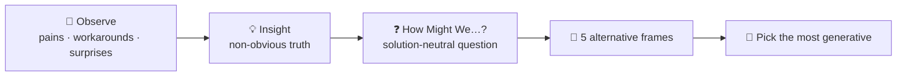
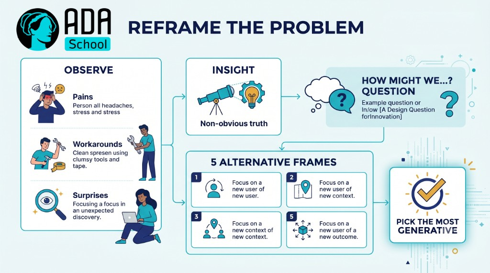

## ⚛ Learning Atom 3 — *Reframe Problems & Spot Opportunities*

**Phase:** 🙈 2 · Visual Exploration (*see*) · **KSA:** 🛠️ Skill · **Target level:** L2
· **Component id:** `S-reframe-opportunities`

### 🎯 Learning objective

- **Reframe** a problem and **spot opportunities** by observing, finding insights, and writing sharp
  "How Might We" questions.

### 🧩 Prerequisites

- Atoms 1–2. The best ideas come from the best *questions* — so we start before ideation.

### 🧭 Atom description

Most weak ideas come from solving the wrong problem. This atom teaches the highest-leverage creative
move: **reframing.** Before generating a single idea, you sharpen *what* you're solving and *for whom*,
turning a vague complaint into a focused, generative opportunity question. It's in Phase 2 (*see*)
because you learn it by watching it modeled, then doing it on a real situation.

---

### 📖 Reading — *Solve the right problem* (≈ 8 min)

**Why reframing matters.** "Make a faster elevator" produces engineering ideas. Reframed to "make the
*wait* feel shorter," it produces *mirrors in the lobby* — cheaper, and it worked. Same situation, a far
better problem. The reframe is often worth more than the idea.

**Step 1 — Observe like an anthropologist (empathize).** Don't ask people what they want; watch what
they *do.* Look for:

- **Pain points** — where do people struggle, wait, complain, or improvise?
- **Workarounds** — homemade fixes reveal unmet needs (a sticky note on a screen = a missing feature).
- **Surprises** — anything that doesn't match what you expected is a clue.
- **Context** — when/where/with whom does this happen? (Jobs-to-be-done: *what is the user really
  trying to accomplish?*)

**Step 2 — Find the insight.** An insight is a *non-obvious truth* about the user that, once seen,
opens new solutions. It's deeper than an observation:

- Observation: *"People skip the onboarding tutorial."*
- Insight: *"People want to feel competent immediately; a tutorial signals 'this is hard.'"*

**Step 3 — Reframe with "How Might We" (HMW).** Turn the insight into an opportunity question that is:

- **Not too broad** ("HMW improve education?" — paralyzing) and **not too narrow** ("HMW add a blue
  button?" — that's a solution in disguise).
- **Solution-neutral** — it invites many answers, not one.
- **Human-centered** — it names *who* and *what outcome.*
- Example: *"How might we help new users feel competent in the first 60 seconds?"*

**Step 4 — Generate alternative frames.** A great practice: write the problem **5 different ways**
(broaden it, narrow it, flip it, change the user, change the goal). Pick the frame that feels most
generative — *then* ideate (Atom 4).

> **The move:** observe → insight → **HMW** question → pick the most generative frame. A sharp question
> makes ideation almost easy.

**Key takeaways**

- [ ] The **reframe** is often worth more than the idea — solve the *right* problem.
- [ ] **Observe behavior** (pains, workarounds, surprises), don't just ask.
- [ ] Turn an **insight** (non-obvious truth) into a **"How Might We"** question.
- [ ] HMW questions are **solution-neutral, human-centered, and right-sized.**

---

### 🖼️ See — observe → insight → reframe





> 🖼️ *Generated image — produced from the prompt below.*

A reusable prompt to generate an on-brand version:

```prompt
Create a clean, modern infographic "Reframe the problem": Observe (pains, workarounds, surprises) →
Insight (non-obvious truth) → "How Might We…?" question → 5 alternative frames → Pick the most
generative. Use ADA brand colors (Indigo #1E2A6E, Turquoise #15B5C6, Gold #E0A53C), light background,
flat vector, legible sans-serif. 16:9.
```

---

### 🧪 Practice — *Reframe a real problem* (Worksheet + Case Study)

Pick a real situation you can observe (a tool your team uses, a daily friction, a service you find
frustrating). Then:

1. **Observe.** Write 5+ concrete observations — focus on pains, workarounds, surprises (watch real
   behavior, not opinions).
2. **Insight.** Distil **one** non-obvious insight about what the user is really trying to do.
3. **HMW.** Write a sharp, solution-neutral "How Might We" question from that insight.
4. **Reframe ×5.** Write the problem 5 different ways (broaden, narrow, flip, change user, change goal).
5. **Pick.** Choose the most generative frame and say why.

---

### ✅ Evaluate — Performance task (`skill`)

Submit your reframe. Scored on:

| Criterion | Excellent (3) | Adequate (2) | Needs work (1) |
| --------- | ------------- | ------------ | -------------- |
| **Observation** | Concrete, behavior-based; captures real pains/workarounds | Some real observations | Opinions/assumptions, not observation |
| **Insight** | Genuine non-obvious truth about the user | A reasonable observation restated | Surface-level or missing |
| **HMW quality** | Solution-neutral, human-centered, right-sized | Usable but broad/narrow | A solution in disguise / vague |
| **Alternative frames** | 5 genuinely different, generative frames | A few real alternatives | Restatements of the same frame |

> Pass = 2+ each → **L2** evidence for `S-reframe-opportunities`.

### 📦 Deliverable

- Your observations, insight, HMW question, 5 frames, and chosen frame.

### 🧠 Final reflection

- Did the reframe change what kinds of solutions feel possible? How?

### 🔗 Sources to verify (human-in-the-loop)

- IDEO, *The Field Guide to Human-Centered Design* (observe, insight, HMW).
- Wedell-Wedellsborg, *What's Your Problem?* (reframing).
- Christensen, *Jobs to Be Done* (what the user is really trying to accomplish).

### 🧩 Connections

- **Predecessor:** Atom 2. **Successor:** Atom 4 (generate ideas against your chosen frame).
