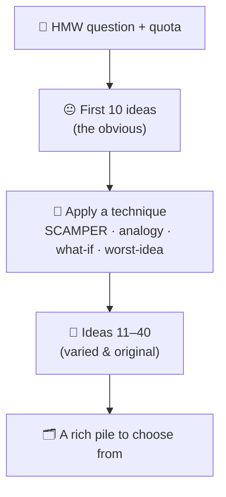
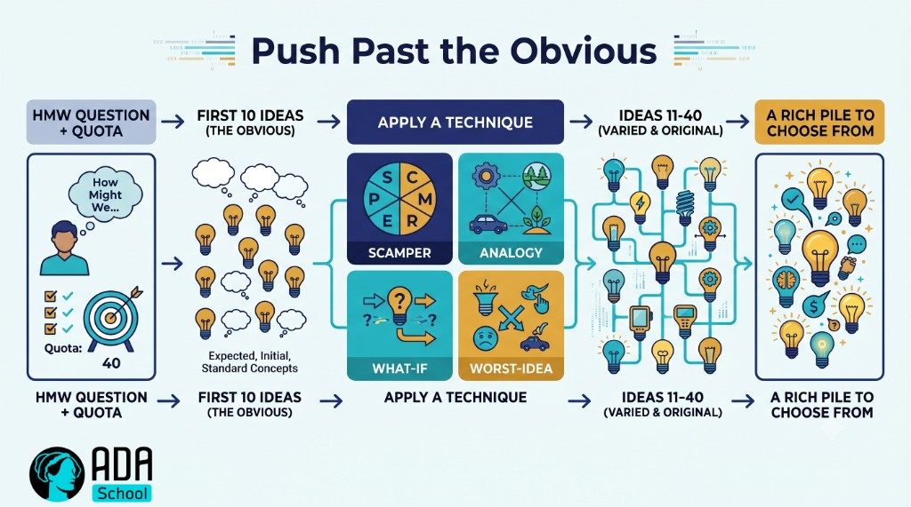

## ⚛ Learning Atom 4 — *Generate Ideas*

**Phase:** 🙊 3 · Applied Practice (*do*) · **KSA:** 🛠️ Skill · **Target level:** L2
· **Component id:** `S-generate-ideas`

### 🎯 Learning objective

- **Generate** many varied, original ideas on demand using divergent techniques — measured by fluency,
  flexibility, and originality.

### 🧭 Atom description

This is the engine room: producing ideas on purpose, in volume, without freezing or self-censoring.
You'll run structured idea sprints, push past the obvious "first ten," and use AI as an idea
multiplier. The goal isn't one perfect idea — it's a *rich, varied pile* to choose from in Atom 5.

---

### 📖 Reading — *Quantity is the path to quality* (≈ 8 min)

**The counter-intuitive truth:** to get *good* ideas, generate *many* ideas. Research and practice both
show that the **best idea is rarely the first** — the obvious ones come out first, and originality lives
deeper in the list. So you chase **quantity** on purpose.

**The three measures of divergent output** (aim to improve all three):

- **Fluency** — *how many* ideas. (Set targets: "30 ideas in 10 minutes.")
- **Flexibility** — *how many different kinds.* (Don't list 20 variations of the same idea — jump
  categories: cheaper, fun, social, automated, physical, AI…)
- **Originality** — *how rare/novel.* (Push past the clichés everyone lists.)

**Rules that keep the ideas flowing:**

1. **Defer judgment.** No "that won't work" during generation. Evaluation is a *separate* mode (Atom 5).
2. **Go for volume.** Set a quota; quotas beat "good ideas."
3. **Encourage wild ideas.** Easier to tame a wild idea than to spice up a safe one.
4. **Build, don't block — "yes, and."** Combine and stack on others' ideas.
5. **Stay visual & fast.** One idea per sticky note/line; speed over polish.

**Techniques to break out of ruts** (from Atom 2, now applied):

- **SCAMPER** the existing solution — force one idea per letter.
- **Analogies** — "how would [Disney / a hospital / nature / a 5-year-old] solve this?"
- **Provocation / "what if"** — "what if it were free? illegal? instant? invisible?"
- **Worst possible idea** — generate *terrible* ideas, then invert them (removes the fear of bad ideas
  and often reveals a good one in reverse).
- **Brainwriting** — generate silently first, then share, to avoid anchoring.

**Using AI as an idea multiplier (you stay the creative director):** an LLM is great at *fluency* and
*flexibility* on demand — but it regresses to the average, so **you** provide the reframe, push for
weirder branches, and judge. Diverge with the AI; *converge with your taste.*

> **The habit:** set a quota → defer judgment → diverge with a technique → push past the first ten →
> only *then* evaluate.

**Key takeaways**

- [ ] The best idea is rarely the first — chase **quantity** to reach **quality.**
- [ ] Improve **fluency** (how many), **flexibility** (how varied), **originality** (how rare).
- [ ] **Defer judgment**, set quotas, welcome wild ideas, build with "yes, and."
- [ ] Use SCAMPER, analogies, "what if," worst-idea — and AI as a multiplier you steer.

---

### 🖼️ See — push past the obvious





> 🖼️ *Generated image — produced from the prompt below.*

A reusable prompt to generate an on-brand version:

```prompt
Create a clean, modern infographic "Push past the obvious": HMW question + quota → first 10 ideas (the
obvious) → apply a technique (SCAMPER, analogy, what-if, worst-idea) → ideas 11-40 (varied & original)
→ a rich pile to choose from. Use ADA brand colors (Indigo #1E2A6E, Turquoise #15B5C6, Gold #E0A53C),
light background, flat vector, legible sans-serif. 16:9.
```

---

### 🧪 Practice A — *The idea sprint* (Worksheet)

Using your chosen "How Might We" frame from Atom 3:

1. **Quota run.** Set a timer (10 min) and generate **at least 30 ideas.** One line each. No editing.
2. **Technique boost.** When you stall, apply **two** techniques (e.g., SCAMPER + analogy + worst-idea)
   to push to **40+.**
3. **Tag for flexibility.** Group your ideas into categories — aim for **6+ different kinds.** If most
   land in one category, generate more in the empty ones.
4. **Star the originals.** Mark the 5 most *original* ideas (the ones you've never seen before).

### 🧪 Practice B — *AI as idea multiplier* (AI Prompt Question)

```prompt
You are my divergent-thinking partner. Generate ideas only — do NOT evaluate or rank.
Give me 25 varied ideas for this "How Might We" question, deliberately spanning these angles:
cheap, premium, playful, social, automated/AI, physical, low-tech, and "wild/borderline impossible".
Then give me 5 "worst possible ideas" I can invert.
How Might We: """[paste your HMW question]"""
```

Then **you** curate: keep the 5 ideas with the most potential, and note one human idea of yours that
the AI didn't reach.

---

### ✅ Evaluate — Performance task (`skill`)

Submit Practice A + B. Pass = real **volume** (30+), genuine **flexibility** (6+ categories),
identifiable **originality** (non-cliché ideas), and evidence you **deferred judgment** and used
techniques to break ruts. → **L2** evidence for `S-generate-ideas`.

### 📦 Deliverable

- Your idea list (tagged by category, originals starred) + the curated AI output with your additions.

### 🧠 Final reflection

- Where did your best ideas appear — early or after idea 20? What does that tell you?

### 🔗 Sources to verify (human-in-the-loop)

- Guilford / Torrance — fluency, flexibility, originality (divergent thinking measures).
- IDEO brainstorming rules; *Creative Confidence* (Kelley & Kelley).
- Research on idea quantity → quality (e.g., "the best ideas come later in the list").

### 🧩 Connections

- **Predecessor:** Atom 3. **Successor:** Atom 5 (now converge, prototype, and evaluate).
