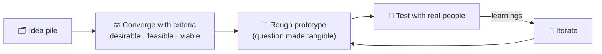
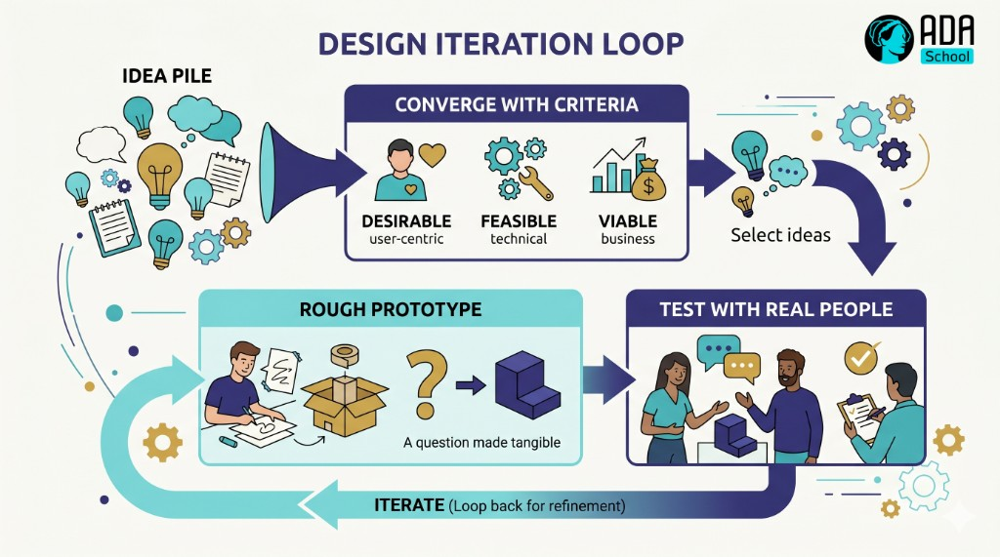

## ⚛ Learning Atom 5 — *Develop, Prototype & Evaluate*

**Phase:** 🙊 3 · Applied Practice (*do*) · **KSA:** 🛠️ Skill + 🌱 Abilities · **Target level:** L2
· **Component ids:** `S-develop-prototype`, `A-creative-confidence`, `A-curiosity-openness`

### 🎯 Learning objective

- **Converge** on the best ideas with criteria, **build a rough prototype**, and **test** it — while
  demonstrating **creative confidence** and **curious openness**.

### 🧭 Atom description

A pile of ideas isn't innovation. This atom is where ideas become *real enough to learn from*: you
select with criteria, make something tangible quickly, and test it to improve it. It's also where the
two **Abilities** get assessed — because sharing rough work and treating failed tests as data is
exactly creative confidence in action.

---

### 📖 Reading — *Make it real to make it better* (≈ 7 min)

**Step 1 — Converge with criteria (don't just pick your favorite).** Score your shortlisted ideas on:

- **Desirability** — do people actually want it? (ties back to your insight, Atom 3)
- **Feasibility** — can it realistically be built/done?
- **Viability** — is it worth it (value vs. cost)?

A quick **impact–effort matrix** (or dot voting to shortlist, then criteria to choose) turns "I like
this one" into a defensible choice. Pick 1–2 to prototype.

**Step 2 — Prototype: lowest-fidelity thing that answers your biggest question.** A prototype isn't a
finished product — it's a **question made tangible.** Match fidelity to the question:

- Paper sketch / storyboard — *does the flow make sense?*
- Clickable mock / slides — *is it understandable?*
- Role-play / "Wizard of Oz" (you fake the backend) — *do people behave as hoped?*
- Landing page / concept poster — *do people want it?*

The marshmallow-challenge lesson: teams that **build early and often** beat teams that plan then build
once. **Fail cheap, fail early.**

**Step 3 — Test & learn.** Put the prototype in front of real people. Ask them to *use* it, not rate
it. Watch for what confuses or delights them. Capture: *what worked, what didn't, what surprised me,
what's next.* Then **iterate** — a "failed" test isn't failure, it's the data that makes the next
version better.

**The two Abilities, made visible.** This atom surfaces dispositions under pressure:

- **🌱 Creative confidence** — you **share rough, unfinished work** without apologizing it to death;
  you treat a test that flops as **iteration, not verdict**; you defer judgment so ideas survive long
  enough to develop.
- **🌱 Curious openness** — you **seek out** disconfirming feedback, ask "what if we tried…", and pull
  ideas from unexpected places rather than defending your first concept.

> **The mark of an innovator:** not falling in love with the first idea, but **building the cheapest
> thing that teaches you the most — and changing your mind when it does.**

**Key takeaways**

- [ ] **Converge with criteria** (desirability, feasibility, viability), not just preference.
- [ ] A **prototype is a question made tangible** — match fidelity to the question; build early.
- [ ] **Test by watching people use it**; capture learnings and **iterate.**
- [ ] **Fail cheap, fail early** — failed tests are data, not verdicts.

---

### 🖼️ See — converge → prototype → test → iterate





> 🖼️ *Generated image — produced from the prompt below.*

A reusable prompt to generate an on-brand version:

```prompt
Create a clean, modern infographic of an iterative loop: Idea pile → Converge with criteria (desirable,
feasible, viable) → Rough prototype (a question made tangible) → Test with real people → Iterate (loop
back to prototype). Use ADA brand colors (Indigo #1E2A6E, Turquoise #15B5C6, Gold #E0A53C), light
background, flat vector, legible sans-serif. 16:9.
```

---

### 🧪 Practice — *Choose, build, test* (Lab + Simulation + Forum)

1. **Converge.** Take your starred ideas from Atom 4. Score the top 5 on desirability/feasibility/
   viability (or an impact–effort matrix). Pick **one** to prototype, and justify the choice.
2. **Prototype.** Build the **lowest-fidelity** prototype that answers your biggest open question
   (sketch, slides, paper flow, role-play, or landing page). Timebox it — rough is the point.
3. **Test.** Show it to **at least 2 people.** Have them *use* it; note what worked, what confused them,
   what surprised you. Write your **next iteration.**
4. **Share in the forum.** Post your prototype + learnings; give "I like / I wish / what if" feedback to
   ≥2 peers and respond to feedback on yours.

> 🤝 **This is a behavioral-assessment occasion.** Mentors observe *how* you work: Do you share rough
> work without over-polishing? Do you treat a flop as iteration? Do you seek and build on others'
> feedback rather than defend?

---

### ✅ Evaluate — Behavioral assessment (`behavioral`, Abilities)

Observed across this atom + the forum + the capstone (≥3 occasions):

| Ability | Look-for (evidence) |
| ------- | ------------------- |
| 🌱 Creative confidence | Shares unfinished work; treats failed tests as iteration; defers judgment; takes a productive risk |
| 🌱 Curious openness | Seeks disconfirming feedback; asks "what if"; borrows ideas across domains; changes course on evidence |

Rated **Emerging / Developing / Proficient** on the behavioral rubric in [`rubrics.md`](rubrics.md)
(not a quiz — evidenced over time). The **prototype/test quality** (criteria use, fidelity-to-question,
real learnings) is scored on the `skill` rubric.

### 📦 Deliverable

- Your selection matrix, the prototype (photo/file/link), test notes, and your next iteration — plus a
  note: "what the test changed about my idea."

### 🧠 Final reflection

- What surprised you in testing? Was sharing rough work uncomfortable — and did it get easier?

### 🔗 Sources to verify (human-in-the-loop)

- Kelley & Kelley, *Creative Confidence*; IDEO prototyping methods.
- Tom Wujec, *The Marshmallow Challenge* (build early, iterate).
- "Desirability / Feasibility / Viability" (IDEO innovation lens).

### 🧩 Connections

- **Predecessor:** Atom 4. **Successor:** Atom 6 (run the whole loop on a real challenge).
