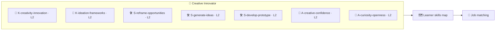

# 🗺️ Skills Map — Innovation & Creativity

How the **🏅 Creative Innovator** badge writes to a learner's skills map, and why it strengthens product,
design, and strategy roles. See the methodology in
[`../../specs/skills-map-and-job-matching.md`](../../specs/skills-map-and-job-matching.md).

---

## 🧩 What the badge writes to the map

On earning the badge, these KSA components are recorded with verified evidence:

| Component | Type | Level | Evidence |
| --------- | ---- | ----- | -------- |
| `K-creativity-innovation` | 🧠 Knowledge | L2 | Pop quiz + applied in capstone |
| `K-ideation-frameworks` | 🧠 Knowledge | L2 | Pop quiz + applied in capstone |
| `S-reframe-opportunities` | 🛠️ Skill | **L2** | Atom 3 performance task |
| `S-generate-ideas` | 🛠️ Skill | **L2** | Atom 4 performance task |
| `S-develop-prototype` | 🛠️ Skill | **L2** | Atom 5 + capstone |
| `A-creative-confidence` | 🌱 Ability | L2 | Behavioral, ≥3 occasions |
| `A-curiosity-openness` | 🌱 Ability | L2 | Behavioral, ≥3 occasions |

---

## 🎯 Why this badge strengthens many roles

Creativity and innovation are **transversal** competencies that O\*NET lists as core abilities
(Originality, Fluency of Ideas) and a key work style (Innovation). The badge also **amplifies** other
skills on the map:

| Pairs with | Combined effect |
| ---------- | --------------- |
| 🧠 [Critical Thinking](../critical-thinking-micro-credential/README.md) | Judge which novel ideas actually hold up |
| 🧩 [Problem Solving](../problem-solving-micro-credential/README.md) | Turn the chosen idea into a shipped solution |
| 🗣️ [Effective Communication](../effective-communication-micro-credential/README.md) | Pitch ideas so they get adopted |
| 🌱 [Growth Mindset](../growth-mindset-micro-credential/README.md) | Treat failed experiments as learning |

---

## 🧮 Worked matching example

A role posting asks for *"a creative, innovative thinker who can generate fresh ideas and turn them into
prototypes and tested concepts."*

| Requirement | Map evidence | Status |
| ----------- | ------------ | ------ |
| Generate fresh ideas | `S-generate-ideas` @ L2 | ✅ met |
| Reframe / find opportunities | `S-reframe-opportunities` @ L2 | ✅ met |
| Prototype & test concepts | `S-develop-prototype` @ L2 | ✅ met |
| Innovative, open mindset | `A-creative-confidence` + `A-curiosity-openness` (behavioral) | ✅ met |

→ A learner holding this badge **meets the innovation minimums** for the role, with *verifiable
evidence* (an Innovation Brief, prototype, and behavioral observations) rather than a self-claimed
"creative" bullet point.

> ⚠️ **Human-in-the-loop:** AI-suggested matches are provisional until a mentor/employer validates the
> evidence — per [`../../CLAUDE.md`](../../CLAUDE.md) §5.
