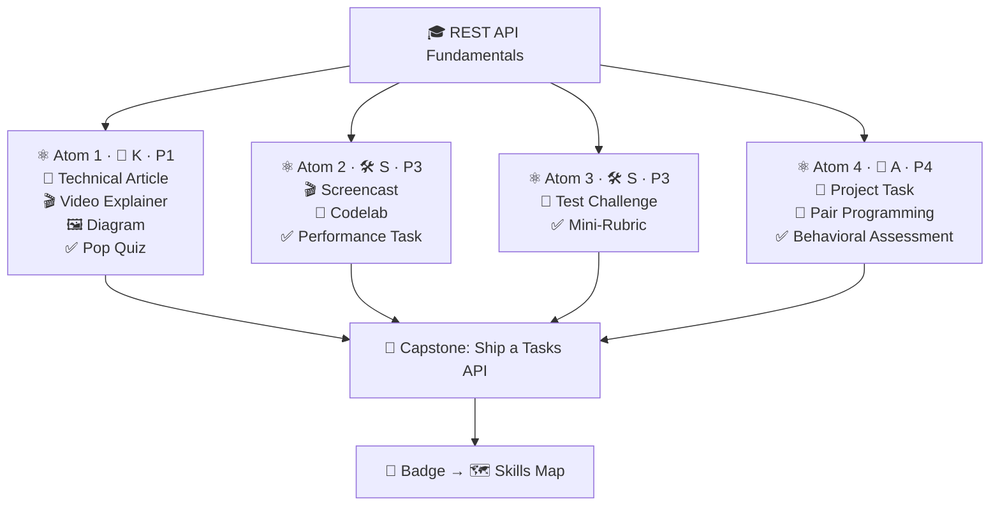

# 🛠️ Example — Technical Skill: REST API Fundamentals (KSA)

**KSA flavor demonstrated:** primarily a **Skill** (technical/hard), built on top of
**Knowledge**, and threaded with one **Ability**.

This worked example shows an ADA **v2** micro-credential conforming to
[`../specs/micro-credential-v2-schema.md`](../specs/micro-credential-v2-schema.md). It
illustrates how a *technical skill* is decomposed into Knowledge (know-what), Skill
(know-how), and Ability (durable disposition).

---

## YAML front matter (machine-readable)

```yaml
---
schema: ada-microcredential/v2
id: mc-rest-api-fundamentals
title: "REST API Fundamentals with Flask"
language: en
duration_hours: 18
status: published
license: CC-BY-SA-4.0
authors: ["Ada School Team"]
mentors: ["@sancarbar"]

target_roles:
  - role: "Junior Backend Developer"
    framework_ref: "O*NET 15-1254.00 Web Developers / SFIA:PROG"

ksa:
  - { id: K-http-semantics,    type: knowledge, label: "HTTP methods, status codes & REST design", target_level: 2, bloom: understand }
  - { id: S-build-rest-endpoint, type: skill,   label: "Build & test a CRUD REST endpoint", target_level: 2, bloom: create, primary: true, prerequisites: [K-http-semantics] }
  - { id: S-write-unit-tests,  type: skill,     label: "Write unit tests for an endpoint", target_level: 2, bloom: apply }
  - { id: A-adaptability,      type: ability,   label: "Adapt the API when requirements change", target_level: 2, affective_stage: respond, assessed_occasions: 3 }

atoms:
  - { id: atom-1, title: "How the web talks", ksa_refs: [K-http-semantics], phase: 1, modalities: [{dimension: read, subtype: "Technical Article"}, {dimension: watch, subtype: "Video Explainer"}, {dimension: see, subtype: "Diagram"}, {dimension: evaluate, subtype: "Pop Quiz"}], rubric: knowledge-mini }
  - { id: atom-2, title: "Build your first endpoint", ksa_refs: [S-build-rest-endpoint, K-http-semantics], phase: 3, modalities: [{dimension: watch, subtype: "Tutorial / Screencast"}, {dimension: practice, subtype: "Codelab"}, {dimension: evaluate, subtype: "Performance Task"}], rubric: skill-performance }
  - { id: atom-3, title: "Prove it works: unit testing", ksa_refs: [S-write-unit-tests], phase: 3, modalities: [{dimension: practice, subtype: "Test Challenge"}, {dimension: evaluate, subtype: "Mini-Rubric"}], rubric: skill-performance }
  - { id: atom-4, title: "Requirements changed — adapt", ksa_refs: [A-adaptability, S-build-rest-endpoint], phase: 4, modalities: [{dimension: practice, subtype: "Project Task"}, {dimension: collaborate, subtype: "Pair Programming"}, {dimension: evaluate, subtype: "Behavioral Assessment"}], rubric: ability-behavioral }

capstone:
  title: "Ship a small Tasks API"
  integrates_ksa: [K-http-semantics, S-build-rest-endpoint, S-write-unit-tests, A-adaptability]
  rubric: capstone-5

badge:
  name: "REST API Fundamentals"
  evidence_required: ["capstone", "atom-3", "atom-4"]
  issued_on: verified-evidence
---
```

---

## 🎓 Title
**REST API Fundamentals with Flask** · ⏳ 18 hours · 3 weeks

## 🎯 Target Job Competency
Build, test, and adapt RESTful web services — a core task for a **Junior Backend Developer**
(O\*NET 15-1254.00 / SFIA:PROG).

## 🧬 KSA breakdown of this competency

| KSA | Component | Why this type | Target |
| --- | --------- | ------------- | ------ |
| 🧠 Knowledge | HTTP methods, status codes, REST resource design | Information you must recall & reason with | L2 Working |
| 🛠️ Skill | Build & test a CRUD endpoint | A procedure that improves with reps & produces an artifact | L2 Working |
| 🛠️ Skill | Write unit tests | Same — procedural, artifact-producing | L2 Working |
| 🌱 Ability | Adaptability when requirements change | A disposition shown across situations | L2 Working |

> Note how a "technical" competency is **not just a skill** — it rests on Knowledge and is
> only job-real when paired with the Ability to adapt.

## 📘 Learning Objectives (Bloom + KSA)

| Objective | Bloom | KSA | Component | Target |
| --------- | ----- | --- | --------- | ------ |
| Explain HTTP methods, status codes & REST design | Understand | 🧠 K | K-http-semantics | L2 |
| Build & test a CRUD endpoint in Flask | Create | 🛠️ S | S-build-rest-endpoint | L2 |
| Write unit tests covering happy + error paths | Apply | 🛠️ S | S-write-unit-tests | L2 |
| Adapt the API to a changed spec | Apply | 🌱 A | A-adaptability | L2 |

## 🧱 Atom & Modality Map

Each atom selects concrete sub-types from the [Learning Atom Topology](../specs/learning-atom-topology.md), matched to its KSA type.



---

## ⚛ Learning Atoms — *taught & assessed to type*

### Atom 1 · "How the web talks" — 🧠 Knowledge *(Phase 1: hear)*
- **📖 Read** *(Technical Article)*: REST/HTTP primer (MDN HTTP overview).
- **🎬 Watch** *(Video Explainer)*: 10-min animated request/response lifecycle.
- **🖼️ See** *(Diagram)*: annotate a client–server request/response diagram.
- **🧪 Practice** *(retrieval)*: map verbs ↔ CRUD.
- **✅ Evaluate** *(Pop Quiz)*: 10-question check (status codes, idempotency).
- **Evidence → level:** ≥80% on quiz + correct diagram → K-http-semantics **L2**.
- **Rubric:** `knowledge-mini` (Accuracy-weighted).

### Atom 2 · "Build your first endpoint" — 🛠️ Skill *(Phase 3: do)*
- **🎬 Watch** *(Tutorial / Screencast)*: walkthrough (mirrors `templates/codelab-ada-template.md`).
- **🧪 Practice** *(Codelab)*: implement `GET/POST/PUT/DELETE /items` in Flask with JSON +
  error handling; commit to a repo.
- **✅ Evaluate** *(Performance Task)*: rubric on the running endpoint + code review.
- **Evidence → level:** working CRUD endpoint reviewed by mentor → S-build-rest-endpoint **L2**.
- **Rubric:** `skill-performance` (Application-weighted).

### Atom 3 · "Prove it works: unit testing" — 🛠️ Skill *(Phase 3: do)*
- **🧪 Practice** *(Test Challenge)*: write `pytest` tests covering happy path + 404/400
  cases; reach ≥80% coverage of the endpoint.
- **✅ Evaluate** *(Mini-Rubric)*: passing suite + coverage report.
- **Evidence → level:** green suite, ≥80% coverage → S-write-unit-tests **L2**.
- **Rubric:** `skill-performance`.

### Atom 4 · "Requirements changed — adapt & review" — 🌱 Ability *(Phase 4: share)*
- **🧪 Practice** *(Project Task)*: a new spec arrives (add filtering + pagination);
  implement via a PR.
- **🤝 Collaborate** *(Pair Programming + Async Peer Review)*: pair on the change; review one
  peer's PR; receive a review on yours.
- **📖 Read/Write** *(Journal)*: reflect — *what changed, what you changed, what you'd do differently.*
- **✅ Evaluate** *(Behavioral Assessment)*: behavioral rubric across **3 occasions** (the
  change, the peer review, the reflection) + mentor observation.
- **Evidence → level:** adaptation handled + constructive review + reflection → A-adaptability **L2**.
- **Rubric:** `ability-behavioral`.

---

## 🔍 Phase planner

| Phase | Atom(s) | KSA focus | Activity | Assessment |
| ----- | ------- | --------- | -------- | ---------- |
| 🙉 1 Self-Guided | Atom 1 | 🧠 K | readings + video + diagram | quiz |
| 🙈 2 Visual | Atom 2 (demo) | 🧠 K→🛠️ S | codelab walkthrough | formative |
| 🙊 3 Applied | Atoms 2–3 | 🛠️ S | build + test labs | performance rubric |
| 🐵 4 Collaboration | Atom 4 | 🌱 A | PR + peer review + reflection | behavioral rubric |

---

## 🚀 Capstone — "Ship a small Tasks API"
Design, build, test, and **adapt** a multi-resource REST API (tasks + tags), submit via PR,
and review a peer's submission. Scored with the 5-criteria capstone rubric; each criterion
maps to a KSA it evidences:

| Capstone criterion | Evidences |
| ------------------ | --------- |
| Relevance (job alignment) | K-http-semantics |
| Application of Skills | S-build-rest-endpoint, S-write-unit-tests |
| Problem-Solving & Creativity | S-build-rest-endpoint |
| Clarity & Communication | reflection + PR description |
| Collaboration & Reflection | A-adaptability + peer review |

## 🏅 Badge → skills map
Earning **REST API Fundamentals** sets `K-http-semantics=2`, `S-build-rest-endpoint=2`,
`S-write-unit-tests=2`, `A-adaptability=2` in the learner profile — directly raising the
**Junior Backend Developer** job-match score (see
[`skills-map-job-match-frontend.md`](skills-map-job-match-frontend.md) for the matching math
on an analogous role).

---

## 🤖 How Gen AI authored this
Generated via [`../specs/genai-authoring-workflow.md`](../specs/genai-authoring-workflow.md):
Stage 1 extracted the KSA from a backend-dev posting → Stage 3–5 designed the atoms and
typed rubrics → a mentor validated the proficiency targets before publishing.
