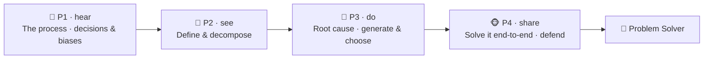

# 🧩 Worked Example — Problem Solving Micro-Credential (full course)

  
  
  
  

A **complete, ready-to-run ADA micro-credential** for the competency at the top of nearly every
employer's wishlist: **solving problems**. It is a *fully populated* example built end-to-end with the
ADA Methodology (KSA + 4 phases + learning-atom topology): every atom has **real reading text**,
**curated videos**, **Mermaid diagrams**, **image-generation prompts**, hands-on drills, and rubrics.

> 🖥️ **See it live:** open [`course.html`](course.html) in any browser for an interactive, navigable
> version of this course (sidebar, progress, embedded videos, diagrams, copyable prompts).

Problem solving is a **cognitive skill** that spans the full KSA spectrum: a small **Knowledge** base
(the problem-solving process; decisions & biases), three core **Skills** (frame & decompose a problem,
find the root cause, and generate & choose solutions), and the durable **Abilities** that power them
(persistence with ambiguity, and critical, curious thinking). It pairs naturally with
[Self-Learning](../self-learning-micro-credential/README.md) (how you fill the gaps a problem reveals)
and [Effective Communication](../effective-communication-micro-credential/README.md) (how you sell the
solution).

Conforms to [`../../specs/micro-credential-v2-schema.md`](../../specs/micro-credential-v2-schema.md) ·
modalities from [`../../specs/learning-atom-topology.md`](../../specs/learning-atom-topology.md) ·
KSA from [`../../specs/ksa-taxonomy.md`](../../specs/ksa-taxonomy.md).

---

## 🧭 What this teaches

"Strong problem-solving skills" is the most common line in job ads — and the least taught. This course
makes it concrete and certifiable: learners stop jumping straight to solutions and instead learn to
**define the real problem**, **diagnose its root cause** (not its symptoms), **generate options and
choose well** under trade-offs, and **persist** through ambiguity — finishing by solving a real
problem end-to-end and defending how they did it.

| | |
| --- | --- |
| **Title** | Problem Solving: Define, Diagnose & Decide |
| **Duration** | ~12 hours · 2–3 weeks |
| **Primary KSA** | 🛠️ Skill — *frame a problem* and *find the root cause*, plus the 🌱 Abilities that sustain them |
| **Target competency** | O\*NET: **Complex Problem Solving** (2.B.2.i), **Critical Thinking** (2.A.2.a), **Judgment & Decision Making** (2.B.4.e) · ESCO transversal *"solve problems", "think analytically"* |
| **Badge** | 🏅 *Problem Solver* |
| **Prerequisites** | None. A real problem from your work/study/life to practice on helps. |

---

## 📚 Course contents

| # | File | What it is |
| - | ---- | ---------- |
| — | [`micro-credential.md`](micro-credential.md) | The full micro-credential spec (YAML schema, objectives, KSA map, phase planner) |
| 1 | [`atoms/atom-1-how-problem-solving-works.md`](atoms/atom-1-how-problem-solving-works.md) | 🙉 P1 · 🧠 K — How problem solving works (the process + mindset) |
| 2 | [`atoms/atom-2-decisions-and-biases.md`](atoms/atom-2-decisions-and-biases.md) | 🙉 P1 · 🧠 K — Decisions & cognitive biases (why we get it wrong) |
| 3 | [`atoms/atom-3-define-and-decompose.md`](atoms/atom-3-define-and-decompose.md) | 🙈 P2 · 🛠️ S — Define & decompose the problem (frame it right) |
| 4 | [`atoms/atom-4-root-cause-analysis.md`](atoms/atom-4-root-cause-analysis.md) | 🙊 P3 · 🛠️ S — Find the root cause (5 Whys · fishbone · hypotheses) |
| 5 | [`atoms/atom-5-generate-and-choose-solutions.md`](atoms/atom-5-generate-and-choose-solutions.md) | 🙊 P3 · 🛠️ S + 🌱 A — Generate & choose solutions (options + trade-offs) |
| 6 | [`atoms/atom-6-capstone-solve-a-real-problem.md`](atoms/atom-6-capstone-solve-a-real-problem.md) | 🐵 P4 · 🛠️ S + 🌱 A — Capstone: solve a real problem end-to-end + peer review |
| — | [`capstone.md`](capstone.md) | Capstone brief + how it maps to KSA |
| — | [`rubrics.md`](rubrics.md) | All rubrics (knowledge-mini, skill, behavioral, capstone-5) |
| — | [`skills-map.md`](skills-map.md) | Badge → skills map and how it boosts almost every role |

> 🤝 **Practiced for real:** the Abilities (persistence/ambiguity-tolerance, critical-curious thinking)
> are assessed **behaviorally across ≥3 occasions** (never a quiz), and the capstone ends in a
> defense + peer review.

---

## 🔄 Phase journey

---

## 🤖 How it was authored (and how to reuse it)

This course follows the Gen AI authoring workflow in
[`../../specs/genai-authoring-workflow.md`](../../specs/genai-authoring-workflow.md):
competency → KSA → atoms → modalities → rubrics → badge. Conventions used throughout:

- **🎬 Videos** are written as a `youtube` block with the real URL + caption (the interactive site
  embeds them as a click-to-play player).
- **🖼️ Diagrams** are provided two ways: a live **Mermaid** diagram *and* a reusable
  **image-generation prompt** in a `prompt` block.
- **✅ Activities** include worksheets, decision matrices, checklists, and rubrics so the course is
  self-paced and practicable.

> ⚠️ **Human-in-the-loop (methodology guardrail):** the links and references below are **curated
> starting points** — a mentor/instructor should verify each one before delivery. The Abilities here
> require human/peer observation across occasions. See [`../../CLAUDE.md`](../../CLAUDE.md) §5.
