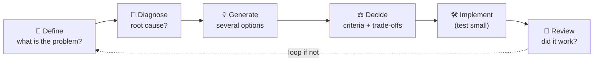
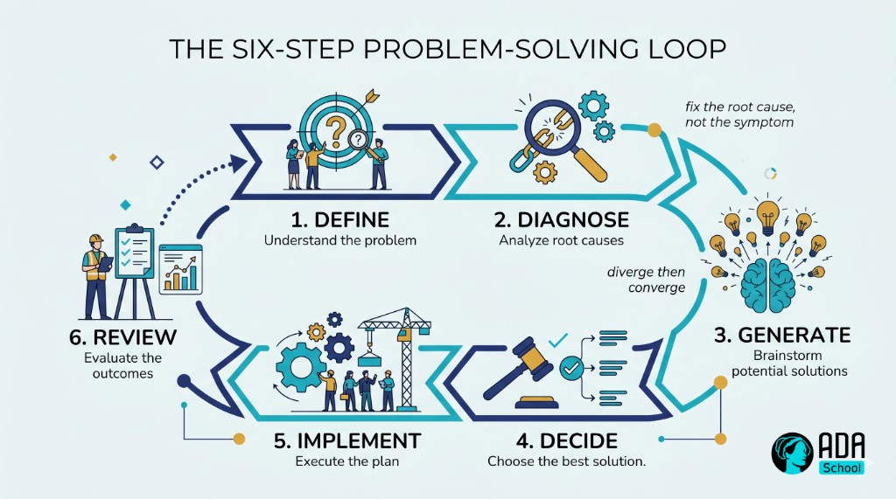

## ⚛ Learning Atom 1 — *How Problem Solving Works*

**Phase:** 🙉 1 · Self-Guided Introduction (*hear*) · **KSA:** 🧠 Knowledge · **Target level:** L2
· **Component id:** `K-process`

### 🎯 Learning objective

- **Explain** the problem-solving process and **distinguish** a symptom from a root cause, and
  divergent from convergent thinking.

### 🧩 Prerequisites

- None. Bring one nagging problem you keep "fixing" that keeps coming back.

### 🧭 Atom description

Most people "solve problems" by grabbing the first idea that feels right and running with it. That
works for trivial problems and fails for important ones. This atom gives you the mental model that the
whole course hangs on: a repeatable **process** that separates *understanding* the problem from
*solving* it — so you fix the real thing, not the first thing.

---

### 📖 Reading — *Slow down to speed up* (≈ 7 min)

There's a famous (probably apocryphal) line attributed to Einstein: *"If I had an hour to solve a
problem, I'd spend 55 minutes thinking about the problem and 5 minutes thinking about solutions."* The
point survives the misattribution: **most failed solutions are answers to the wrong problem.**

A reliable problem-solving process has six steps:

1. **Define** — What exactly is the problem? Who has it, where, when, how big? Write it down.
2. **Diagnose** — *Why* is it happening? Dig past symptoms to the **root cause** (Atom 4).
3. **Generate** — Produce *several* possible solutions, not one (Atom 5).
4. **Decide** — Choose using explicit criteria and trade-offs (Atom 5).
5. **Implement** — Do it (often as a small test first).
6. **Review** — Did it work? What did you learn? Loop if not.

Three ideas to internalize:

- **Symptom vs. root cause.** A *symptom* is what you notice ("the report is late again"); the *root
  cause* is why it keeps happening ("approvals queue with one person"). Treating symptoms gives you
  temporary relief and a recurring problem. Treating the root cause makes it *stay* fixed.
- **Divergent vs. convergent thinking.** Good problem solving alternates two modes: **divergent**
  (open up — generate many questions, causes, and options without judging) and **convergent**
  (narrow down — analyze, evaluate, decide). The classic mistake is converging too early: judging
  ideas before you've generated enough of them. *Separate the generating from the judging.*
- **Solution-jumping is the default failure.** Under time pressure we leap from a vague problem
  straight to a favorite solution, skipping define and diagnose. The fix is mechanical: **force
  yourself through define → diagnose before you allow a single solution.**

> **Reframe for the whole course:** the quality of your solution is capped by the quality of your
> problem definition. Time spent understanding is not a delay — it's the work.

**Key takeaways**

- [ ] The process: **define → diagnose → generate → decide → implement → review.**
- [ ] Fix the **root cause**, not the **symptom**, or the problem returns.
- [ ] Alternate **divergent** (generate) and **convergent** (decide); don't judge too early.
- [ ] Beware **solution-jumping** — force define + diagnose first.

---

### 🎬 Watch — how we think & solve (pick one, ~5–12 min)

```youtube
https://www.youtube.com/watch?v=UBVV8pch1dM
Veritasium — "The Science of Thinking" (fast vs. slow thinking; why we jump to answers).
```

```youtube
https://www.youtube.com/watch?v=9gM8j-mtL0
A short explainer on a structured problem-solving process (verify before delivery).
```

---

### 🖼️ See — the problem-solving loop





> 🖼️ *Generated image — produced from the prompt below.*

A reusable prompt to generate an on-brand version of this diagram:

```prompt
Create a clean, modern educational infographic of a six-step problem-solving loop: Define → Diagnose →
Generate → Decide → Implement → Review, with a dotted arrow looping Review back to Define. Add small
captions: "fix the root cause, not the symptom" and "diverge then converge". Use ADA brand colors
(Indigo #1E2A6E, Turquoise #15B5C6, Gold #E0A53C accents) on a light background, flat vector style,
legible sans-serif, no text errors. 16:9.
```

---

### ✅ Evaluate — Pop quiz (formative, `knowledge-mini`)

1. What's the difference between a symptom and a root cause? Give an example.
2. What does "converging too early" mean, and why is it a problem?
3. Name the six steps of the process in order.

<details>
<summary>Answer key</summary>

1. A **symptom** is the visible effect you notice; the **root cause** is the underlying reason it
   keeps happening (e.g., symptom: "late reports"; root cause: "single approver bottleneck"). Fixing
   only the symptom lets the problem return.
2. Judging/eliminating ideas before generating enough of them — you settle on a mediocre option and
   never discover better ones. **Separate generating from judging.**
3. **Define → Diagnose → Generate → Decide → Implement → Review.**

</details>

---

### 📦 Deliverable

- Take your recurring problem. In 4–6 sentences, separate the **symptom** from a likely **root cause**,
  and note where you've been **solution-jumping.**

### 🧠 Final reflection

- Which step do you personally skip most under pressure — define, diagnose, or generate? What does
  skipping it cost you?

### 🔗 Sources to verify (human-in-the-loop)

- Pólya, *How to Solve It* (the classic four-step heuristic).
- Kahneman, *Thinking, Fast and Slow* (System 1/2 and why we jump to answers).
- Guilford — divergent vs. convergent thinking.

### 🧩 Connections

- **Successors:** Atom 2 (the biases that derail the process), Atoms 3–5 (each step, in practice).
