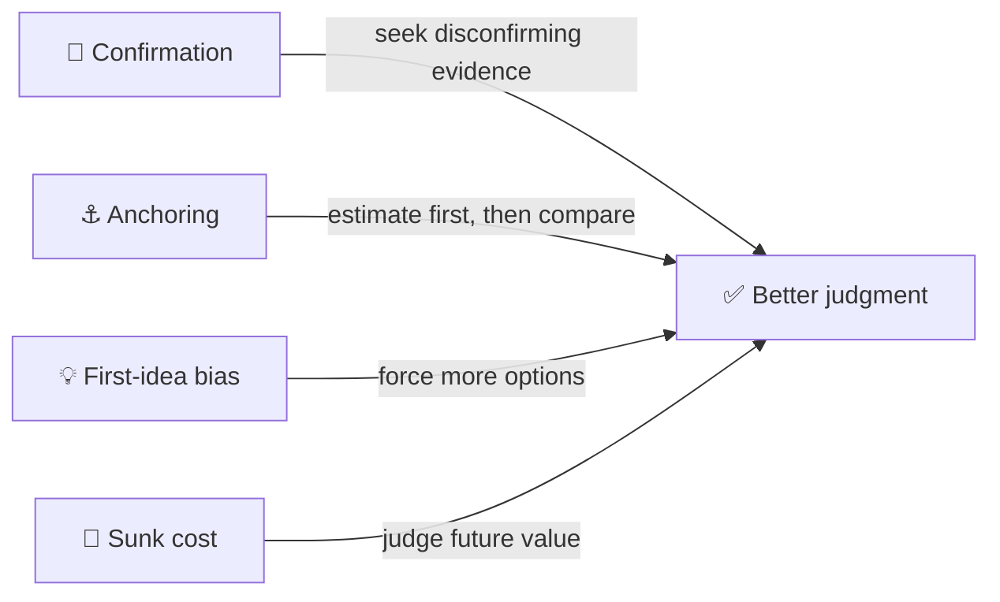
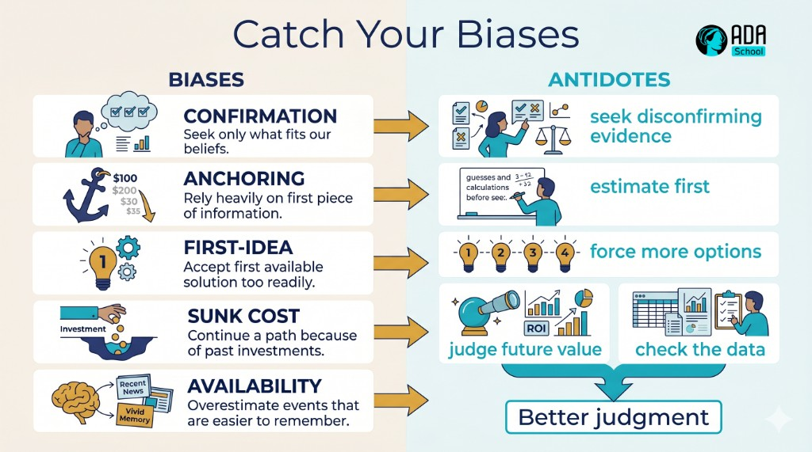

## ⚛ Learning Atom 2 — *Decisions & Cognitive Biases*

**Phase:** 🙉 1 · Self-Guided Introduction (*hear*) · **KSA:** 🧠 Knowledge · **Target level:** L2
· **Component id:** `K-decisions-biases`

### 🎯 Learning objective

- **Recognize** common cognitive biases and **explain** how they distort problem solving and
  decisions — plus the basics of deciding with criteria and trade-offs.

### 🧩 Prerequisites

- Atom 1 (the process). Biases mostly attack the *diagnose* and *decide* steps.

### 🧭 Atom description

Your brain takes shortcuts. Most of the time that's efficient; in problem solving it quietly steers
you toward the wrong cause and the comfortable answer. This atom names the usual suspects so you can
catch them — and introduces the simple idea of deciding *on purpose*, with explicit criteria, instead
of by gut feel.

---

### 📖 Reading — *Your brain's helpful, dangerous shortcuts* (≈ 8 min)

We run on two systems (Kahneman): **System 1** is fast, automatic, intuitive; **System 2** is slow,
effortful, analytical. System 1 is brilliant for routine life and terrible for novel problems, where
it serves up a confident answer that *feels* right and skips the analysis. Biases are the predictable
ways System 1 misfires:

- **Confirmation bias** — you look for evidence that supports your existing hunch and ignore evidence
  against it. *Antidote:* actively seek disconfirming evidence; ask "what would prove me wrong?"
- **Anchoring** — the first number/idea you hear drags your judgment toward it. *Antidote:* generate
  your own estimate before looking at others'.
- **Availability** — you overweight whatever is recent, vivid, or easy to recall. *Antidote:* look at
  base rates / actual data, not just the dramatic example.
- **Sunk-cost fallacy** — you keep pouring effort into something because you've already invested, not
  because it's working. *Antidote:* decide based on future value, not past spend.
- **Premature convergence / "first idea" bias** — you grab the first plausible cause or solution.
  *Antidote:* the divergent step (Atom 1) — force more options.
- **Groupthink / authority bias** — you defer to the loudest or most senior voice. *Antidote:* gather
  views independently first; invite a devil's advocate.
- **Overconfidence** — you trust your judgment more than the evidence warrants. *Antidote:* ask for
  the data and a second opinion.

**Deciding on purpose (preview of Atom 5).** Once you have options, don't decide by vibe. Make the
**criteria explicit** (what does a good solution need — impact, cost, effort, risk, time?), weigh
them, and compare options against them. Writing it down both improves the decision *and* exposes your
biases ("oh, I only liked option A because I thought of it first"). Almost every important decision is
a **trade-off** — naming what you're trading is half the skill.

> **The meta-move:** you can't delete biases, but you can build *habits and checklists* that catch
> them. Slow down, write it down, seek the opposite. That's most of "critical thinking."

**Key takeaways**

- [ ] **System 1** (fast/intuitive) hands you confident answers that skip analysis — engage **System 2.**
- [ ] Know the big biases: **confirmation, anchoring, availability, sunk-cost, premature convergence.**
- [ ] **Antidote pattern:** slow down, write it down, **seek disconfirming evidence.**
- [ ] Decide with **explicit criteria + trade-offs**, not by gut.

---

### 🎬 Watch — thinking about thinking (~5–11 min)

```youtube
https://www.youtube.com/watch?v=JiTz2i4VHFw
"Cognitive biases / how to think, not what to think" — a short explainer (verify before delivery).
```

---

### 🖼️ See — bias → antidote





> 🖼️ *Generated image — produced from the prompt below.*

A reusable prompt to generate an on-brand version:

```prompt
Create a clean, modern infographic titled "Catch Your Biases": a left column of cognitive biases
(Confirmation, Anchoring, First-idea, Sunk cost, Availability) each with an arrow to its antidote
(seek disconfirming evidence, estimate first, force more options, judge future value, check the data),
ending in "Better judgment". Use ADA brand colors (Indigo #1E2A6E, Turquoise #15B5C6, Gold #E0A53C),
light background, flat vector, legible sans-serif. 16:9.
```

---

### ✅ Evaluate — Pop quiz (formative, `knowledge-mini`)

1. What is confirmation bias, and what's a practical antidote?
2. Why is the sunk-cost fallacy dangerous when deciding whether to continue a project?
3. Why does writing down explicit criteria improve a decision?

<details>
<summary>Answer key</summary>

1. Favoring evidence that supports your existing belief and ignoring the rest; antidote: actively
   **seek disconfirming evidence** ("what would prove me wrong?").
2. It makes you continue based on **past** investment rather than **future** value, throwing good
   resources after bad. Decide on expected future outcomes.
3. It forces a structured comparison, makes **trade-offs** visible, and exposes biases (e.g., favoring
   your own idea) instead of deciding by gut.

</details>

---

### 📦 Deliverable

- Recall a decision that went wrong. Name the **bias** most responsible and the **antidote** that
  would have helped — in 3–5 sentences.

### 🧠 Final reflection

- Which bias do you fall into most? What one habit/checklist could catch it next time?

### 🔗 Sources to verify (human-in-the-loop)

- Kahneman, *Thinking, Fast and Slow*.
- Heath & Heath, *Decisive* (the WRAP process for better decisions).
- Cognitive bias references (e.g., the "Cognitive Bias Codex" — verify before use).

### 🧩 Connections

- **Predecessor:** Atom 1. **Successors:** Atom 4 (avoid bias while diagnosing), Atom 5 (decide with
  criteria).
