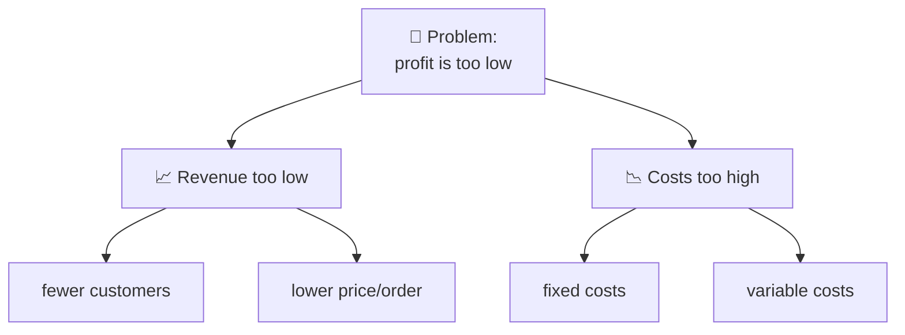
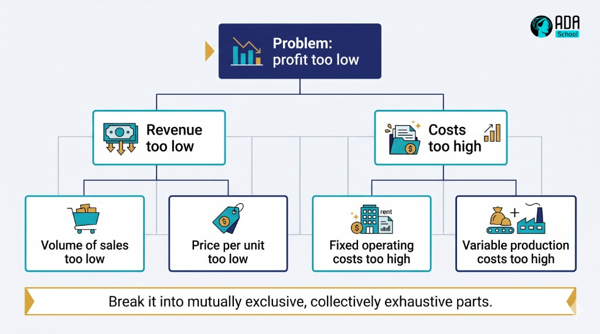

## ⚛ Learning Atom 3 — *Define & Decompose the Problem*

**Phase:** 🙈 2 · Visual Exploration (*see*) · **KSA:** 🛠️ Skill · **Target level:** L2
· **Component id:** `S-frame`

### 🎯 Learning objective

- **Write** a clear problem statement and **decompose** a problem into parts — using first-principles
  thinking to get past assumptions.

### 🧩 Prerequisites

- Atoms 1–2. This is the *define* step, done well.

### 🧭 Atom description

A well-defined problem is half-solved. This atom turns vague complaints ("our process is broken") into
sharp, workable problem statements, and big tangled problems into smaller pieces you can actually
attack. It's in Phase 2 (*see*) because you learn it by watching it modeled, then doing it on a real
problem of your own.

---

### 📖 Reading — *Define it before you fight it* (≈ 8 min)

**1) Write a problem statement.** A good statement is specific, neutral, and solution-free. A simple
template:

> *"[Who] is experiencing [what problem], in [what context/when], which causes [what impact]. Today it
> is [current state] vs. the desired [target state]. Success looks like [measurable outcome]."*

Compare:

- 👎 *"The website is bad."*
- 👍 *"New mobile users abandon checkout (68% drop-off on the payment step) since the April redesign,
  costing ~$X/month. We want drop-off back under 40%."*

The second is **specific** (who, where, how big), **measurable** (68% → 40%), and **doesn't smuggle in
a solution.** Avoid baking the answer into the question ("we need a new payment button" presumes the
button is the cause — that's the diagnose step's job).

**2) Sharpen with questions.** Interrogate the problem before solving:

- **Is it the right problem?** Ask "why does that matter?" up the chain until you hit the problem worth
  solving. (You may discover the real problem is bigger or smaller than you thought.)
- **What's in/out of scope?** State boundaries so you don't boil the ocean.
- **What do we actually know vs. assume?** Separate facts from guesses — guesses become hypotheses to
  test (Atom 4).
- **How will we know it's solved?** Define the success metric *now*.

**3) Decompose.** Break the problem into parts so it's tractable:

- **Issue tree / MECE.** Split the problem into sub-problems that are **M**utually **E**xclusive and
  **C**ollectively **E**xhaustive (no overlaps, no gaps). E.g., "low profit" → "revenue too low" OR
  "costs too high"; then break each down further. Now you can attack branches independently.
- **First principles.** Strip away assumptions and inherited "that's how it's done" until you reach
  the basic truths, then reason up from there. Ask: *what do we actually know to be true? what are we
  assuming just because it's familiar?* First-principles thinking is how you escape "we've always done
  it this way."

> **The payoff:** a sharp statement + a clean decomposition turns an overwhelming blob into a list of
> smaller, solvable questions — and tells you exactly where to point the root-cause analysis next.

**Key takeaways**

- [ ] A good **problem statement** is specific, measurable, neutral, and **solution-free.**
- [ ] **Separate facts from assumptions**; define the **success metric** up front.
- [ ] **Decompose** with a MECE issue tree (no overlaps, no gaps).
- [ ] Use **first principles** to escape inherited assumptions.

---

### 🖼️ See — an issue tree (MECE decomposition)





> 🖼️ *Generated image — produced from the prompt below.*

A reusable prompt to generate an on-brand version:

```prompt
Create a clean, modern "issue tree / MECE decomposition" infographic: a top box "Problem: profit too
low" branching into "Revenue too low" and "Costs too high", each branching into two sub-causes.
Caption: "Break it into mutually exclusive, collectively exhaustive parts." Use ADA brand colors
(Indigo #1E2A6E, Turquoise #15B5C6, Gold #E0A53C), light background, flat vector, legible
sans-serif. 16:9.
```

---

### 🧪 Practice — *Frame a real problem* (Worksheet + AI Prompt Question)

Pick a real problem you face. Then:

1. **Statement.** Write it with the template (who · what · context · impact · current vs. target ·
   success metric). Check that no solution is hidden inside it.
2. **Facts vs. assumptions.** List 3 things you *know* and 3 you're *assuming.*
3. **Decompose.** Draw a 2-level MECE issue tree of possible parts/causes.
4. **First principles.** Name one "that's just how it's done" assumption and challenge it.
5. **AI Prompt Question.** Ask an AI: *"Critique my problem statement — is it specific, measurable, and
   free of a hidden solution? What's missing?"* Improve it based on the critique (then sanity-check the
   critique yourself).

---

### ✅ Evaluate — Performance task (`skill`)

Submit your framed problem. Scored on:

| Criterion | Excellent (3) | Adequate (2) | Needs work (1) |
| --------- | ------------- | ------------ | -------------- |
| **Problem statement** | Specific, measurable, neutral, solution-free | Mostly clear | Vague / hides a solution |
| **Facts vs. assumptions** | Cleanly separated; assumptions flagged | Some separation | Mixed together |
| **Decomposition** | MECE issue tree, no gaps/overlaps | Reasonable breakdown | Flat / overlapping |
| **First principles** | Challenges a real assumption | Some questioning | Accepts the obvious |

> Pass = 2+ each → **L2** evidence for `S-frame`.

### 📦 Deliverable

- Your problem statement + facts/assumptions list + issue tree + the assumption you challenged.

### 🧠 Final reflection

- Did framing change what you *thought* the problem was? How?

### 🔗 Sources to verify (human-in-the-loop)

- Minto, *The Pyramid Principle* / McKinsey problem-structuring (issue trees, MECE).
- Spradlin, *Are You Solving the Right Problem?* (HBR).
- First-principles thinking references (verify before use).

### 🧩 Connections

- **Predecessor:** Atom 2. **Successor:** Atom 4 (diagnose the branches you found).
