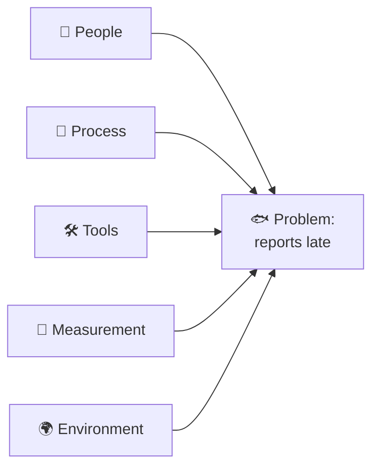

## ⚛ Learning Atom 4 — *Find the Root Cause*

**Phase:** 🙊 3 · Applied Practice (*do*) · **KSA:** 🛠️ Skill · **Target level:** L2
· **Component id:** `S-root-cause`

### 🎯 Learning objective

- **Find a root cause** using the **5 Whys**, a **fishbone (Ishikawa)** diagram, and simple
  **hypothesis testing.**

### 🧩 Prerequisites

- Atom 3 (a framed, decomposed problem). Now diagnose *why* it happens.

### 🧭 Atom description

This is the *diagnose* step — and the one most people skip. Without it you treat symptoms forever. This
atom gives you three practical tools to dig from "what's wrong" to "why it's wrong," and the discipline
to **test** your suspected cause instead of assuming it.

---

### 📖 Reading — *Keep asking why* (≈ 8 min)

**Tool 1 — The 5 Whys.** Start with the symptom and ask "why?" repeatedly (roughly five times) until
you reach a cause you can actually act on:

> *Problem: the report was late.*
> 1. Why? — It waited two days for approval.
> 2. Why? — Only one manager can approve, and she was out.
> 3. Why? — There's no backup approver.
> 4. Why? — We never defined one.
> 5. Why? — No one owns the approval process. ← **root cause**

Fixing #5 (assign an owner + backup) prevents recurrence; fixing #1 ("nag the manager") doesn't. Note:
"5" isn't magic — stop when you reach something **actionable** and **systemic**, not a person to blame.
There can be more than one branch ("why?" may have two answers — follow both).

**Tool 2 — Fishbone (Ishikawa) diagram.** When a problem has *many* possible causes, group them into
categories and brainstorm causes under each. Common categories (the "6 Ms" for operations, or adapt
them): **People, Process, Tools/Technology, Materials, Environment, Measurement.** The diagram looks
like a fish skeleton — the problem is the head, the categories are the bones. It forces you to consider
causes you'd otherwise miss and prevents fixating on the first one.

**Tool 3 — Hypothesis testing.** A suspected cause is a **hypothesis**, not a fact. Before you commit
to a fix, **test it**: *"If queue-time is the cause, then reports with single-approver steps should be
late more often — let's check the data."* Look for evidence that would **confirm or disconfirm** it
(remember confirmation bias from Atom 2 — actively look for evidence you're *wrong*). Cheap tests beat
expensive assumptions.

**Watch out for:**

- **Blame instead of cause.** "Who did it?" is rarely the root cause; "what in the *system* allowed it?"
  usually is. Blame ends inquiry; systems thinking continues it.
- **Stopping at the first plausible cause.** Generate several candidate causes (divergent), then test.
- **Correlation ≠ causation.** Two things moving together doesn't mean one caused the other — test.

> **The discipline:** suspect → **test** → confirm before you fix. A confirmed root cause is worth ten
> clever solutions to the wrong cause.

**Key takeaways**

- [ ] **5 Whys:** ask why until you reach an **actionable, systemic** cause (not a person to blame).
- [ ] **Fishbone:** brainstorm causes by category (People, Process, Tools, etc.) to avoid fixation.
- [ ] **Test hypotheses** with confirming *and* disconfirming evidence before committing.
- [ ] **Correlation ≠ causation;** blame ≠ root cause.

---

### 🖼️ See — fishbone (cause categories)



A reusable prompt to generate an on-brand version:

```prompt
Create a clean, modern fishbone (Ishikawa) diagram infographic: a central spine pointing to a fish
head labeled "Problem", with angled bones labeled People, Process, Tools/Technology, Materials,
Environment, Measurement, each with room for sub-causes. Caption: "Brainstorm causes by category."
Use ADA brand colors (Indigo #1E2A6E, Turquoise #15B5C6, Gold #E0A53C), light background, flat vector,
legible sans-serif. 16:9.
```

---

### 🧪 Practice — *Root-cause a case* (Case Study + Worksheet)

**Case:** *A small online store's customer support is overwhelmed — tickets doubled last month and
replies now take 3 days. The team wants to hire more agents.* Before spending on hires:

1. **5 Whys.** Run at least one "why?" chain on "tickets doubled." (What changed last month?)
2. **Fishbone.** Brainstorm causes across People / Process / Tools / Measurement (e.g., a buggy
   release? a confusing new checkout? a price change? a broken FAQ?).
3. **Hypothesis + test.** Pick the most likely cause and state how you'd **test** it with available
   data before committing to a fix.
4. Then do the same on **your own** problem from Atom 3.

<details>
<summary>Sample insight</summary>

"Hire more agents" treats the symptom (too many tickets). A 5-Whys/fishbone often reveals a root cause
like "a recent release introduced a bug that generates the same complaint" — fixing the bug removes the
tickets entirely, far cheaper than hiring. The point: **diagnose before you spend.**

</details>

---

### ✅ Evaluate — Performance task (`skill`)

Submit your case + own-problem diagnosis. Scored on:

| Criterion | Excellent (3) | Adequate (2) | Needs work (1) |
| --------- | ------------- | ------------ | -------------- |
| **Depth (5 Whys)** | Reaches an actionable, systemic cause | Some digging | Stops at a symptom/blame |
| **Breadth (fishbone)** | Multiple categories & candidate causes | A few causes | One cause only |
| **Testing** | States a real confirm/disconfirm test | Vague test | Assumes the cause |
| **Bias awareness** | Seeks disconfirming evidence | Some | Confirmation-driven |

> Pass = 2+ each → **L2** evidence for `S-root-cause`.

### 📦 Deliverable

- Your 5-Whys chain(s) + fishbone + the hypothesis test, for the case and your own problem.

### 🧠 Final reflection

- Did the root cause differ from your first guess? What would treating only the symptom have cost?

### 🔗 Sources to verify (human-in-the-loop)

- Ohno / Toyota Production System — *The 5 Whys*.
- Ishikawa — *cause-and-effect (fishbone) diagrams*.
- Any reputable root-cause-analysis (RCA) guide (verify before use).

### 🧩 Connections

- **Predecessor:** Atom 3. **Successor:** Atom 5 (generate & choose solutions for the confirmed cause).
