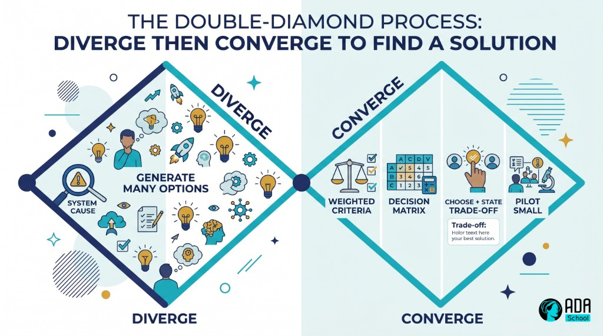

## ⚛ Learning Atom 5 — *Generate & Choose Solutions*

**Phase:** 🙊 3 · Applied Practice (*do*) · **KSA:** 🛠️ Skill + 🌱 Ability · **Target level:** L2
· **Component ids:** `S-solutions`, `A-persistence`, `A-critical-curious`

### 🎯 Learning objective

- **Generate** several options (divergent) and **choose** one (convergent) using a **decision matrix**
  and explicit **trade-offs** — persisting through ambiguity and questioning assumptions.

### 🧩 Prerequisites

- Atom 4 (a confirmed root cause). Now solve *that*.

### 🧭 Atom description

With the real problem and its root cause in hand, this atom is the *generate + decide* steps. You'll
practice producing many options before judging any, then choosing transparently with criteria and
trade-offs. It's also where the **Abilities** show up: staying with the discomfort of an unclear
problem (persistence) and challenging the obvious answer (critical curiosity).

---

### 📖 Reading — *Diverge to find options, converge to choose* (≈ 8 min)

**Step 1 — Diverge (generate options).** Resist the first idea. Aim for **quantity first**, judgment
later:

- **Brainstorm broadly.** Target 5–10 candidate solutions for the root cause. Include a "do nothing"
  option and at least one "wild" option to stretch the space.
- **Borrow & combine.** How do others solve this? Can two weak ideas combine into a strong one?
- **Use prompts to expand.** *"What if we had no budget? Unlimited budget? Had to solve it in a day?"*
  Constraints provoke fresh options.
- **Don't judge yet.** Write them all down before evaluating — premature judging kills good ideas
  (Atom 1's divergent/convergent rule).

**Step 2 — Converge (choose).** Now apply judgment, on purpose:

- **Define criteria.** What makes a good solution *here*? Typical: **impact, effort/cost, time, risk,
  feasibility.** Weight them (some matter more).
- **Build a decision matrix.** Score each option against each criterion; total the (weighted) scores.
  The matrix doesn't decide *for* you — it makes the **trade-offs visible** and your reasoning
  defensible.

| Option | Impact (×3) | Effort (×2, lower=better) | Risk (×2, lower=better) | Weighted total |
| ------ | ----------- | ------------------------- | ----------------------- | -------------- |
| A: fix the bug | 5 → 15 | 2 → (inverted) | 2 → (inverted) | … |
| B: hire agents | 3 → 9 | 4 | 3 | … |
| C: do nothing | 1 → 3 | 1 | 1 | … |

- **Name the trade-off out loud.** *"We're choosing A over B because it removes the cause for less
  effort, accepting a small rollout risk."* Every real decision trades something — say what.
- **Prefer reversible, testable bets.** When unsure, pick the option you can **pilot small** and undo.
  Run it (implement), then **review** (Atom 1) and iterate.

**Where the Abilities live:**

- **🌱 Persistence & ambiguity tolerance.** Hard problems stay foggy for a while. The skill is to keep
  working the process — generating, testing, refining — without grabbing a premature answer just to
  end the discomfort. Stuck ≠ failed; it's where the work is.
- **🌱 Critical, curious thinking.** Keep asking *"why is that the obvious answer? what are we
  assuming? what would change our mind?"* The best solvers interrogate their own favorite option
  hardest.

> **The discipline:** options before judgment, criteria before choice, trade-off stated out loud,
> small reversible bet when unsure.

**Key takeaways**

- [ ] **Diverge first:** generate 5–10 options (incl. "do nothing" + a wild card) before judging.
- [ ] **Converge with a decision matrix:** explicit, weighted criteria; visible trade-offs.
- [ ] **State the trade-off** and prefer **reversible, testable** bets.
- [ ] **Persist** through ambiguity; **question** the obvious answer.

---

### 🖼️ See — diverge → converge




> 🖼️ *Generated image — produced from the prompt below.*

A reusable prompt to generate an on-brand version:

```prompt
Create a clean, modern infographic showing a "diverge then converge" double-diamond: from a confirmed
root cause, widen to "generate many options", then narrow through "weighted criteria → decision matrix
→ choose + state trade-off → pilot small". Use ADA brand colors (Indigo #1E2A6E, Turquoise #15B5C6,
Gold #E0A53C), light background, flat vector, legible sans-serif. 16:9.
```

---

### 🧪 Practice — *Solve it: options + matrix* (Challenge + Simulation + Pair)

For your confirmed root cause (from Atom 4):

1. **Diverge.** Generate **at least 6** options, including "do nothing" and one wild idea. No judging
   while listing.
2. **Criteria.** Choose 3–4 criteria and weight them for your context.
3. **Matrix.** Score options, total them, and pick — then **write one sentence naming the trade-off.**
4. **Pilot plan.** Describe the smallest reversible test of your choice and what "it worked" looks like.
5. **Pair review (collaborate).** Swap with a partner: each plays devil's advocate on the other's
   choice — *"what assumption could be wrong? what option did you dismiss too fast?"*

---

### ✅ Evaluate — Behavioral assessment (`behavioral`)

Scored from your work + pair observation — a key occasion for the Abilities:

| Criterion | Excellent (3) | Adequate (2) | Needs work (1) |
| --------- | ------------- | ------------ | -------------- |
| **Divergence (🛠️)** | Many varied options before judging | A few options | First idea only |
| **Convergence (🛠️)** | Clear weighted matrix; trade-off stated | Some structure | Decides by gut |
| **Persistence (🌱)** | Stays with ambiguity; refines instead of forcing | Some persistence | Grabs premature answer |
| **Critical curiosity (🌱)** | Questions own assumptions; welcomes challenge | Some questioning | Defends first instinct |
| **Reversibility** | Plans a small, testable pilot | Vague plan | Big bet, no test |

> Pass = 2+ each. This is **occasion 1 of 3** for `A-persistence` and `A-critical-curious` (also
> observed in the capstone and throughout).

### 📦 Deliverable

- Your options list + weighted decision matrix + chosen option with the stated trade-off + pilot plan.

### 🧠 Final reflection

- When did you want to stop and just pick something? What did persisting (or not) change?

### 🔗 Sources to verify (human-in-the-loop)

- Heath & Heath, *Decisive* (widen options; reality-test assumptions).
- Design Council — the *Double Diamond* (diverge/converge).
- Decision-matrix / weighted-scoring references (verify before use).

### 🧩 Connections

- **Predecessor:** Atom 4. **Successor:** Atom 6 (run the whole process on a real problem & defend it).
